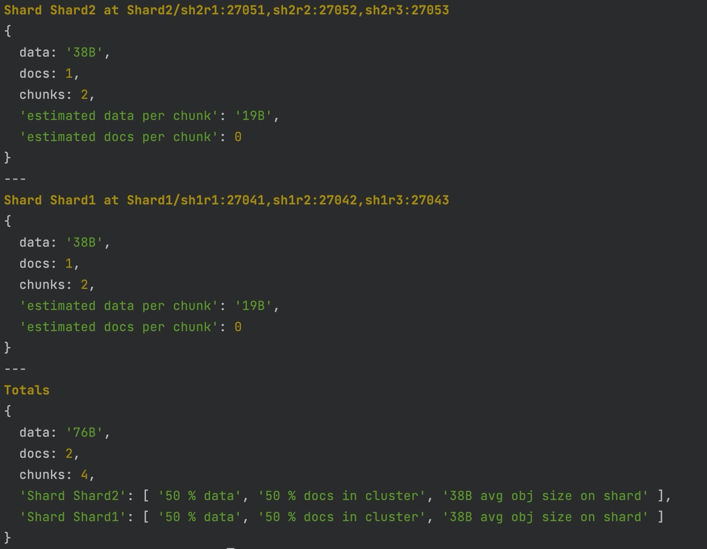
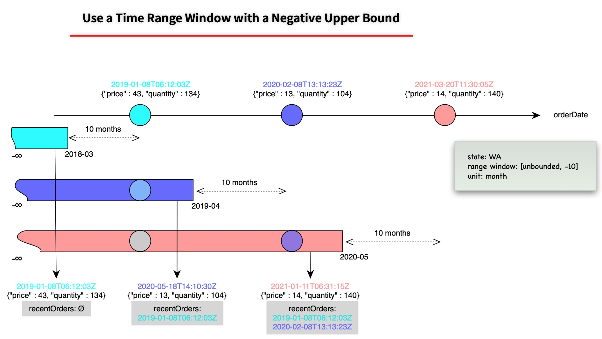

+++
title = "MongoDb 5 來了，有什麼值得注意的更新呢?"
date = "2021-08-01"
description = "MongoDb 5 來了，有什麼值得注意的更新"
featured = false
categories = [
  "隨手筆記"
]
tags = [
  "MongoDB"
]
images = [
  "posts/notes/2021-08-01-mongodb-5-來了有什麼值得注意的更新/images/205E1EDC91FA1B5BAF557D3E052EC920.jpg"
]
+++

MongoDB 於 7月13日釋出了 5.0 版，這次除了更新 `mongosh` shell，也針對 Time Series 資料的支援。
<!--more-->

> 完整的更新列表請參考 [Release Notes for MongoDB 5.0](https://docs.mongodb.com/manual/release-notes/5.0/#shell-changes)。


## `mongosh` shell

`mongo` shell 在 5.0 版被棄用了，取而代之是 `mongosh` shell，它是一個 Node.js 14.x REPL 互動環境，你甚至可以 `require()` 其它 npm module，見：[Write Scripts for mongosh](https://docs.mongodb.com/mongodb-shell/write-scripts/#use-require---to-include-external-files-and-modules)。另外，它還支援 GCP 和 Azure 的 [Key Management Service (KMS)](https://docs.mongodb.com/manual/core/security-client-side-encryption-key-management/#std-label-field-level-encryption-kms)。

雖然 `mongo` 被棄用，它的指令目前都可以運行在 `mongosh` 上，完整的指令見 [MongoDB Shell Methods](https://docs.mongodb.com/mongodb-shell/reference/methods/)。

`mongosh` 的改變很大，其中是語法高亮(syntax highlighting)，它讓許多「查詢狀態」指令類的結果好讀了許多，如：**db.collection.getShardDistribution()**




## 時間序列資料集 (Time Series Collection)

5.0 版引進時間序列資料集(Time Series Collection)，它優化儲存空間和查詢效能。

使用者要顯示地用 [db.createCollection()](https://docs.mongodb.com/manual/reference/method/db.createCollection/#mongodb-method-db.createCollection) 建立資料集：

```javascript
db.createCollection("weather", { timeseries: { timeField: "timestamp" } } )

db.createCollection(
    "weather24h",
    {
       timeseries: {
          timeField: "timestamp",
          metaField: "metadata",
          granularity: "hours"
       },
       expireAfterSeconds: 86400
    }
)
```

MongoDB 雖然會在內部建立 *timeField* 指定欄位的 index，使用者還是可以對 *metaField* 和 *timeFiel* 指定欄位建立*次索引*(*二級索引*) [Secondary Index](https://docs.mongodb.com/manual/core/timeseries/timeseries-secondary-index/#std-label-timeseries-add-secondary-index) 來改善查詢效能。

> 注意：二級索引的設定有些限制， 目前只能設定在 **metadata**(如果有設定) 和 **timestamp** 指定的欄位中，如：
> ```javascript
> db.weather24h.createIndex({ "metadata.sensorId": 1, "timestamp": 1 })
> ```

> 注意：目前 Time Series 還不能在 sharding 環境中，據說會在接下來的版本持續釋出。
  

## Aggregation
使用 MongoDB 一定要學習的就是 *Aggregation Pipeline*，它幫助我們以流水線的方式處理/分析整個資料集(collection)。

### `$setWindowFields` stage
從 MongoDB 4.2 引入 [`$merge`](https://docs.mongodb.com/manual/reference/operator/aggregation/merge/) stage 讓我們可以把聚合結果寫回並合併到指定的資料集(collection)。這次引入新的  [`$setWindowFields`](https://docs.mongodb.com/manual/reference/operator/aggregation/setWindowFields/#mongodb-pipeline-pipe.-setWindowFields) stage，我們可以在一個排序的資料集中，以及自定義的 window，對每個 document 的 window 所涵蓋的資料聚合計算，並儲存於 document 的 field 上。



以上圖為例，就是對每筆訂單計算前十個月的訂單紀錄 **recentOrders**，完整例子見：[Use a Time Range Window with a Positive Upper Bound](https://docs.mongodb.com/manual/reference/operator/aggregation/setWindowFields/#use-a-time-range-window-with-a-positive-upper-bound)。

> 股票技術分析中的「移動平均線(Moving Average)」也可以用這個來實現。

### 聚合算子(Aggregation Operators)
同時增加分析 Time Series 資料可能會用到的算子。


1. 時間日期操作(Date operation)：[`$dateAdd`](https://docs.mongodb.com/manual/reference/operator/aggregation/dateAdd/#mongodb-expression-exp.-dateAdd)，[`$dateDiff`](https://docs.mongodb.com/manual/reference/operator/aggregation/dateDiff/#mongodb-expression-exp.-dateDiff)，[`$dateSubtract`](https://docs.mongodb.com/manual/reference/operator/aggregation/dateSubtract/#mongodb-expression-exp.-dateSubtract)，[`$dateTrunc`](https://docs.mongodb.com/manual/reference/operator/aggregation/dateTrunc/#mongodb-expression-exp.-dateTrunc)

2. `$group` 的聚合累積算子(aggregation accumulator)中新增 [`$count`](https://docs.mongodb.com/manual/reference/operator/aggregation/count-accumulator/#mongodb-group-grp.-count)，來計算各分群的數量。另外，此算子也可以用在 [`$setWindowFields`](https://docs.mongodb.com/manual/reference/operator/aggregation/setWindowFields/#mongodb-pipeline-pipe.-setWindowFields) 中。

3. 針對含有錢字 (**\$**) 或句號 (**.**) 欄位名(field)的設定和取出: [`$getField`](https://docs.mongodb.com/manual/reference/operator/aggregation/getField/#mongodb-expression-exp.-getField) / [`$setField`](https://docs.mongodb.com/manual/reference/operator/aggregation/setField/#mongodb-expression-exp.-setField)

4. 機率抽樣指定比率的文件(document)量 [`$sampleRate`](https://docs.mongodb.com/manual/reference/operator/aggregation/sampleRate/#mongodb-expression-exp.-sampleRate)。(這在 4.4.2 版已釋出)


### db.collection.aggregate() 增加 **let** Option
[db.collection.aggregate(pipeline,options)](https://docs.mongodb.com/manual/reference/method/db.collection.aggregate/#mongodb-method-db.collection.aggregat) 可以用 *let* option 改善 pipeline 的可讀性。


```javascript
db.cakeSales.aggregate(
   [
      { $match: {
         $expr: { $gt: [ "$salesTotal", "$$targetTotal" ] }
      } }
   ],
   {let: { targetTotal: 3000 } }
)
```

**let** 定義 *targetTotal* 變數，然後在 pipeline 中用 *$$targetTotal* 引用變數。這表示我們可讓 pipeline 可以更乾淨一點，也可以拿來分離非 pipeline 的程式碼。


接下來，在分片叢集架構上，也加入了維運用的 [`refineCollectionShardKey`](https://docs.mongodb.com/manual/reference/command/refineCollectionShardKey/) 和 [`reshardCollection`](https://docs.mongodb.com/manual/reference/command/reshardCollection/#mongodb-dbcommand-dbcmd.reshardCollection)。

## Shared Cluster
雖然在 4.4 版加入了 [`refineCollectionShardKey`](https://docs.mongodb.com/manual/reference/command/refineCollectionShardKey/) 來處理 [jumbo chunks](https://docs.mongodb.com/manual/core/sharding-data-partitioning/#std-label-jumbo-chunks) 的議題 - 可能由於基數(cardinality) 不足引起而無法切分(split)的巨大 chunk。但還是沒有搔到癢處，因為除非很有經驗或是很確定查詢資料的方式或資料結構，否則不太容易第一次取的 shard key 就會很準確。這次 5.0 版終於可以用 [`reshardCollection`](https://docs.mongodb.com/manual/reference/command/reshardCollection/#mongodb-dbcommand-dbcmd.reshardCollection) 來修改 shard key。

不過別高興的太早，因為會把一個資料集分散在個各分片，通常那資料集就是很大的資料量，所以要把大量的資料重新分配，可想而知是很巨大的挑戰，使用前請詳讀 [Reshard a Collection](https://docs.mongodb.com/manual/core/sharding-reshard-a-collection/#reshard-a-collection)。

另外，[`renameCollection`](https://docs.mongodb.com/manual/reference/command/renameCollection/#mongodb-dbcommand-dbcmd.renameCollection) 在 5.0 版也可以用在 sharded collection 上了。
