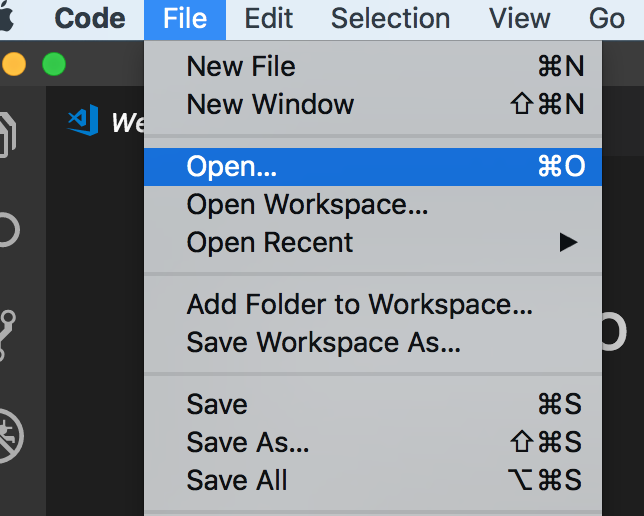
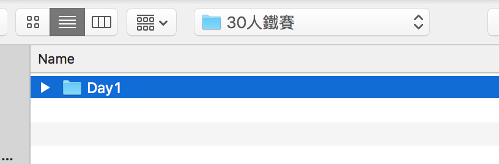
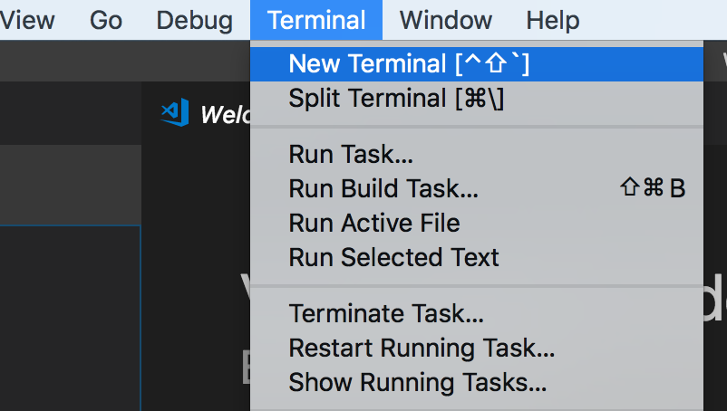
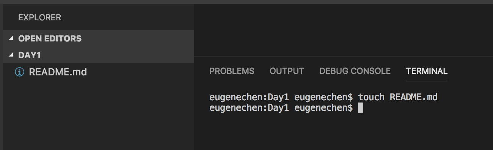

+++
title = "Day 1 - 前言／開發環境準備"
date = "2018-10-01"
description = "最近剛好在做自己的個人網站，整理自己的技能樹，想要透過「iT邦幫忙鐵人賽」整理自己的開發經驗。"
featured = false
categories = [
]
tags = [
"2019 iT 邦幫忙鐵人賽",
"用js成為老闆心中的全端工程師"
]
images = [
]
series = [
"用js成為老闆心中的全端工程師 - 2019 iT邦幫忙鐵人賽"
]
+++

最近剛好在做自己的個人網站，整理自己的技能樹，想要透過「iT邦幫忙鐵人賽」整理自己的開發經驗。

<!--more-->

# 題目由來
最近剛好在做自己的個人網站，整理自己的技能樹，想要透過「iT邦幫忙鐵人賽」整理自己的開發經驗。

# 題目目標
1. 新手工程師，應該可以本主題學到不少前後端開發經驗，我會盡量用直白說法解釋內容
2. 提供比較全面的技能介紹，以提供有興趣的人躦研
3. 適合想看看後端開發在做什麼的人

因為我想要儘量包含我所知道的，但這幾天我打草稿後發現不太可能，所以我只能抓取我覺得重要的內容，若有覺得講的不好的地方或缺少的內容，請跟我說[yujichen0514@gmail.com](yujichen0514@gmail.com)，或直接討論。

# 學習心態
本篇叫「用js成為老闆心中的全端工程師」，我想老闆都希望可以快速完成工作，剛好我比較主張 **用學相長**(邊用邊學)，畢竟時間有限，但我不是指只要寫程式就好，**(使)用** 是讓自己抓到直覺和感受別人的設計最快的方法， **學(習)** 可以有更深的體悟、也記得久，更能融會貫通，**用學相長** 是一種知識上的演進。

幾乎每天的文章內容都可以有自己動手做的部分，有興趣的人可以自己玩看看。

# 文章概觀
本目題打算進行三周目，大致上是先開發、發佈，再維運。主要使用 javascript / nodejs 為開發語言, 利用 docker 準備開發環境，進而發佈，最後引入程式維運。不得不說 docker 的出現使得開發者學習上有很大幫助。

* ***前言/一輩子受用的工具***：常用的工具：shell常用指令、markdown、draw.io，學會使用就一輩子受用
* ***一周目***：以極精簡程式一次串完前後端，快速了解前後端在串什麼東西
* ***二周目***：更深入了解前後端，不得不了解的概念或技術
* ***三周目***：利用 docker 發佈自己的程式，架設維運所需的相關服務

# 開發環境準備
若怕用髒自己的電腦環境、可以用 Virtual Machine，來安裝一個虛擬的作業系統。 Windows的使用者可以用[VirtualBox](https://www.virtualbox.org/)，Mac可以用[Parallels Desktop Lite](https://itunes.apple.com/tw/app/parallels-desktop-lite/id1085114709?mt=12)。不過我們也只會安裝 NodeJS、docker/ docker-compose, Visual Studio Code, Vegeta。

雖然我的作業系統是Mac OS，我所以下的指令大多相容 linux, 就算是windows應該都有相對應的指令。

首先，我們要建立開發環境，先安裝[Visual Studio Code](https://code.visualstudio.com/?wt.mc_id=DX_841432)，這是程式碼編輯程式，同時也整合了發開現代網頁和後端應用程式的工具。

## Visual Studio Code 怎麼開一個專案
第一個重要的事就是：
> 一個專案就是一個資料夾

所有跟專案有關的程式/檔案都會放在同一個資料夾裡。

那麼有人會問，不同專案共用程式碼怎麼辨，可以用 ***程式庫*** 決解，不會放在專案，所有專案都可以下載到的地方。未來就會提到怎麼建立自己的私有庫。

1. 隨便開一個資料夾後，打開Visual Studio Code，選擇你建立的資料夾

圖中`Day1`就是一個專案。
1. 結束，你學會了用Visual Studio Code開啟一個專案

## 建立專案中第一個檔案
1. 開 terminal

1. 就可以直接下指命

這裡 `touch README.md` 就會建立一個名為`README.md`的檔案

一但開啟一個 terminal，預設工作目錄就會在專案資料夾，所以下達`touch README.md`就會在專案根目錄建立檔案。

# 回顧
1. 學習怎麼用 Visual Studio Code 開一個專案
1. 用 terminal下達一個指令

# (附錄)題目可能包含的內容
下面是可能包含的內容，可能會隨著文章更改內容

1. 前言
1. 一輩子受用的工具
    1. shell常用指令
    1. markdown - 打筆記
    1. draw.io - 畫圖
1. 一周目 - 一次串完所有的服務
    1. js/nodejs project
    1. js 速成 - es6語法、模組化
    1. eslint - 程式碼品質工具
    1. quick backend
    1. Postman - api 測式工具
    1. quick frontend
1. 二周目
    1. 開發流程
    1. 後端
        1. 基本知識
        1. awilix - 依賴注入
        1. process.env
        1. middleware / router / request / response 
        1. 建立與連線 MongoDB
        1. 後端多工/ 叢集/child process
        1. Auth: token - JWT
        1. 常用庫: lodash, monent, mongoose
        1. 可研究方向: GraphQL, websocket, redis, server-side rending, Oauth
    1. 測試
        1. 基本知識 - 依賴注入
        1. 單元測試、整合測試
        1. 替身
        1. 常用庫
        1. sinon.createFakeServer()
        1. unexpected/ unexpected react
    1. 前端
        1. 基本知識 - 打包, sass, rwd(mdiea query, boostrip)
        1. tooles: chrome extension
        1. google devtools
        1. snadbox - codesandbox
        1. React - pure/container, Fragments, lifecycle, Context, loop/condition expression, [lifecycle sandbox](https://codesandbox.io/s/8k9k5zm060), loop key strategy
        1. Redux - flux
        1. RxJs - 非同步action
        1. material-ui - UI元件庫
        1. 可研究方向: PWA, functional programing
    1. 串連前後端
        1. 串接api
        1. 單元測試、整合測試(puppeteer)
        1. nginx, single page application(spa) 設定
1. 三周目 - 發佈、維運
    1. 發佈
        1. Docker, Docker-compose: volumn, ps, image, network
        1. 打包 image, shell script
        1. verdaccio - 建立自己的私有庫
    1. 維運
        1. ELK
        1. Zabbix - email, slask
        1. vegeta - 壓測工具
        1. MongoDb 備份
