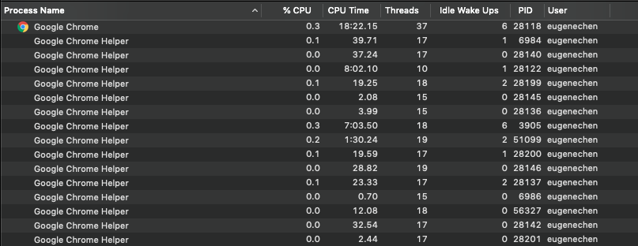
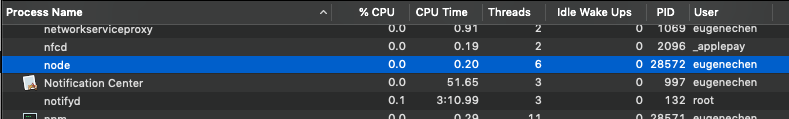
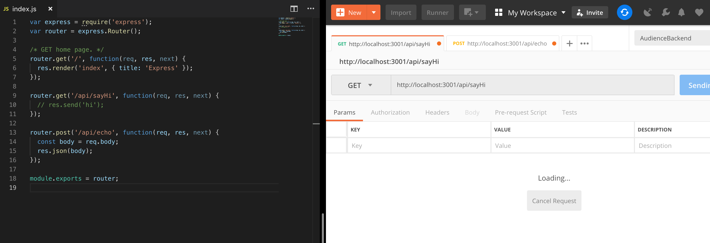
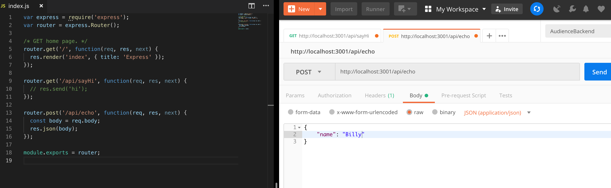

+++
title = "Day 12 - 二周目 - 準備起程深入後端"
date = "2018-10-12"
description = "用非同步 request 串接前後端做為一周目的收尾。"
featured = false
categories = [
]
tags = [
"2019 iT 邦幫忙鐵人賽",
"用js成為老闆心中的全端工程師"
]
images = [
]
series = [
"用js成為老闆心中的全端工程師 - 2019 iT邦幫忙鐵人賽"
]
+++

在一周目最後，用非同步 request 串接前後端做為一周目的收尾。

<!--more-->

# 回憶
恭喜你!! 完成了龐大一周目，我們在一周目11天內介紹了很多東西、工具，像是
* 下指令、Markdown
* 開專案
* draw.io
* VSCode
* Chrome devTools
* Postman

也寫了簡單的前後端
* hello-express
* hello-react

在一周目最後，用非同步 request 串接前後端做為一周目的收尾。

# 二周目的進行方法
完成一周目的你已經掌握了我們在[Day 1 - 前言／開發環境準備](https://ithelp.ithome.com.tw/articles/10199491)中提到的一周目目標：快速了解前後端在串什麼東西。原則上前面的知識已經可以開始開發自己的前後端，只是會覺得東缺西缺、不方便、效能不好或寫程式一直重覆程式碼，一但出現上述問題，恭喜你!有進步機會了!

接下來二周目要更深了解前後端，以主題式的方式進行，每篇應該都可以獨立看，可以自行選擇需要的看。

我覺得比起講如何套用，動機比較重要，所以我可能會花些時間在那，舉些什麼情況導致我們引入新的概念。這也跟學習過程經驗相近，遭遇困難、引入新東西、解決它。

# 前後端開發前的準備工作

軟體開發流程或方法論有很多種，且會因為公司、時間、人有所不同(見 [軟體開發流程是什麼？PM與UX Designer的區別？](https://medium.com/uxeastmeetswest/%E8%BB%9F%E9%AB%94%E9%96%8B%E7%99%BC%E6%B5%81%E7%A8%8B%E6%98%AF%E4%BB%80%E9%BA%BC-pm%E8%88%87ux-designer%E7%9A%84%E5%8D%80%E5%88%A5-75bf69a46016))，但從開發者的角度來看，以下工作多少都出現：

1. 企畫/需求分析：程式的目地性？有沒有意義？怎麼整合之前的軟體？
1. 軟體架構規畫：資料要存哪？資料如何串接？串接介面為何？要開幾個伺服器？效能好不好？有沒有彈性？需要認証機制？
1. 前端開發：畫面草稿(UI markup)？使用者操作感受如何(UX)？如何切版成HTML/CSS？怎麼串後端資料？
1. 後端後端：資料怎麼連線存取？認証機制怎麼實作？效能能否改善？程式能不能重用、模組化？
1. 發佈、測試：怎麼發佈前後端的程式？要發佈在哪個主機、雲端？需要申請DNS、SSL嗎？如何開防火牆？怎麼測試？上線後怎麼維運、監控？

上述種種問題全端工師都可能要面對，甚至有我沒有列舉到的。每個環節都息息相關，不論你是想學前端還是後端，多了解都是有幫助的。
> 這文章很有趣：[App / Web 開發工程師的三大錯覺，搞懂了就能成為大師](https://m.oursky.com/app-web-%E9%96%8B%E7%99%BC%E5%B7%A5%E7%A8%8B%E5%B8%AB%E7%9A%84%E4%B8%89%E5%A4%A7%E9%8C%AF%E8%A6%BA-%E6%90%9E%E6%87%82%E4%BA%86%E5%B0%B1%E8%83%BD%E6%88%90%E7%82%BA%E5%A4%A7%E5%B8%AB-de067af7a2f8)，提出有趣的錯覺：
    1. 錯覺一：「寫 app 專注在前端 (front-end) 就好了，不需要懂後端 (back-end)。」
    2. 錯覺二：「只要寫 React native 就不用碰到 iOS / Android 的 code。」
    3. 錯覺三：「這個 bug 我只要一個小時就能搞定。」

# 問題很多，但先從寫後端商業邏輯 ~~(當碼農)~~，是個不錯開始

寫後端商業邏輯你會直接碰到需求並實作，會考慮：
1. 需求如何實現？　－　商業邏輯就是需求，用程式碼實現。
1. 資料怎麼存？ －　資料可以存在記憶體、本地端硬碟還是資料庫，資料庫又可以讓各個後端連線、共享資料。
1. 寫完的商業邏輯如何提供服務？　－　採用Web API讓外界與你的後端互動，並告訢前端要打什麼API。
1. 怎麼發佈？　－　最簡單的方法就是在背景執行`npm run start`

# 開始深入Node.js 

接下來，看看看 Node.js 的特色

## Node.js 是單執行緒(single thread)
執行緒(Thread), 行程(Process)...!! 沒學過作業系統嗎？沒關西，這不是作業系統的課，了解概念就好。

首先，一隻程式是在執行時會把程式碼載入記憶體中等待 CUP 執行，這在記憶體中的實體就叫 `Process`。為了更有效率的使用 CPU，人們發明了更小執行單位，`Thread`，它是CUP最小的執行單位。

一般而言，一個 Process 可以有多個 `Thread`，以達到 CPU 多工，


而 Node.js 有一個很重要的事實
```
它只有一個執行緒(thread)
```
也就是 Node.js 在執行的時候，只產生一個 Process，且裡面只有一個 Thread。

有人會問：是不是說他的效率不好呢？也不是這麼說。不論一個 Process 內有多少Thread，都還是會受到 CUP 實際可以運算的數量(ex: 四核、八核)限制。太多的Thread會反而會造成[排程(scheduling)](https://zh.wikipedia.org/wiki/%E6%8E%92%E7%A8%8B)的系統負擔。反觀，單執行緒就只佔一個CPU運算單位，執行幾個 Node.js 程式就可以利用多少CPU。那…能不能說 Node.js 效能比其它語言好？我想是不能的，因為還要考慮程式碼的複雜程度、CPU的排程…等。

下圖是執行 `hello-express` 的結果


> 關於有Process/Thread興趣的人可以看看： [Program/Process/Thread 差異](https://medium.com/@totoroLiu/program-process-thread-%E5%B7%AE%E7%95%B0-4a360c7345e5)

## 非阻塞
還記得我們在 [Day 11 - 一周目- 開始玩轉前端(二)](https://ithelp.ithome.com.tw/articles/10200933)提到的非同步概念嗎？在 Node.js 中因為大量的使用非同步函數，所以產生非阻塞的特色。

用[官方的讀檔例子](https://nodejs.org/en/docs/guides/blocking-vs-non-blocking/) 來說，檔案相關的模組 `fs`，大部分同時提供非同步和同步函數，像是讀檔就有兩個 `fs.readFile()`　`fs.readFileSync()`：

``` javascript
const fs = require('fs');
const data = fs.readFileSync('/file.md'); // blocks here until file is read
console.log(data);
moreWork(); // will run after console.log
```
上面的例子，`moreWork();` 會等到 `fs.readFileSync()` 讀檔完成才執行。

改成非同步的版本
``` javascript
const fs = require('fs');
fs.readFile('/file.md', (err, data) => {
  if (err) throw err;
  console.log(data);
});
moreWork(); // will run before console.log
```
`moreWork()` 會在還沒讀檔完成前就會執行。

`非阻塞`的特色在處理 request 的 web server 很有幫助，一個 request 來的時後很多時候都要到資料庫讀取資料(I/O)。若讀取資料的操作是同步時，我們要等到資料庫回傳資料程式才能往下執行，這時其它的 request 都要等之前 request 結束才能換它們處理。然而，若讀取資料的操作是非同步時，我們就可以用等資料庫回傳前的時間來處理其它 request。

我們可以做個實驗，`hello-express`之前做了兩個 API， `GET /api/sayHi`、`POST /api/echo`，把 `GET /api/sayHi` 內的 `res.sned('hi')` 註解，就假設我們做的非同步的I/O，一直沒給回應。若這時用 Postman 打他

Postman不會給回應，因為我們一直不送出結果(除非 request timeout)。

若馬上發出 `POST /api/echo`

會發現，一樣可以馬上回應，就算前一個 request 還沒完成，Node.js 還是可以回應其它的 request。

## Node.js適合 I/O bound 的工作，不適合 CPU bound 的工作
Node.js 是單執行緒，若你的程式是計算型的程式，需要大量的 CPU 運算 (CPU bound)，其它的工作會因為計算而卡住。因為 Node.js 預期你的程式可以並發(Concurrency)，只留下非同步的callback，等別人完成(ex: 資料庫回應，或I/O 結束)再來繼續執行。這非阻塞的特色，使得等待可以被覆蓋(或者說同時等待)進而提高吞吐量(throughput)

## Event Loop 實現非阻塞
[Event Loop](https://nodejs.org/en/docs/guides/event-loop-timers-and-nexttick/) 是實現非阻塞操作的關鍵技術，不過我沒打算太詳細的說它，因為先了解運作、寫寫程式，抓到感覺再去深入也不遲。有基本的了解就足以應付大部分的情形了。

Event Loop，大致上長的像

```
   ┌───────────────────────────┐
┌─>│           timers          │
│  └─────────────┬─────────────┘
│  ┌─────────────┴─────────────┐
│  │     pending callbacks     │
│  └─────────────┬─────────────┘
│  ┌─────────────┴─────────────┐
│  │       idle, prepare       │
│  └─────────────┬─────────────┘      ┌───────────────┐
│  ┌─────────────┴─────────────┐      │   incoming:   │
│  │           poll            │<─────┤  connections, │
│  └─────────────┬─────────────┘      │   data, etc.  │
│  ┌─────────────┴─────────────┐      └───────────────┘
│  │           check           │
│  └─────────────┬─────────────┘
│  ┌─────────────┴─────────────┐
└──┤      close callbacks      │
   └───────────────────────────┘
```
圖片的串起來的每個區塊都是 queue，裡面放著一堆等待被執行的 callback fucntion ，queue 中的執行順序是 **先進先出(First In First Out, FIFO)**，區塊由上到下執行，直到所有的 queue 都空了，執行就會結束，關掉 process。

看下面的程式：
``` javascript
const a = 'hi';
setTimeout(() => {
  console.log('bye');
}, 1000); // 1秒後執行 callback()
console.log('done');
```
過程如下：
1. 當執行到 `setTimeout(callback)`，會把 callback 放到 ***timers*** 中。
1. `console.log('done')` 執行完，理當要結束的，但因為 ***timers*** 裡面還有東西，所以就一直等(loop的檢查每一個 queue)
1. 直到時間到，callback 執行完， ***timers*** 也空了
1. 當所有的 queue 都空，程式就結束了

我只提了大概的運作，這也足夠應付大部分的情形，有更多的細節請看 [The Node.js Event Loop, Timers, and process.nextTick()](https://nodejs.org/en/docs/guides/event-loop-timers-and-nexttick/)。若你注重效能、寫底層的套件、遭遇callback/Promise太多導致記憶體不足的人，我覺得一定要看。

> 這文章 [setTimeout async promise執行順序總結](https://blog.csdn.net/baidu_33295233/article/details/79335127) 的例子可以自己猜猜看結果。不過正常人應該不會寫出這種程式： async/await, setTimeout, Promise並發(Concurrency)，又要管 console.log 的順序

# 總結
今天提了全端工程師可能遭遇的問題。此外，也提點了 Node.js 的特性：
1. 單執行緒
2. 非阻塞
3. Node.js適合 I/O bound 的工作
4. Event Loop 實現非阻塞

> 題外話：我希望可以用白話的說法解釋概念，所以今天的文字有點多。
