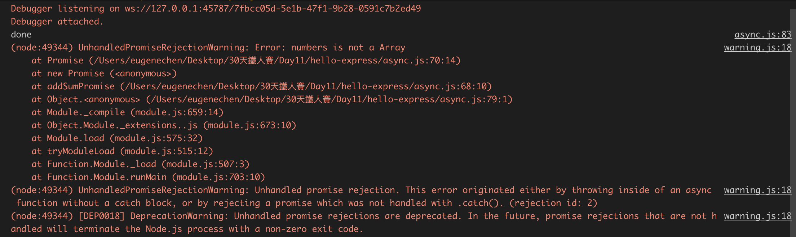

+++
title = "Day 13 - 二周目 - 非同步神器 Promise"
date = "2018-10-13"
description = "怎麼利用計時器(timer)函式`setTimeout`做出非同步執行的函數和用 `Promise` 包裝非同步函數。"
featured = false
categories = [
]
tags = [
"2019 iT 邦幫忙鐵人賽",
"用js成為老闆心中的全端工程師"
]
images = [
]
series = [
"用js成為老闆心中的全端工程師 - 2019 iT邦幫忙鐵人賽"
]
+++

今天要來談怎麼利用計時器(timer)函式`setTimeout`做出非同步執行的函數和用 `Promise` 包裝非同步函數。

<!--more-->

# 回憶
昨天我們提到 Node.js 非阻塞的特色，其實可以說 Node.js 到處都是非同步執行。

# 目標

今天要來談怎麼利用計時器(timer)函式`setTimeout`做出非同步執行的函數和用 `Promise` 包裝非同步函數。


# 自己做的非同步執行的函數：由同步轉成非同步

我們可以由同步的程式，改寫成非同步函數。

1. 考慮以下同步函數，`addSum` 是累加函數
    ``` javascript
    // 同步
    function addSum(numbers) {
        let sum = 0;
        numbers.forEach(number => sum = sum + number);
        return sum;
    }
    const numbers = [1, 2];
    console.log(addSum(numbers)); // 3
    ```

1. 先想介面：怎麼回傳？透過一個 callback function
    ``` javascript
    // 同步
    function addSum(numbers, callback) {
      let sum = 0;
      numbers.forEach(number => sum = sum + number);
      callback(sum);
    }
    const numbers = [1, 2];
    addSum(numbers, sum => {
      console.log(sum);
    })
    console.log('done');
    ```
    結果：
    ```
    3
    done
    ```
    `addSum(numbers, callback)`看起來是不是有非同步的影子了阿。但他其實還是同步函數，只是在內部呼叫 `callback(sum)`。

1. 調用系統計時器 `setTimeout()`
    ``` javascript
    // 非同步
    function addSum(numbers, callback) {
      setTimeout(() => {
        let sum = 0;
        numbers.forEach(number => sum = sum + number);
        callback(sum);
      }, 0);
    }
    const numbers = [1, 2];
    addSum(numbers, sum => {
      console.log(sum);
    })
    console.log('done');
    ```
    結果：
    ```
    done
    3
    ```
    雖然我們設定 0 秒，但不是指馬上執行，`setTimeout()` 會把裡面的 callback 放到 event loop 中的 queue (見 [Day 12 - 二周目 - 準備起程深入後端](https://ithelp.ithome.com.tw/articles/10201085))。當 `addSum()` 執行完後，`console.log('done')`印出 `done`，然後 event loop 就再迴圈一次，重新執行所有 queue 中的 callback function，發現我們有送入
    ``` javascript
    () => {
      let sum = 0;
      numbers.forEach(number => sum = sum + number);
      callback(sum);
    }
    ```
    就開始執行，`callback` 這變數因為箭頭函數產生閉包 (見：[Day 5 - 一周目- 從VSCode debug 模式看作用域(Scope)、this、閉包(Closure)](https://ithelp.ithome.com.tw/articles/10200107))，如下圖：
    
    
    
    `callback`有值，值是我們送入的
    ``` javascript
    sum => {
      console.log(sum);
    }
    ```
    所以 `callback(sum)` 最後印出 `3`

這樣就完成了把同步函數 `addSum(numbers)` 轉成非同步函數 `addSum(numbers, callback)`。

> 惡搞：你可以把 `setTimeout()` 改成 `setInterval()`，`setInterval()` 會一直在指定時間內重做(直到你 `clearInterval()`)，我們改成 1000 ms，就會一直印出 3。

你可以想想為什麼程式停不了？因為 event loop 的 timer queue 的 callback 一直在的關係，queue 永遠非空。

需要自己做的非同步函數的情況，我還真的比較少發生，因為這表示你用到大量的CPU計算，這時候你應該開子行程(subprocess)處理，主行程改用非同步呼叫子行程處理，這個技巧未來會提。反而，大部分是要重新包裝非同步函數，或使用別人的非同步函數。

> 在 Node.js 中，也提供 nextTick, setImmediate，它們都可以用來做非同步函數，可以看以下文章
    1. [詳解 setTimeout、setImmediate、process.nextTick 的區別](https://www.cnblogs.com/onepixel/articles/7605465.html)
    2. [Node探秘之事件循環（2）--setTimeout/setImmediate/process.nextTick的差別](https://www.jianshu.com/p/837b584e1bdd)


# 包裝非同步函數

非同步操作如下(截錄自[從Promise開始的JavaScript異步生活](https://eyesofkids.gitbooks.io/javascript-start-es6-promise/content/contents/before_start.html))
1. 使用計時器(timer)函式: `setTimeout`, `setInterval`
1. 特殊的函式: `nextTick`, `setImmediate`
1. 執行I/O: 監聽網路、資料庫查詢或讀寫外部資源
1. 訂閱事件：常用 `on('event name', callback)` 訂閱

1,2 常用來引起非同步，而 3,4 常用需要包裝非同步函數，使用我們的後端更有可讀性。

## 包裝神器 `Promise`

`Promise` 是一個物件，它遵從[Promises/A+](https://promisesaplus.com/)標準，下圖截錄自 [Promises/A+標準定義](https://eyesofkids.gitbooks.io/javascript-start-es6-promise/content/contents/promise_a_plus.html)

Promise 建立時是 pending 狀態，它可收到 value (透過`resolve(value)`) 就被鎖定成 fulfilled，不然就是收到 reason  (透過`reject(reason)`, `reason` 一般是 `Error` 物件)就被鎖定成 rejected。鎖定後再也動不了。

`Promise`物件的建立方法如下：
``` javascript
new Promise((resolve, reject) => {
});
```
`(resolve, reject) => {}` 這是 Promise 物件建立時就要立刻傳入的東西，也會立刻執行。
這裡我們可以用 `resolve(value)` 通知此 Promise resolve，也可以用 `reject(error)` 通知此 Promise reject。

### 用 Promse 包裝 `addSum(number, callback)`：改變函數簽章 `addSumPromise(numbers)`
我們曾提過 Pomise 方便的地方在於可以用 `then().catch()` 鍊式語法，所以我們把 `addSum(numbers, callback)`包裝成 `addSumPromise(numbers)`，它回傳 Promise 物件，就可以用鍊式語法

``` javascript
// 包裝非同步回傳 Promise
function addSum(numbers, callback) {
  setTimeout(() => {
    let sum = 0;
    numbers.forEach(number => sum = sum + number);
    callback(sum);
  }, 0);
}
function addSumPromise(numbers) {
  return new Promise((resolve, reject) => {
    addSum(numbers, sum => {
      resolve(sum);
    })
  });
}
const numbers = [1, 2];
addSumPromise(numbers)
  .then(sum => {
    console.log(sum);
  })
console.log('done');
```
我們利用回傳 Promise 物件，可以把 callback 參數拿掉，就可以享有鍊式語法。

### 強化 `addSumPromise()` 參數處理
有沒有發現我們的 `addSum()` 很脆弱，可以加入一些判斷使它強健一點。例如我們要確保 numbers 是 Array，若不是的話就回傳的 reject promise
``` javascript
// 包裝非同步回傳 Promise
function addSum(numbers, callback) {
  setTimeout(() => {
    let sum = 0;
    numbers.forEach(number => sum = sum + number);
    callback(sum);
  }, 0);
}
function addSumPromise(numbers) {
  return new Promise((resolve, reject) => {
    if(!Array.isArray(numbers)) {
      reject(new Error('numbers is not a Array'));
      return; // 這行要寫，雖然Promise 狀態不變，但下面的程式一樣會執行
    }
    addSum(numbers, sum => {
      resolve(sum);
    })
  });
}
const numbers = {};
addSumPromise(numbers)
  .then(sum => {
    console.log(sum);
  })
console.log('done');
```
就可以得到

`addSumPromise({})` 會得到一個 reject promise。我們注意以下幾點：
1. `console.log('done')` 一樣有執行，不會因為 reject promise。
2. 新版的Node.js 現在會告訢你有一個未處理的 Promise，且這 Error 不是例外發生，不會引起程式插斷(interrupts)，執行會一直下去。因此，你不處理的話就這錯誤就不見了。

所以改成下面
``` javascript
addSumPromise(numbers)
  .then(sum => {
    console.log(sum);
  })
  .catch(error => {
    console.error(error);
  })
```
這麼一來 Promise 就處理完所有的非同步的情況了。

### 小總結
我們舉了 `addSum(numbers, callback)`為例子，再用 Promise 包裝改成像是 `addSum(number)`。早期非同步函數中，常常有 callback function 當參數，callback 的簽章一般是`(err, value) => ...`，常會利用上述方法包裝成 Promise 的版本方便使用。另外，Node.js 也提供 [util.promisify()](https://nodejs.org/dist/latest-v10.x/docs/api/util.html#util_util_promisify_original) 快速轉換。

最近的套件有時也會同時提供兩種版本(callback版或回傳Promise)，像是 Node.js MongoDB Driver API 或是 [`fs-extra`](https://github.com/jprichardson/node-fs-extra)。 `fs-extra` 我會拿來取代原生的 `fs`，它也提供好用的函數。另外，在Node.js 10 以後，`fs.promises` 也開始支援 Promise版。

## `then().catch()` 鍊式語法：Promise 物件好用之處
`then().catch()` 可以說是 Promise 的核心之一，`then()` 和 `catch()`函數被 Promises/A+ 規定要回傳 Promise，他可以讓我們的非同步操作串接起來。

### `then(callback)`/`catch(callback)`的 callback 叫起與回傳
`then(callback)`/`catch(callback)` 中的 callback 被叫起：
1. `aPromise.then(callback)`：當 aPromise resolve時，resolve value 送入 callback(value)
1. `aPromise.catch(callback)`：當 aPromise reject，reject reason 送入 callback(reason)

`then(callback)`/`catch(callback)` 中的 callback 可以回傳：
1. 回傳 Primitive值：如undefined, object, number, string...等，`then()` 會回傳 resolve promise
    ``` javascript
      .then(() => ({name: 'Billy'})) // resolve promise
    ```
1. 回傳 Promise：`then()`會和回傳的 promise 同樣狀態
    ``` javascript
      .then(() => Promise.resolve()) // resolve promise
    ```
    ``` javascript
      .then(() => Promise.reject()) // reject promise
    ```
> 這裡的：`Promise.resolve()` 直接回傳 reolve promise 物件；`Promise.reject()` 直接回傳 reject promise 物件

> 其實：`then()`的完整簽章是：`then(resoveCallback, rejectCallback)`，這個我比較少用，反而常用`then(resoveCallback).catch(rejectCallback)`

### 一個鍊式例子
例如，我們要查詢一個人的訂單要做兩個非同步的查詢：
1. `fetchPerson(name)`　－　查人
1. `fetchOrders(person)`　－　查此人的訂單

``` javascript
// then()　鍊式
function fetchOrders(person) {
  const orders = person.orderIds.map(id => ({ id }));
  return Promise.resolve(orders); // 直接回傳 reolve promise 物件
}

function fetchPerson(name) {
  // return Promise.reject(new Error('name is not string')); // 直接回傳 reject promise 物件
  return Promise.resolve({
    name,
    orderIds: ['A', 'B']
  });
}

fetchPerson('Billy')
    .then(fetchOrders)
    .then(orders => {
      orders.forEach(order => {
        console.log(order);
      })
    })
    .catch(console.error);
```


我們利用 `then()` 把非同步操作串接起來，且 `fetchPerson()`、`fetchOrders()`任一個Promise 發生 reject 才會引起 `.catch()` 發生。若前面的任一個Promise reject，後面的 `then()` 都不會發生直到 `catch()`。（你可以把解開註解看看 `// return Promise.reject(new Error('name is not string'));`）

### `.catch()`常犯的錯：`.catch(callback)` 可能是回傳 resolve promise
在用鍊式時你可能會想要截斷某個reject，查看結果，常會寫以下的程式
``` javascript
Promise.resolve(1)
  .then(() => Promise.reject(new Error('error 1')))
  .catch(console.error)
  .then(() => Promise.resolve(2))
  .then(console.log)
  .catch(console.error)
```
這結果是
```
Error: error 1
2
```
這是因為 `.catch(console.error)` 寫清楚一點就是
``` javascript
function catch(error) => {
  return console.error(error); // console.error() 回傳 undefined
}
```
因為回傳 undefined，所以 `.catch()` 的回傳是 resolve promise，這使下一行的 `.then(() => Promise.resolve(2))`執行。因此，你若要保持 reject 往下傳，要用 `Promise.reject()`
``` javascript
Promise.resolve(1)
  .then(() => Promise.reject(new Error('error 1')))
  .catch(error => {
    console.error(error);
    return Promise.reject(error);
  })
  .then(() => Promise.resolve(2))
  .then(console.log)
  .catch(console.error)
```
才會得到
```
Error: error 1
Error: error 1
```

### Promise 的例發發生會導致 reject
一但進入 Promise後在內部的執行不論在哪丟出例外都會導致 promise reject

``` javascript
// Promise 的例外發生
function somePromise() {
  return new Promise((resolve, reject) => {
    // throw new Error('constructor error');
    resolve();
  });
}
somePromise()
  .then(sum => {
    // throw new Error('resolve error');
    console.log('done');
  })
  .catch(error => {
    console.error(error);
  });
```
你可以解開註解看看，都是會產生 reject promise。

這事實可以看成是，Promise 幫我們包住了所有例外，某方面降低了程式當掉的可能。

# 總結
今天如何利用 `setTimeout()` 做非同步函數，還用 Promise 包裝它，且介紹 `then().catch()`鍊式語法。
