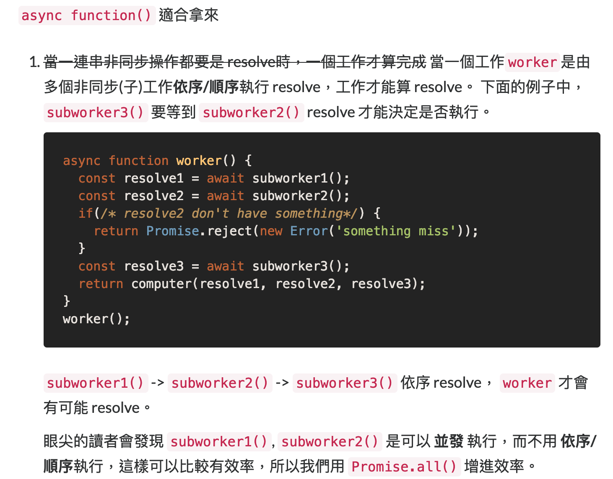
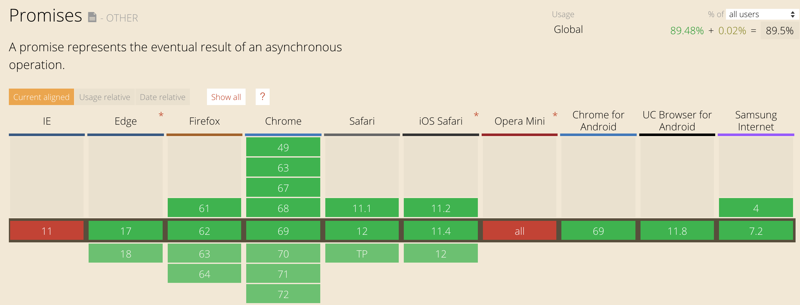
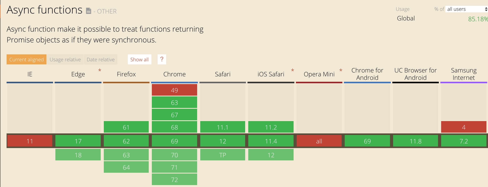

+++
title = "Day 14 - 二周目 - 從Promise 昇華到 async:await"
date = "2018-10-14"
description = "從 Promise 昇華到 async:await"
featured = false
categories = [
]
tags = [
"2019 iT 邦幫忙鐵人賽",
"用js成為老闆心中的全端工程師"
]
images = [
]
series = [
"用js成為老闆心中的全端工程師 - 2019 iT邦幫忙鐵人賽"
]
+++

從 Promise 昇華到 async:await

<!--more-->

# 修正
## 2019-02-18
謝謝 [文祥](https://ithelp.ithome.com.tw/articles/10201420#response-309921) 的提醒
> 

此處的例子太過複雜沒有表現出 **依序/順序** 的重點。內文增加一些說明，如下：



# 回憶
昨天介紹了非同步神器 Promise 來包裝非同步函數穫得不用帶入 callback 當參數的簽章，爾後還可以使用 `then().catch()` 的鍊式語法

# 目標
今天要來介紹
1. Promise 解決了什麼問題？
2. asyn/await 這語法糖衣讓語法更自然
3. 他們要怎麼選用？

# 非同步 callback 的產生的 **callback hell**

非同步的函數通常要帶入 callback function當參數，等到結果出來才會被呼叫。若一大堆非同步串在一起就會出現 **callback hell**：

下圖截自 [Node 7.6 + Koa 2: asynchronous flow control made right](https://medium.com/ninjadevs/node-7-6-koa-2-asynchronous-flow-control-made-right-b0d41c6ba570)


以昨天 [Day 13 - 二周目 - 非同步神器 Promise](https://ithelp.ithome.com.tw/articles/10201276) 的例子來說：
兩個函數 `fetchOrders()` 和 `fetchPerson()`
``` javascript
function fetchOrders(person) {
  const orders = person.orderIds.map(id => ({ id }));
  return Promise.resolve(orders);
}

function fetchPerson(name) {
  return Promise.resolve({
    name,
    orderIds: ['A', 'B']
  });
}
```
可以串成
``` javascript
fetchPerson('Billy')
    .then(fetchOrders)
    .then(orders => {
      orders.forEach(order => {
        console.log(order);
      })
    })
    .catch(console.error);
```
若是 callback 版本就是像
``` javascript
// callback version with arrow functions
fetchPerson('Billy', (error, person) => {
  if(error) {
    console.error(error);
    return;
  }
  fetchOrders(person, (_error, orders) => {
    if(_error) {
      console.error(_error);
      return;
    }
    orders.forEach(order => {
      console.log(order);
    });
  })
});
```
為了必免混淆，我們刻意把內層的 `error` 改成 `_error`

若沒有箭頭函數，更會使人抓狂
``` javascript
// callback version with normal functions
fetchPerson('Billy', function (error, person) {
  if(error) {
    console.error(error);
    return;
  }
  fetchOrders(person, function (_error, orders) {
    if(_error) {
      console.error(_error);
      return;
    }
    orders.forEach(order => {
      console.log(order);
    });
  })
});
```

callback 版本的的問題：
1. 可讀性大幅度降低
2. 處理錯誤發生的程式都要重寫一次，就算抽出一個共用的錯誤處理函數，也是要寫呼叫錯誤處理函數

因此，Promise 的出現可以降低 callback hell 的發生 ~~(可能從第18層地獄到第2層地獄)~~。

## `then()...catch()` 鍊式語法的問題：非同步函數簽章需完整契合
`then()...catch()` 鍊式語法也不是沒有問題，我們注意看函數簽章

1. `fetchPerson()` 的簽章：`function(name: string): Promise<object>`
    `fetchPerson(name)`，這裡 `name` 是 `string`，resolve value 是 `object`
1. `fetchOrders()` 的簽章：`function(person: {orderIds: array<string>}): Promise<array<object>>`
    `fetchOrders(person)`，這裡 `person` 是 `object`且有一個`orderIds`屬性的字串陣列，resolve value 是 `object` 的陣列

> 為了更清楚表達：這裡我們偷引入[JSDoc](http://usejsdoc.org/)
    1. `A: B` 用在參數時, 後面(B)是前面參數名(A) 的型態 
    2. `function(): C` 用在函數時 在後面(C)就是函數的回傳
    3. `Promise<D>` 是指 Promise 的 resolve value 型態是 D
    4. `array<E>` 是指型態 E 元素的陣列
    5. `{propertyName: F}` 是指一個物件有 `propertyName` 屬性，且型態是 F

為了讓 `then()` 可以串接，`fetchPerson()`　回傳的 resolve value 必需有 `object`且有一個`orderIds`屬性的字串陣列，或者說 `fetchOrders()`的實作要認識 `fetchPerson()` 的回傳才可以
``` javascript
fetchPerson('Billy')
    .then(fetchOrders)
```
然而，實務上不太可能，因為非同步函數可能不是你寫的。

若改成 `fetchOrders(orderIds)`，參數改成是字串陣列
``` javascript
function fetchOrders(orderIds) {
  const orders = orderIds.map(id => ({ id }));
  return Promise.resolve(orders);
}

function fetchPerson(name) {
  return Promise.resolve({
    name,
    orderIds: ['A', 'B']
  });
}
```
對應的鍊式就要改成
``` javascript
fetchPerson('Billy')
    .then(person => {
        const {orderIds} = person;
        return fetchOrders(orderIds);
    })
// 或直接解構
fetchPerson('Billy')
    .then(({orderIds}) => {
        return fetchOrders(orderIds);
    })
```
我們只需要多一個箭頭函數就可以解構 `person` 的 `orderIds`，再往下傳。
解構的程式是少不了的，但這樣不是又多出了一個 callback function嗎？

## 非同步語法糖衣 `async/await`

`async/await`的出現解開了前面的麻煩，我們先看最後的樣子：
我們的目地是從名字(name) 查詢出訂單(orders)，所以命名一個函數 `getOrdersFromPersonName`

``` javascript
async function getOrdersFromPersonName(name) {
  const person = await fetchPerson(name);
  const {orderIds} = person;
  const orders = await fetchOrders(orderIds);
  return orders;
}
```
使用如下：
``` javascript
getOrdersFromPersonName('Billy')
  .then(orders => {
    orders.forEach(order => {
      console.log(order);
    })
  })
  .catch(console.error);
```

`getOrdersFromPersonName()`的實作看起來就像是同步函數，只要：
1. `getOrdersFromPersonName()` 定義前面加上 `async`
2. 所有回傳 Promise 的非同函數前面都可以加上 `await` ，被加上時就會等到 resolve value 出現程式才會往下走

使用起來很簡單、自然。

接下來，來詳細的說明 `async/await`

### `async function()` 是回傳 Promise
定義時加入 `async` 的函數會變成回傳Promise，且實作中的 `return` 的值會被當做 resolve value。他的規則如同 [Day 13 - 二周目 - 非同步神器 Promise](https://ithelp.ithome.com.tw/articles/10201276) 中 `.then(callback)` 的 callback 的回傳。若：
1. 回傳 Primitive值：如undefined, object, number, string...等，`async getOrdersFromPersonName()` 會回傳 resolve promise
1. 回傳 Promise：`async getOrdersFromPersonName()`會和回傳的 promise 同樣狀態
    ``` javascript
    async getOrdersFromPersonName() {
      return Promise.resolve();
    }
    getOrdersFromPersonName(); // resolve promise
    ```
    ``` javascript
    async getOrdersFromPersonName() {
      return Promise.reject();
    }
    getOrdersFromPersonName(); // reject promise
    ```

### `async function()` 的 reject 處理
在 `getOrdersFromPersonName(name)` 裡的 **執行路徑上** 所有 `await` 的 Promise 物件有任何一個 reject，則程式會 **跳離** `getOrdersFromPersonName()`，且 `getOrdersFromPersonName()` 會回傳 reject promise 而且 reason 是發生 reject promise 的 reason。
``` javascript
async function getOrdersFromPersonName(name) {
  const person = await fetchPerson(name);  // 若 reject, 則 getOrdersFromPersonName() reject　且是 fetchPerson() 引起的 reason
  const {orderIds} = person;
  const orders = await fetchOrders(orderIds); // 若 reject, 則 getOrdersFromPersonName() reject 且是 fetchOrders() 引起的 reason
  return orders;
}
```

就好像丟出一個例外(exception)，只是不會引起例外，而是變成 reject promise.

#### 怎麼攔截內部的 reject reason
我們可以用 `try..catch` 攔截中間的 reject reason，例如：
``` javascript
async function getOrdersFromPersonName(name) {
  let person;
  try {
    person = await fetchPerson(name);
  } catch(error) { // 處理 reject reason，讓程式繼續
    console.warn(error);
    person = {name: '訪客'};
  }
  
  const {orderIds} = person;
  const orders = await fetchOrders(orderIds);
  return orders;
}
```
`fetchPerson(name)` 丟出的 error reason 會被 `try..catch` 攔截，然後 `getOrdersFromPersonName()` 繼續執行。

若都不寫 `try..catch`，`async function getOrdersFromPersonName(name)` 就像是有個超大的`try..catch`包著，所以 `getOrdersFromPersonName(name)`的執行不可能丟出例外，最多只會變成 reject prmoise。因此，`async function()` 可以說被保護著，但在強調一次
```
Promise 可能會發生 reject，強健的程式應該要 ".catch()" reject reason，不然就漏接了。
```

上圖來自[A quick guide to JavaScript Promises](https://www.twilio.com/blog/2016/10/guide-to-javascript-promises.html)

### 可以在裡面丟出例外
你可以在 `async function()` 中使用 `throw` 丟出例外，也可以用 `try...catch`攔截。

``` javascript
async function foo() {
  try {
    throw new Error('foo 1');
  } (error) {
    console.error(error);
    throw new Error('foo 2');
  }
}

foo(); // reject promise with Error('foo 2') reason
```
這樣就會變成回傳 reject promise。

你也可以用 `return Promise.reject()` 直接表明回傳的東西，如下
``` javascript
async function foo() {
  try {
    throw new Error('foo 1');
  } (error) {
    console.error(error);
    return Promise.reject(new Error('foo 2'));
  }
}

foo(); // reject promise with Error('foo 2') reason
```

我個人是習慣用 `return Promise.reject()`，因為比較好掌控自己有處理過的例外，也知道是哪產生的。若出現沒看過的reject reason 表示有潛在的例外可能會發生，而是 `async function()` 幫你處理了。


## async/await VS Promise 物件用誰？它們可以互相取代嗎？
這問題我覺得沒有一定答案？拿它們來比較有點怪，因為各有各的優、缺點和用法，找到自己的程式風格和混合使用才能有比較好的可讀性。

Promise 適合拿來
1. 包裝具有 callback 的函數，以修改函數簽章
1. 支援度，但 `async/await` 就算不支援也可以用[轉譯的](https://ithelp.ithome.com.tw/articles/10200734)
    
    
1. 鍊式寫起來可以用比較短的程式碼，不像 `async function()` 還要包裝
1. 截斷中間的 reject promise，debug 時很好用，反觀 `async function()` 要用 `try...catch`這種產生分支的語法。
    ``` javascript
    Promise.resolve(1)
      .then(() => Promise.reject(new Error('error 1')))
      .catch(error => {
        console.log(error);
        return Promise.reject(error);
      })
      .then(() => Promise.resolve(2))
      .then(console.log)
      .catch(console.error)
    ```

`async function()` 適合拿來
1. ~~當一連串非同步操作都要是 resolve時，一個工作才算完成~~ 當一個工作`worker`是由多個非同步(子)工作**依序/順序**執行 resolve，工作才能算 resolve。 下面的例子中，`subworker3()` 要等到 `subworker2()` resolve 才能決定是否執行。
    ``` javascript
    async function worker() {
      const resolve1 = await subworker1();
      const resolve2 = await subworker2();
      if(/* resolve2 don't have something*/) {
        return Promise.reject(new Error('something miss'));
      }
      const resolve3 = await subworker3();
      return computer(resolve1, resolve2, resolve3);
    }
    worker();
    ```
    `subworker1()` -> `subworker2()` -> `subworker3()` 依序 resolve， `worker` 才會 resolve。
    
    眼尖的讀者會發現 `subworker1()`, `subworker2()` 是可以 **並發** 執行，而不用 **依序/順序**執行，這樣可以比較有效率，所以我們用 `Promise.all()` 增進效率。
    ``` javascript
    async function worker() {
      const reslut_1_2 = await　Promise.all([subworker1(), subworker2()]);
      const resolve1 = reslut_1_2[0];
      const resolve2 = reslut_1_2[1];
      if(/* resolve2 don't have something*/) {
        return Promise.reject(new Error('something miss'));
      }
      const resolve3 = await subworker3();
      return computer(resolve1, resolve2, resolve3);
    }
    worker();
    ```
    若是全改用 prmoise 會很麻煩(尤其是有條件出現)
    ``` javascript
    const workerPromise = Promise.all([subworker1(), subworker2()])
      .then(([resolve1, resolve2]) => {
        if(/* resolve2 don't have something*/) {
          return Promise.reject(new Error('something miss'));
        }
        return subworker3().then(resolve3 => ([resolve1, resolve2, resolve3]));
      })
      .then(([resolve1, resolve2, resolve3]) => {
        return computer(resolve1, resolve2, resolve3);
      })
    workerPromise // promise
    ```
    > 這裡偷用了 `Promise.all(promises)`， promises 是一個 promise array, 所有的 promise 都要 resolve，`Promise.all(promises)` 才會 resolve，否則就是 reject。`Promise.all(promises)` 的 resolve value 是 promise array 的 resolve array。
    
2. 可讀性好，看起來像同步函數
3. 保護未處理到的例外，因為 `asyn function()` 不會丟出例外，只有 reject promise

最後，還有一點很重要

```
Promise 和 async/await 可以執行在 Node.js 和 瀏覽器(但可能要轉譯)。
```

# 補完 Promise 的相關函數
1. `.finally()`：除了 `.then()` 和 `.catch()`外，還有一個 `.finally()`， 這是不論怎麼是 reject / resolve 都一定會回調，通常用在進行一些事後處理或清理用不到的資料。
1. `bluebird`：標準 Promise 提供建立 Promise 物件的建構函數只有：`Promise.resolve()`、`Promise.reject()`、`Promise.all()`、`Promise.race()`。有點不夠用，[bluebird](http://bluebirdjs.com/docs/api-reference.html) 提供更多好用的 Promise 相關函數，像是要求 map 產生的 Promise 元系依序執行 `Promise.mapSeries()`…等

# 總結

今天再深入的探討 Promise 、引入 `async/await` 和比較它們。它們在 Node.js 和 瀏覽器扮演很重要的角色，所以它們值得我們花兩天學習。
