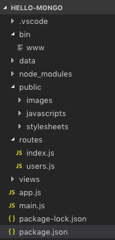
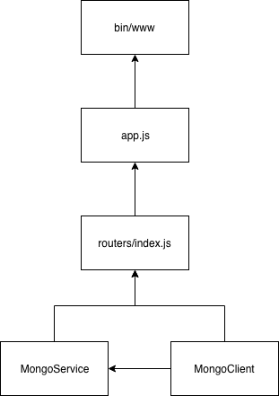
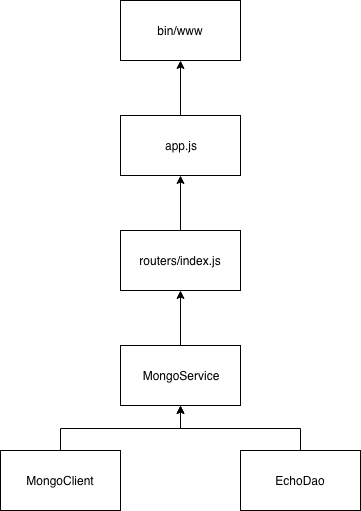

+++
title = "Day 16 - 二周目 - 強化後端專案結構"
date = "2018-10-16"
description = "專案結構介紹、了解如何重構，將商務邏輯拆的更細"
featured = false
categories = [
]
tags = [
"2019 iT 邦幫忙鐵人賽",
"用js成為老闆心中的全端工程師"
]
images = [
]
series = [
"用js成為老闆心中的全端工程師 - 2019 iT邦幫忙鐵人賽"
]
+++

專案結構介紹、了解如何重構，將商務邏輯拆的更細


<!--more-->

# 回憶

昨天我們使用Node.js Driver 操作 MongoDB，寫出下面的程式

``` javascript
const MongoClient = require('mongodb').MongoClient;

// 建立連線
const url = 'mongodb://localhost:27017';
const dbName = 'myproject';
const client = new MongoClient(url, {useNewUrlParser: true});
client.connect()
  .then((connectedClient) => {
    console.log('mongodb is connected');
  })
  .catch(error => {
    console.error(error);
  });

// GET /api/mongo
router.get('/api/mongo', function (req, res, next) {
  // 回應
  res.json({
    isConnected: client.isConnected(),
  });
});

// GET /api/echo
router.post('/api/echo', function (req, res, next) {
  const body = req.body;

  // 處理
  const worker = (async function (data) {
    const db = client.db(dbName);
    const collection = db.collection('echo');
    const result = await collection.insertOne(data);
    console.log(result);
    return result;
  })(body);

  // 回應
  worker.then(() => {
    res.json(body);
  })
    .catch(next); 
});
```

會出現以下問題：

* 萬一我們的 client，要在別的地方用怎麼辨？
* 明明是 `.src/router/index.js` 路由的程式，為什麼會放資料庫連線邏輯？
* 這種混雜的各種邏輯的程式要怎麼寫測試、維護？

# 目標
要解決以上問題需要從專案結構下手，跟程式語言沒什麼關係。

1. 專案結構介紹
2. 了解如何重構，將商務邏輯拆的更細

> 因為後端的目地、功能的見解、認知不同，每個人做出的專案結構一定會不一樣，這是正常的。

# express 的專案結構
打開 `hello-mongo`，我們先來看看 express 給我們預設的專案結構



* **bin** : Node.js 入口程式資料夾
    * **www** : Web Server 的入口
* **public** : 存放靜態的檔案資料夾
* **routes** : 路由資料夾
    * **index.js** :  `/` 路由的根目路
    *  **users.js** : 其它路由的範例程式
* **views** : 網頁樣版 (我們的後端是 application server，不太用的到，不理它)
    * **error.hbs** : 錯誤發生的網頁樣版
    * **index.hbs** : 首頁的網頁樣版
    * **layout.hbs** : 網頁的 layout
* **app.js** : 應用程式的初始化設定

express 提供基本的 Web Server 應該要有的目錄，但我們的後端顯然不夠，我們修改成以下

* **bin** : Node.js 入口程式資料夾
    * **www** : Web Server 的入口
* **public** : 存放靜態的檔案資料夾
* **middlewares** : 中間件(middleware)資料夾
* **routes** : 跟它同義的有 controller。路由資料夾
    * **index.js** :  `/` 路由的根目路
    *  **users.js** : 其它路由的範例程式
* **app.js** : 應用程式的初始化設定
* **services** : 服務模組資料夾
* **daos** : 資料存取模組資料夾
* **utilities** : 共用工具資料夾

我們多出了，middlewares、services、daos、utilities，

middlewares、services、daos、utilities 的職責概述：
* **middlewares** : 提供 router 使用的中間件
* **services** : 提供 router 使用的模組，函數定義時常會 Web API 有關。可以使用其它 service 和 dao。
* **daos** : data acess object，跟它同義的有 repositories / models(mongoose常用)。提供資料存取用，要跟資料庫互動。
* **utilities** : 常用的工具庫，整個專案都有可能使用，所以應該要減少相依。常是一些小工具，像是：`formatDate(date)`。

我們依照職責概述重構程式

## 重構 `GET /api/mongo` 
重構過程見 [ithelp-30dayfullstack-Day16](https://github.com/eugenechen0514/ithelp-30dayfullstack-Day16/tree/master/)
[網頁版專案 codesandbox(只能看檔案，不能執行)](https://codesandbox.io/s/github/eugenechen0514/ithelp-30dayfullstack-Day16)
我們約定：
1. 類別為 `MongoClient` 時，建立的物件會取為 `mongoClient`，依些類推

### 把資料庫連線放到 `app.js`
``` javascript
const MongoClient = require('mongodb').MongoClient;
const url = 'mongodb://localhost:27017';
const dbName = 'myproject';
const client = new MongoClient(url, { useNewUrlParser: true });
client.connect()
  .then((connectedClient) => {
    console.log('mongodb is connected');
  })
  .catch(error => {
    console.error(error);
  });
```
資料庫連線放在 **app.js** ，因為後端一啟動就一定要連上，不然就後面都不用玩了。

### `./routers/index.js` 控制反轉(Inversion of Control)
我們用 `createRouter(dependencies)` 包住整個程式碼，給外界注入相依後才建立 router 物件。

`./routers/index.js` 相依的是 `client`，改成在 `app.js` 中才用 `createRouter({client})` 注入
``` javascript
/**
 * 
 * @param {MongoClient} client 
 */
function createRouter(dependencies) {
  // Get dependencies
  const {client} = dependencies;
  if(!client) {
    throw new Error('client is empty');
  }

  // Create a router
  var router = express.Router();

  /* GET home page. */
  router.get('/', function (req, res, next) {
    ...略
  });

  router.get('/api/sayHi', function (req, res, next) {
    ...略
  });

  router.post('/api/echo', function (req, res, next) {
    ...略
  });

  router.get('/api/mongo', function (req, res, next) {
    ...略
  });

  const mongoose = require('mongoose');
  router.get('/api/mongoose', function (req, res, next) {
    ...略
  });

  return router;
}

module.exports = {
  createRouter
};
```

然後修改使用`./routers/index.js` 的 `app.js`
``` javascript
...略
const indexRouter = require('./routes/index');
...略
app.use('/', indexRouter);
...略
```
改成
``` javascript
...略
const {createRouter: createRootRouter} = require('./routes/index');
const indexRouter = createRootRouter({client});
...略
app.use('/', indexRouter);
...略
```

### 建立 `MongoSevice` class，放在 `./services/MongoSevice.js`
``` javascript
class MongoService {
    /**
     * 
     * @param {MongoClient} mongoClient
     */
    constructor({mongoClient}) {
        this.mongoClient = mongoClient;
    }

    /**
     * 
     * @returns Promise<bool>
     */
    isConnected() {
        return Promise.resolve(this.mongoClient.isConnected())
    }
}
module.exports = MongoService;
```

我們把 `GET /api/mongo` 的實作放在 `MongoService` 的 `isConnected()`。

### `./routers/index.js` 使用 `MongoService` 物件
多增加一個 `MongoService`的依賴項，`mongoService` 是 `MongoService` 物件。

``` javascript
/**
 * 
 * @param {object} dependencies
 * @param {MongoService} dependencies.mongoService 
 * @param {MongoClient} dependencies.client 
 */
function createRouter(dependencies) {
  // Get dependencies
  const { client, mongoService } = dependencies;
  if (!client) {
    throw new Error('client is empty');
  }
  ...略
}
```

`GET /api/mongo` 改成使用 `MongoService` 物件
``` javascript
 router.get('/api/mongo', function (req, res, next) {
    mongoService.isConnected()
      .then(isConnected => {
        res.json({isConnected});
      })
      .catch(next);
  });
```

最後，在 `app.js` 建立 `MongoService` 物件並注入
``` javascript
const MongoService = require('./services/MongoService');

const mongoService = new MongoService({mongoClient: client});
const {createRouter: createRootRouter} = require('./routes/index');
const indexRouter = createRootRouter({client, mongoService});
```

我們總結一下，我們所做的事
1. 建立了 `MongoService` 物件，router 會使用 `MongoService` 物件完成實作(ex: `isConnected()`)而不是把實作留在 router，router 因該專心對付 web api的介接
2. 所有物件的建立被我們移到了 `app.js`，它們的相依性如下圖(注：這不是UML class diagram，只是表達關係)
    

接下來我們可以更進一步重構 `POST /api/echo`，這樣我們就可以把 `./routers/index.js` 對 `client` 的相依拿掉，讓它只面對 `MongoService`，之後的相依關係就更單純了。


## 重構 `POST /api/echo`

### 把 `POST /api/echo` 的資料庫操作移到 `MongoService` 的 `insertEcho()`

加入 `insertEcho()`後，移除 `POST /api/echo` 資料庫操作，且改成使用 `MongoService` 的 `insertEcho()`
``` javascript
class MongoService {
    ...略

    /**
     * 
     * @param {*} data 
     * @returns Promise
     */
    async insertEcho(data) {
        const dbName = 'myproject';
        const db = this.mongoClient.db(dbName);
        const collection = db.collection('echo');
        const result = await collection.insertOne(data);
        console.log(result);
        return result;
    }
}
```

`./routers/index.js` 的 `POST /api/echo` 變成
``` javascript
  router.post('/api/echo', function (req, res, next) {
    const body = req.body;

    mongoService.insertEcho(body)
      .then(() => {
        res.json(body);
      })
      .catch(next);
  });
```

### 移除 `./routers/index.js` 對 client 的相依
因為 `./routers/index.js` 沒有用到 client，可以移除了，且`app.js`中也不用注入 clinet了
``` javascript
const {createRouter: createRootRouter} = require('./routes/index');
const indexRouter = createRootRouter({mongoService});
```

我們完成了，得到更單純的關係


## 提出 DAO
我自可以更進一步重構出更底層的 DAO 出來，例如 EchoDao

### 建立 `EchoDao`

``` javascript
class EchoDao {
    /**
     * 
     * @param {MongoClient} mongoClient
     */
    constructor({ mongoClient }) {
        this.mongoClient = mongoClient;
    }

    insert(data) {
    }
}

module.exports = EchoDao;
```

### 把 `MongoService` 的資料章操作移到 `insertEcho()`
``` javascript
class EchoDao {
    /**
     * 
     * @param {MongoClient} mongoClient
     */
    constructor({ mongoClient }) {
        this.mongoClient = mongoClient;
    }

    insert(data) {
        const dbName = 'myproject';
        const db = this.mongoClient.db(dbName);
        const collection = db.collection('echo');
        return await collection.insertOne(data);
    }
}

module.exports = EchoDao;
```

###  `MongoService` 使用 `EchoDao`
加入相依

``` javascript
class MongoService {
    /**
     * 
     * @param {MongoClient} mongoClient
     * @param {EchoDao} echoDao
     */
    constructor({ mongoClient, echoDao }) {
        this.mongoClient = mongoClient;
        this.echoDao = echoDao;
    }
    ...略

    /**
     * 
     * @param {*} data 
     * @returns Promise
     */
    async insertEcho(data) {
        return this.echoDao.insert(data);
    }
}

module.exports = MongoService;
```

### 修改 `app.js` 中 `MongoService` 的建立
加入 `echoDao` 的相依
``` javascript
const EchoDao = require('./daos/EchoDao');

const echoDao = new EchoDao({mongoClient: client});
const mongoService = new MongoService({mongoClient: client, echoDao});
```

## 重構總結
經過重構 `GET /api/mongo` 和 `POST /api/echo`，我們完成了最後的樣子



這結構有什麼好處
1. 商業邏輯依照職責做分割，加強可維護性
1. 易於加入新功能，例如：當使用者打 `POST /api/echo` 時輸入物件時要帶入 `token` 屬性值，才可寫入資料庫，我們就可以在` MongoService` 加入這種邏輯。
    ``` javascript
    async insertEcho(data) {
      const {token} = data; // 省略了值型別的驗証
      if(token !== 'hello-mongo') {
        return Promise.reject(new Error('缺少 token'));
      }
      return this.echoDao.insert(data);
    }
    ```
1. 因為切割了更多檔案，所以容易多人合作且合併程式碼比較不會衝突
1. 這種依賴注入的結構，更方便寫測試

但也有缺點
1. 過度設計(Over design)，增加程式的複雜度
1. 合作時要學習更多的程式碼，過多的類別可能要花時間了解
1. 更容易出現過渡函數，像是只把值 by-pass 往下送
    ``` javascript
    class EchoService {
      constructor({ echoDao }) {
        this.echoDao = echoDao;
      }
      async insertEcho(data) {
        return this.echoDao.insert(data);
      }
    }
    ```
    但可以改成
    ``` javascript
    class EchoService {
      constructor({ echoDao }) {
        this.echoDao = echoDao;
        this.insertEcho = this.echoDao.insert;
      }
    }
    ```

總結一句話
```
當介面越多，越有彈性、但越複雜；彈性不夠，就抽一個介面
```

## mongoose 重構的注意事項
mongoose 也可以進行這類似的重構，doa 可以直接用 [model](https://mongoosejs.com/docs/api.html#Model) 替換，但有幾點要注意：
1. `const Cat = mongoose.model('Cat', { name: String })` 是和 mongoose 註冊 model(只需執行一次就可以)，跟 mongoose 有沒有 connection 沒關西，只當送出資料庫操作(ex: `.save()`)才會使用到 connection
1. 要小心 resolve data 的型態。很可能是 model，有時可能要 `model.toObject()`
    ``` javascript
      const Cat = mongoose.model('Cat', { name: String }); // 註冊 Cat model
      router.post('/api/cat', function (req, res, next) {
        const { name } = req.body;
        const worker = (async function () {
          const kitty = new Cat({ name });
    
          // 測試一
          return await kitty.save(); // 回傳 model 型態
    
          // 測試二
          // const result =  await kitty.save();
          // return result.toObject(); // 回傳 ojbect 型態
        })();
    
        worker
          .then(data => {
            data._dirty = 'hi'; // 動態放髒東西
            console.log(JSON.stringify(data));
            res.json(data);
          })
          .catch(next);
      });
    ```
1. 若把 mongoose 的 Model 當相依注入給 service 使用，service 就要認識 mongoose 的 api (指 mongoose 的類別、函數)。萬一，有人要換別的 ORM(應該不常發生拉)，就要所有 service 的實作都要換。因此，自己寫 dao 雖然麻煩，但還是有優點的。

# 總結

今天我們引入了專案結構，並實際重構 `GET /api/mongo` 和 `POST /api/echo`， 讓我們的程式碼更有結構性。
