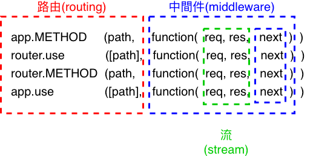
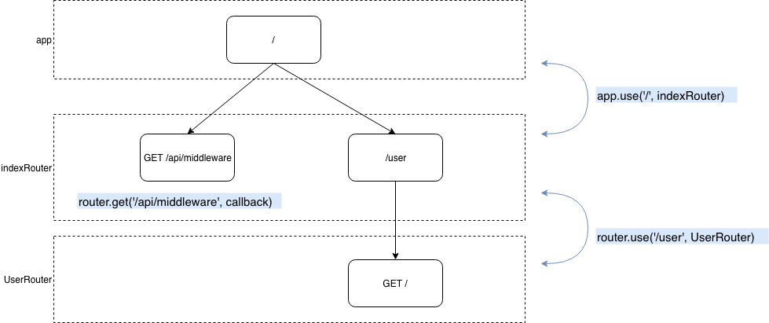
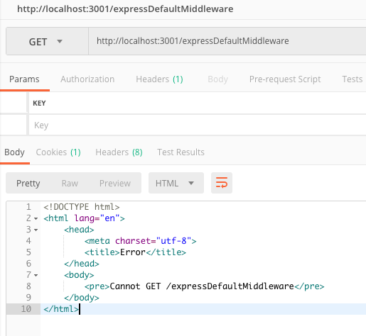
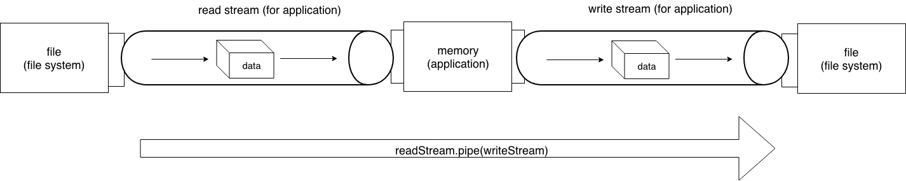
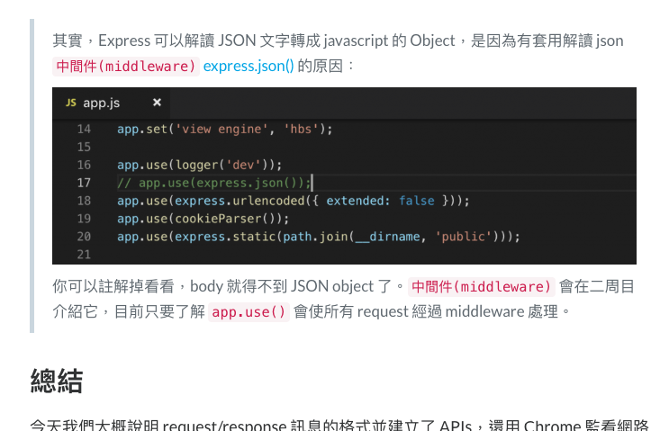

+++
title = "Day 18 - 二周目 - 剖析 express 路由(router) 三概念：中間件(middleware)、路由(routing)、流(stream)"
date = "2018-10-18"
description = "中間件(middleware)、路由(routing)、流(stream)"
featured = false
categories = [
]
tags = [
"2019 iT 邦幫忙鐵人賽",
"用js成為老闆心中的全端工程師"
]
images = [
]
series = [
"用js成為老闆心中的全端工程師 - 2019 iT邦幫忙鐵人賽"
]
+++

剖析 express 路由(router) 三概念：中間件(middleware)、路由(routing)、流(stream)

<!--more-->

# 回憶
昨天介紹 awilix 來依賴注入， awilix 幫我們把 `mongoService` 建立好，並注入 `./routers/index.js` 這個根路由物件中，使我們可以在 `router.METHOD()` 中調用 `mongoService` 的方法。 

今天要看 `router.METHOD()` 、`router.use()`這些神秘的東西，是怎麼幫我們組合出各式各樣的 API。

# 目標
> 過程請見 github commit log [ithelp-30dayfullstack-Day18](https://github.com/eugenechen0514/ithelp-30dayfullstack-Day18)

express 的核心技術之一就是 router，它之所以複雜是因為他同時包含三個重要的概念：


1. 中間件(middleware)
1. 路由(routing)
1. 流(stream)

我們一一來了解它們

# 剖析 `router` /  `app`
首先看 [`app.METHOD(path, callback [, callback ...])`](http://expressjs.com/en/4x/api.html#router.METHOD) 和 [`router.METHOD(path, [callback, ...] callback)`](http://expressjs.com/en/4x/api.html#router.METHOD) 的簽章，`path` 是我們要比對的網址片斷，callback 是我們要做的事，你會發現簽章中你可以「串」很多個 callback，express 「**預期**」每一個 callback 可以一個個被呼叫。這種特別的目地的 callback，被稱作中間件(middleware)，未來在前端的 redux 也會看到。

## 中間件(middleware)：串接處理流程

express 中的兩種 middleware：

1. Regular middleware `function (req, res, next)`：處理正常流程
1. Error-handling middleware `function (err, req, res, next)`：處理錯誤流程

不論是哪種 middleware，它們的簽章一定是長成那樣。並且，當 middleware 作完事，
***一定要呼叫 `next()`*** 引發下一個 middleware 做事，除非是送出回應的最後一個 middleware，可以不用呼叫 `next()`。例如：
``` javascript
function middleware1(req, res, next) {
    // 錯誤發生(一)
    // throw new Error('fake error by throw'); 
    
    // 錯誤發生(二)
    // next(new Error('fake error by next()'));
    // return;

    console.log('middleware1');
    // res.send('搶先送出回應'); // 這會引起錯誤，但不中斷： Error [ERR_HTTP_HEADERS_SENT]: Cannot set headers after they are sent to the client 
    next(); // 引發下一個 middleware
  }
  function middleware2(req, res, next) {
    console.log('middleware2');
    next(); // 引發下一個 middleware
  }
  router.get('/api/middleware', middleware1, middleware2, function (res, res, next) {
    res.send('done');
  });
```
打 `GET /api/middleware` 的後在 console 結果是
```
middleware1
middleware2
```

當沒有錯誤發生，所有「有呼叫 `next()` 的 regular middleware」 會依序處理，直到最後一個「沒有呼叫 `next()` regular middleware」執行完。因此，你一定要在後面一個 regular middleware 回應 request，不然 request 就會一直卡著，直到 timeout。

當有錯誤發生，在某個 middleware 呼叫 `next(err)` 或被 `throw error`，就會略過所有 regular middleware 直到找到 error-handling middleware，來處理。

雖然 regular middleware 和 error-handling middleware 可以交錯著串起來（就像 Promise 的 `then()...catch()`），但我薦議不要這麼做，這樣會讓處理邏輯混亂。


> 試看看：
    1. 你可以解開上例中 "錯誤發生" 的註解看看
    2. 把 next() 註解，會使下一個 middleware 無法運作
    3. 搶先送出回應看看

## 路由(routing)：網址片斷串接
`app.METHOD(path, callback [, callback ...])` 和 `router.METHOD(path, [callback, ...] callback)` 規定：
1. request 的 method(GET/POST/DELETE/...) 要附合，並且
2. 網址片斷(path)附合

才會執行參數中的 callback (middleware)

此外，`app.usr([path, ]callbackOrRouter)` 和 `router.use([path,] callbackOrRouter)` (path 預設是 `/`) 就是不管所有 method ，只比對附合片斷就可以執行：
1. 參數中的 callback 或
2. 往下一個 router 執行

直接舉例比較快，見下面：

``` javascript
// app.js
app.use('/', indexRouter);
```

``` javascript
// routers/index.js
const UserRouter = require('./users');

function createRouter(dependencies) {
  router.get('/api/middleware', middleware1, middleware2, function (res, res, next) {
    res.send('done');
  });
  router.use('/user', UserRouter);
  return router;
}
```

``` javascript
// routers/users.js
router.get('/', function(req, res, next) {
  res.send('respond with a resource');
});
```
有三個 router，`app`, `indexRouter`, `UserRouter`，串接圖如下：



上述串接後，只能搭配出
1. `GET /api/middleware`
1. `GET /user/`

這兩個路徑，它們需要我們們自行回應 request(ex: `res.send()`、`res.json()`)。

### 關於網址片斷比對
網址片斷(`path`)，不是只能有定值，可以是下列任一種：

1. path: 
1. Path Pattern
2. Regular Expression
3. Array

我覺得直接看文件範例就可以了，見 [Path examples](http://expressjs.com/en/4x/api.html#path-examples)，或 [Route paths](http://expressjs.com/en/guide/routing.html#route-paths) 更詳細。

不過有一點我一定要提，path 是可以抽取出 parameter 的，結果會放在 `req.param` 中，像是：
``` javascript
router.get('/user/:userId', function(req, res, next) {
  const userId = req.param.userId;
  ...略
})
```
這在 `RESTful API` 的設計很常使用。

若是沒比對到的怎麼辨？ 在 `express-generator` 幫我們產生的 express 專案就幫我們寫好一些 middleware。

### 預設的 middleware

`express-generator` 在生成 express 專案時，有幫我們產生預設的 middleware。

#### `express-generator` 預先產生的 middleware
在 `app.js`中最下面，有以下的程式碼…

``` javascript
// app.js

// 若 1. 前面的 middleware 都沒人處理 或 2. 沒有比對到路徑片斷，就會到這裡。
// catch 404 and forward to error handler
app.use(function (req, res, next) {
  next(createError(404)); // 引起 Error, 實際上是 HttpError，它繼承 Error。 給下一個 error-handling middleware　處理。
});

// 最後的 error-handling middleware
// error handler
app.use(function (err, req, res, next) {
  // set locals, only providing error in development
  res.locals.message = err.message;
  res.locals.error = req.app.get('env') === 'development' ? err : {};

  // render the error page
  res.status(err.status || 500);
  res.render('error');
});
```

這個兩個 middleware 依序是
1. regular middleware：當 1. 前面的 middleware 都沒人處理 或 2. 沒有比對到路徑片斷，就會執行。它在內部 `next(createError(404))`，把 error 送到下一個 error-handling middleware。
1. error-handling middleware：當之前的 error-handling middleware 沒有人處理回應 request，就會執行。`res.render('error')` 會讀入名為 `error` 的樣板檔案(即`./view/error.hbs`)，樣板帶入參數(預設是 `res.locals`)後，傳 html 文字給 request。 這裡的 `res.locals` 有兩個屬性，因為
    ``` javascript
    res.locals.message = err.message;
    res.locals.error = req.app.get('env') === 'development' ? err : {};
    ```
    
如果把上面 `express-generator` 預先產生的 middleware，註解掉會怎麼樣呢？　…什麼事都不會發生，因為…

#### `express` 內建的 middleware

`express` 有內建(built-in)的 middleware。



這是寫在套件中，你改不了的。

## 流(stream)：送出回應 request

### 流(stream) 的基本概念
stream 在 Node.js 是很常見的，其實我們常用的檔案存取都可以用 stream 來操作

在資料傳遞的模型中，有兩個角色


1. producer：產生資料的人
1. consumer：消耗資料的人

站在 producer 的角度來看，它拿著的 stream 叫做 **write stream**，它透過 [`writeStream.write(data)`](https://nodejs.org/dist/latest-v10.x/docs/api/stream.html#stream_writable_write_chunk_encoding_callback) 送出資料。當沒資料的時候送出 [`writeStream.end()`](https://nodejs.org/dist/latest-v10.x/docs/api/stream.html#stream_writable_end_chunk_encoding_callback) 通知 consumer 已經沒資料了。

反之，站在consumer  的角度來看，它拿著的 stream 叫做 **read stream**，它透過 [`readStream.read()`](https://nodejs.org/dist/latest-v10.x/docs/api/stream.html#stream_readable_read_size) 讀出資料。更仔細的說，在 `read stream` 中內部有一個 buffer 區塊， producer 會把資料送到 consumer 的 buffer 中，滿的時候就會叫送出 `data` 事件，若 `readStream` 有註冊事件(即 `readStream.on('data', callback)`) ，就會被叫起處理資料。

我們只需了解到這，更細的說明有機會再說。

舉個 `fs` 模組常用的 stream 為例子：

* `fs.createWriteStream(path[, options])`：建立一個 write stream，拿來寫檔
    圖解 write stream 就是
    
* `fs.createReadStream(path[, options])`：建立一個 read stream，拿來讀檔
    圖解 read stream 就是
    

最後， stream 的迷人之處在於 `readStream.pipe(writeStream)`，就好像透過程式把兩個端點接起來，例如：copy 的 stream 版本


``` javascript
// copyFile.js
const fs = require('fs');
const readStream = fs.createReadStream('README.md');
const writeStream = fs.createWriteStream('README.log');
readStream.pipe(writeStream);
```


### request(`req`), response(`res`) 其實分別就是 read stream 和 write steam

了解 stream 基本概念後，回來看 express 的 middleware 中 `req`, `res`，它們的真身就是：
* `req`：read stream
* `res`：write steam

只不過它幫我們設定和處理 http message，像 state code, headers…之類的。

之前說過，在 middleware中 「**回應 request**」 是指什麼呢？

``` javascript
res.send()
res.file()
res.download()
res.json()
res.render()
```

以上都是拿來回應 request， 都會引起 write steam 送出 `end()` 而斷掉。

### 不使用 `app.use(express.json())` 的後果及修正
我們曾在 [Day 9 - 一周目- 開始玩轉後端(二)](https://ithelp.ithome.com.tw/articles/10200622) 中提到



把 `app.js` 中的 `app.use(express.json());` 註解掉會讓 `req.body` 讀不到 JSON 資料，這是因為 `express.json()` middleware 幫我們讀資料和轉換成 JSON Object。不過，我們還是可以自己處理，利用 `req` 這個 read stream 就可以讀出資料(使用 [flowing mode](https://nodejs.org/dist/latest-v10.x/docs/api/stream.html#stream_two_reading_modes)，可以監聽收事件)。過程如下：

1. 收集所有 raw 資料(Buffer array)
1. 用解碼 Buffer array 成 String
1. 轉換成 JSON Object

``` javascript
router.post('/api/echo', function (req, res, next) {
    // decode: Buffer -> String
    const { StringDecoder } = require('string_decoder');
    const decoder = new StringDecoder('utf8');

    let rawData = [];
    req.on('data', (data) => { // read chunk
      rawData = rawData.concat(data);
    })
    req.on('end', () => {
      const decodeData = decoder.end(rawData); // to String
      console.log(decodeData);

      const body = JSON.parse(decodeData); // to Object
      mongoService.insertEcho(body)
        .then(() => {
          res.json(body);
        })
        .catch(next); // 發生 error 的話，next() 交給之後的 middleware 處理，express 有預設的處理方法
    });
  });
```

這樣就可以了。是不是超麻煩的？感謝 `express.json()` 這方便的 middleware 的存在。

我修改過的檔案放在分支 [no_express_json](https://github.com/eugenechen0514/ithelp-30dayfullstack-Day18/tree/release/no_express_json)中，有興趣可以下載來跑看看。

# 總結

今天解析了三個概念：
1. 中間件(middleware)：串接處理流程
1. 路由(routing)：網址片斷串接
1. 流(stream)：送出回應 request

他們在 express 的運作極為重要。學習時可以用 debug 模式，多下一些中斷點觀察他們跑流程，可以有很大的收穫。

最後，我們提一些要點做為本篇的總結：

1. router, middleware 的串接是有順序性的
1. 每個 middleware 都要呼叫 `next()`，除非它是送出回應的最後 middleware
1. 回應 request 的方法(ex: `res.json()`) 很多，它們會讓 `res`(write steam) 斷掉，重送它們會印出 `Error [ERR_HTTP_HEADERS_SENT]: Cannot set headers after they are sent to the client`，但不會中斷程式和進 error-handling middleware

> 測驗：請自己寫一個 middleware 可以印出所有 request 的網址。解答放在 [github commit](https://github.com/eugenechen0514/ithelp-30dayfullstack-Day18/commit/2c2a78e077f34592d3740a794a8dc3f703b7b03b)
    
> 題外話：有人把「送出回應的最後 middleware」稱作端點(endpoint)，也有人說一個 API 網址 `GET /api/sayHi` 是 endpoint。我想都可以，方便溝通就好。

# 附錄：express middleware 運作原始碼

我把 express middleware 運作原始碼截錄下來，有興趣可以自己看一下，就會發現巧妙之處。

``` javascript
// lib/router/index.js
proto.use = function use(fn) {
  var offset = 0;
  var path = '/';

  // default path to '/'
  // disambiguate router.use([fn])
  if (typeof fn !== 'function') {
    var arg = fn;

    while (Array.isArray(arg) && arg.length !== 0) {
      arg = arg[0];
    }

    // first arg is the path
    if (typeof arg !== 'function') {
      offset = 1;
      path = fn;
    }
  }

  var callbacks = flatten(slice.call(arguments, offset));

  if (callbacks.length === 0) {
    throw new TypeError('Router.use() requires a middleware function')
  }

  for (var i = 0; i < callbacks.length; i++) {
    var fn = callbacks[i];

    if (typeof fn !== 'function') {
      throw new TypeError('Router.use() requires a middleware function but got a ' + gettype(fn))
    }

    // add the middleware
    debug('use %o %s', path, fn.name || '<anonymous>')

    var layer = new Layer(path, {
      sensitive: this.caseSensitive,
      strict: false,
      end: false
    }, fn);

    layer.route = undefined;

    this.stack.push(layer);
  }

  return this;
};
```

``` javascript
// lib/router/route.js
Route.prototype.dispatch = function dispatch(req, res, done) {
  var idx = 0;
  var stack = this.stack;
  if (stack.length === 0) {
    return done();
  }

  var method = req.method.toLowerCase();
  if (method === 'head' && !this.methods['head']) {
    method = 'get';
  }

  req.route = this;

  next();

  function next(err) {
    // signal to exit route
    if (err && err === 'route') {
      return done();
    }

    // signal to exit router
    if (err && err === 'router') {
      return done(err)
    }

    var layer = stack[idx++];
    if (!layer) {
      return done(err);
    }

    if (layer.method && layer.method !== method) {
      return next(err);
    }

    if (err) {
      layer.handle_error(err, req, res, next);
    } else {
      layer.handle_request(req, res, next);
    }
  }
};
```
