+++
title = "Day 2 - 一輩子受用的工具"
date = "2018-10-02"
description = "介紹常用來打文件的 Markdown 語法和畫圖用的 draw.io"
featured = false
categories = [
]
tags = [
"2019 iT 邦幫忙鐵人賽",
"用js成為老闆心中的全端工程師"
]
images = [
]
series = [
"用js成為老闆心中的全端工程師 - 2019 iT邦幫忙鐵人賽"
]
+++

昨天我們示範了`touch`指令來建立空檔案，今天我們來看看有什麼常用的指令。此外，介紹常用來打文件的 Markdown 語法和畫圖用的 draw.io。

<!--more-->

# 回憶
昨天我們示範了`touch`指令來建立空檔案，今天我們來看看有什麼常用的指令。此外，介紹常用來打文件的 Markdown 語法和畫圖用的 draw.io。

# 指令

## 為什麼要學指令？
指令是很強大的，就只要一行指令，就可以執行常用的操作，像是建立資料夾、預先編輯程式碼、背景執行程式…等，甚至可以集合起來成一聯串的腳本，如：linux `.sh` 或 windows `.cmd`。未來我們會透過腳本，打造自己的發佈腳本、備份腳本、執行腳本。

## 指令怎麼執行？ Shell
[shell](https://en.wikipedia.org/wiki/Shell_(computing)) 是一個存取作業系統服務的使用者介面，如：windowns 有命令提示字元，linux有bash...等。我們說的 ***指令*** 通常是指 ***command-line interface*** (***CLI***)，指令文字會打在終端機中(terminal/命令提示字元)。

## 下面列出一定要認識的指令

1. cd - 移動當前資料夾
1. mkdir - 建立資料夾
1. cp - 拷貝檔案
1. mv - 移動檔案
1. rm - 刪除檔案
1. pwd - 印出當前資料夾
1. ls/ll(***ls -l***) - 印出當前資料夾的檔案/資料夾
1. chmod - 改變檔案/資料夾權限，操作可以看[鳥哥的 Linux 私房菜-如何改變檔案屬性與權限](http://linux.vbird.org/linux_basic/0210filepermission.php#filepermission_ch)
1. chown - 改變檔案/資料夾擁有者，操作可以看[鳥哥的 Linux 私房菜-如何改變檔案屬性與權限](http://linux.vbird.org/linux_basic/0210filepermission.php#filepermission_ch)

## 動手做

接下來你可以操作看看，過程只是玩玩看指令，沒有特別的目地。

1. 我們開啟一個VScode專案，並執行一個terminal
1. 輸入 `pwd` 可以知道當前資料夾是在哪，指令的預設目錄是這裡
  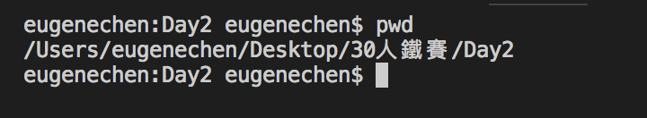
1. `mkdir src` 就會建立src資料夾
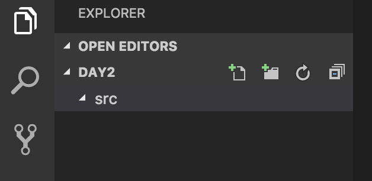
1. `touch README.md` 建立空的README.md
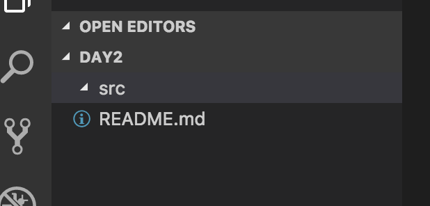
1. `cp README.md src` 拷貝README.md到src資料夾
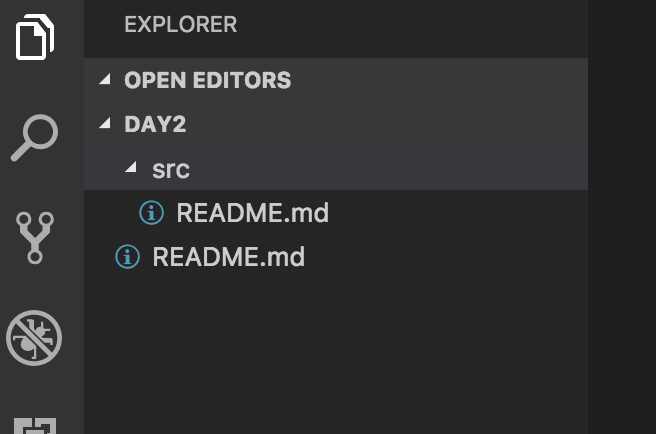
1. `cd src` 移動當前資料夾到src，你可以再輸入`pwd`看看當前資料夾是不是變了
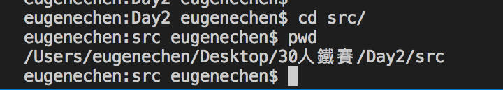
1. `rm README.md` 刪除README.md
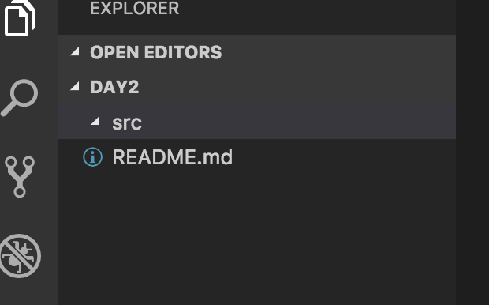
1. `cd ..` 回到上一層資料夾。這裡的相對路徑中，`..` 指上一層資料夾，`.`指當前資料夾
1. `ls -l`
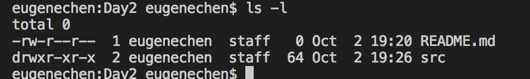

## 指令要背嗎？
不用刻意背，上網查或指令說明查詢，一般指令都可以查使用說明，常見
```
# `rm` 是要查的指令
rm --help
rm help
rm -h
man rm
```
上面都有可能可以查看用法，要看製作指令的人怎麼寫。

## cmd 常見格式: `<command> --<full name> -<brief name>`
`--` 或 `-` 一般指指令選項(options), `--`常會搭配選項全名, `-`常會搭配參數簡稱，如下圖的 `--version` 和`-v`
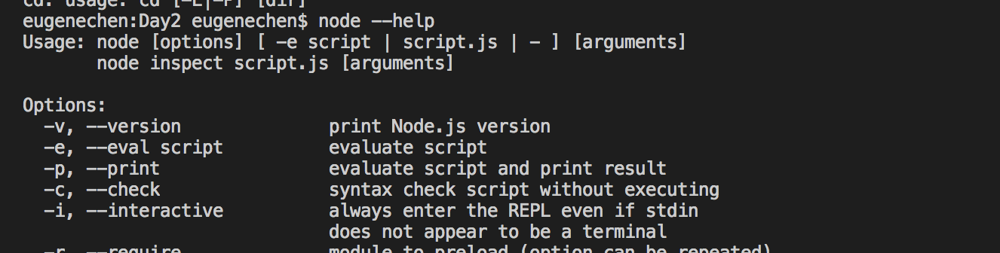

## 指令小抄
下面我常用指令
```
# 確保build資料夾存在
mkdir -p build

# 拷貝resource資料夾(包含裡面的所有檔案/資料夾)
cp -R ./resource .src/ 

# 刪除build資料夾(包含裡面的所檔案/資料夾)
rm -rf build

# 重新命名並移動
mv ./README.md ./src/README.bak.md
```
[cheatsheet](https://devhints.io/bash)這網站我很推薦，可以查常用的指令或程式碼的小抄，也可能拿來學一些沒用過的指令或程式碼。

# Markdown
前面提到 cheatsheet，那是別人整理好的小抄，你也可以寫屬於自己小抄。不僅如此，Markdown也常被用來寫文章、文件、筆記。

Markdown是用文字和格式來做排版，如下：
```
# 第一章
## 第一節
* item
* item
```
透過Markdown reader 就會變成
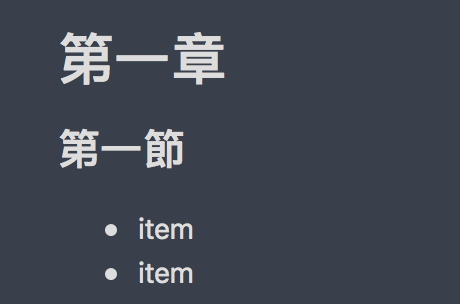

## 為什麼用Markdown？
1. 文字排版，方便複製、貼上
1. 文字容易傳送、儲存，也可以像程式碼一樣放入版本管理(version control)工具Git/SVN
1. 文字資料只須少量的檔案大小

## 常用語法
我發現 [iT幫邦-Markdown說明](https://ithelp.ithome.com.tw/markdown)整理的東西很常用，我只例出必學的。

Markdown 文字：
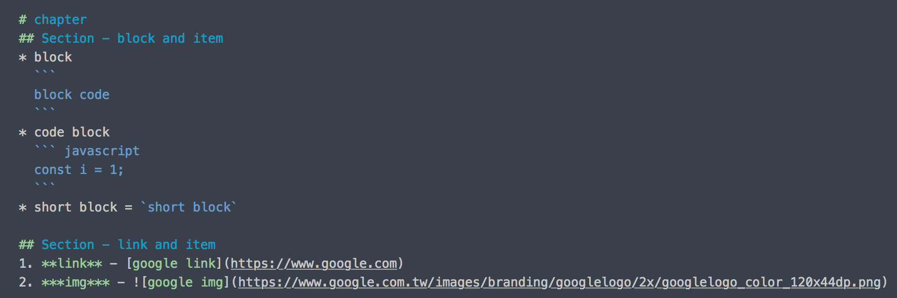

檢視結果如下：
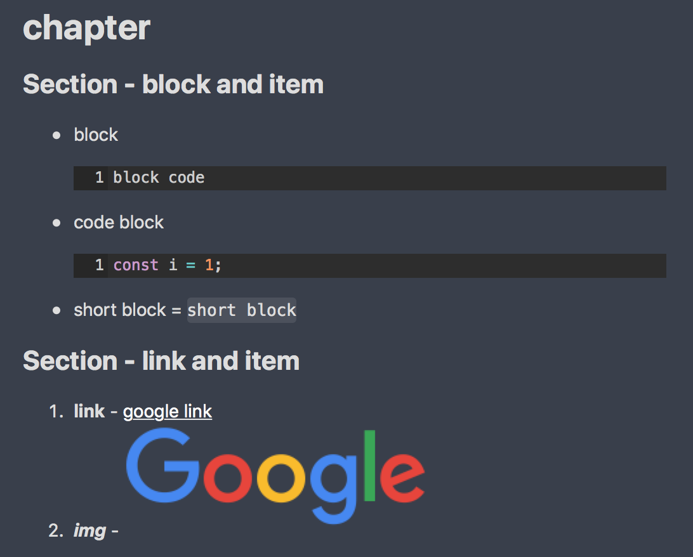

## Markdown的限制
1. Markdown 只是文字，不是即可見的，所以要搭配檢視軟體(reader)才能看
1. 不同的檢視軟體有自己檢視結果，所以會有些許的不同，像是風格、大小
1. 也因為受於檢視軟體的解讀差異，Markdown 格式語法風格會有差，像是不同縮排或語法中空白的數量，都可能在不同檢視軟體有不同結果或不能正常顯示
1. 格式語法風格不容易統一
1. 圖片/檔案資源一般不會放在文件內，要用外部資源，以圖片為例：``。不過，還是可以用[base64 image](https://www.base64-image.de/)文字，把圖片轉成文字再鑲入文件中，但你不會想這麼做的，下面就是一張圖片：。此外，檢視軟體能不能解讀又是另一回事，我用的筆記軟體  [Quiver](https://itunes.apple.com/app/quiver-programmers-notebook/id866773894?ls=1&mt=12)和 VSCode - Markdown All in One 剛好都可以解讀。
    ```
    ![c word](data:image/png;base64,iVBORw0KGgoAAAANSUhEUgAAABIAAAA0CAYAAACHO2h8AAAKB2lDQ1BJQ0MgUHJvZmlsZQAASImFlndYFNcaxs/M9kZbWHrvvcMC0nuTXkVhWWCp67JUERsSVCCiiIiAIkioCkZDjQURxUIQUMCCBiQIKDFYABWVDJDEJPc+937znOf8nnfOeeebM3/MCwDJjcHhxMN8ACSwk7nejjYygUHBMrhnAA2wAA/EgQ6DmcSx9vR0A0j9Of+zFkcAtDrf01z1+s/7/7P4IyKTmABAngjTmRxuMsL7EfZNS+as8hjCglykKYTnV5m1xjB6lcPXWWRtja+3LcIaAODJDAaXBQCRjugyqUwW4kMMRFiHHRHDRnjV34IZzYhA+CbCGlHxKekIv1tdk5CwFdFJCgirhP/Nk/UP//C//BkM1l+cEJ/C/OO9Vk+EHMn280FmMWRIgCigBeJBCkgHMoADuGArosQgSiRy9v99H31tny2ykgO2ITtiAAtEg2Rkv8PfvHzWnJJBGmAgayIRxQ25bFe/47rlW9qaK0S7/VVL7ALAJBcRWV81hjwAHc8BoC5+1eTfIO0cAuDSADOFm7qurR49wAAi4AWCQBRIAXmgAjSBHjACZsAK2AMX4AF8QRDYAphIvwlIV2kgE+wBOSAPHAJHQSmoAKdBHTgLzoM2cBFcBTfAHTAAhsFjMA6mwEswDxbBMgRBOIgCUSFRSBpShNQhPYgOWUD2kBvkDQVBYRALYkMpUCa0F8qDCqFSqBKqh76HOqCr0C1oEHoITUCz0BvoI4yCybAgLAkrwdowHbaGXWFfeDPMghPhDDgbPgiXwFXwGbgVvgrfgYfhcfglvIACKBKKhpJFaaLoKFuUByoYFYXionaiclHFqCpUE6oT1Yu6hxpHzaE+oLFoKloGrYk2Qzuh/dBMdCJ6JzofXYquQ7eie9D30BPoefQXDAUjgVHHmGKcMYEYFiYNk4MpxtRgWjDXMcOYKcwiFoulYZWxxlgnbBA2Frsdm489gW3GdmEHsZPYBRwOJ4pTx5njPHAMXDIuB3ccdwZ3BTeEm8K9x5Pw0ng9vAM+GM/GZ+GL8Q34y/gh/DR+mcBHUCSYEjwIEYRthAJCNaGTcJcwRVgm8hOVieZEX2IscQ+xhNhEvE4cI74lkUhyJBOSFymGtJtUQjpHukmaIH0gC5DVyLbkEHIK+SC5ltxFfkh+S6FQlChWlGBKMuUgpZ5yjfKU8p6HyqPF48wTwbOLp4ynlWeI5xUvgVeR15p3C28GbzHvBd67vHN8BD4lPls+Bt9OvjK+Dr5RvgV+Kr8uvwd/An8+fwP/Lf4ZAZyAkoC9QIRAtsBpgWsCk1QUVZ5qS2VS91KrqdepU4JYQWVBZ8FYwTzBs4L9gvNCAkIGQv5C6UJlQpeExmkomhLNmRZPK6Cdp43QPgpLClsLRwofEG4SHhJeEhEXsRKJFMkVaRYZFvkoKiNqLxoneli0TfSJGFpMTcxLLE3spNh1sTlxQXEzcaZ4rvh58UcSsISahLfEdonTEn0SC5JSko6SHMnjktck56RoUlZSsVJFUpelZqWp0hbSMdJF0lekX8gIyVjLxMuUyPTIzMtKyDrJpshWyvbLLsspy/nJZck1yz2RJ8rT5aPki+S75ecVpBXcFTIVGhUeKRIU6YrRiscUexWXlJSVApT2KbUpzSiLKDsrZyg3Ko+pUFQsVRJVqlTuq2JV6apxqidUB9RgNUO1aLUytbvqsLqReoz6CfVBDYyGiQZbo0pjVJOsaa2ZqtmoOaFF03LTytJq03qlraAdrH1Yu1f7i46hTrxOtc5jXQFdF90s3U7dN3pqeky9Mr37+hR9B/1d+u36rw3UDSINTho8MKQauhvuM+w2/GxkbMQ1ajKaNVYwDjMuNx6lC9I96fn0myYYExuTXSYXTT6YGpkmm543/c1M0yzOrMFsZoPyhsgN1RsmzeXMGeaV5uMWMhZhFqcsxi1lLRmWVZbPrOStIqxqrKatVa1jrc9Yv7LRseHatNgs2Zra7rDtskPZOdrl2vXbC9j72ZfaP3WQc2A5NDrMOxo6bnfscsI4uToddhp1lnRmOtc7z7sYu+xw6XElu/q4lro+c1Nz47p1usPuLu5H3Mc2Km5kb2zzAB7OHkc8nngqeyZ6/uiF9fL0KvN67q3rnend60P1CfVp8Fn0tfEt8H3sp+KX4tftz+sf4l/vvxRgF1AYMB6oHbgj8E6QWFBMUHswLtg/uCZ4YZP9pqObpkIMQ3JCRjYrb07ffGuL2Jb4LZdCeUMZoRfCMGEBYQ1hnxgejCrGQrhzeHn4PNOWeYz5MsIqoihiNtI8sjByOso8qjBqhmXOOsKajbaMLo6ei7GNKY15HesUWxG7FOcRVxu3Eh8Q35yATwhL6GALsOPYPVultqZvHeSoc3I444mmiUcT57mu3JokKGlzUnuyIPLz7EtRSfkmZSLVIrUs9X2af9qFdP50dnrfNrVtB7ZNZzhkfLcdvZ25vTtTNnNP5sQO6x2VO6Gd4Tu7d8nvyt41tdtxd90e4p64PT9l6WQVZr3bG7C3M1sye3f25DeO3zTm8ORwc0b3me2r2I/eH7O//4D+geMHvuRG5N7O08krzvuUz8y//a3utyXfrhyMOthfYFRw8hD2EPvQyGHLw3WF/IUZhZNH3I+0FskU5Ra9Oxp69FaxQXHFMeKxlGPjJW4l7ccVjh86/qk0unS4zKasuVyi/ED50omIE0MnrU42VUhW5FV8PBVz6kGlY2VrlVJV8Wns6dTTz6v9q3u/o39XXyNWk1fzuZZdO17nXddTb1xf3yDRUNAIN6Y0zp4JOTNw1u5se5NmU2UzrTnvHDiXcu7F92Hfj5x3Pd99gX6h6QfFH8pbqC25rVDrttb5tui28fag9sEOl47uTrPOlh+1fqy9KHux7JLQpYLLxMvZl1euZFxZ6OJ0zV1lXZ3sDu1+fC3w2v0er57+667Xb95wuHGt17r3yk3zmxdvmd7quE2/3XbH6E5rn2Ffy0+GP7X0G/W33jW+2z5gMtA5uGHw8pDl0NV7dvdu3He+f2d44/DgiN/Ig9GQ0fEHEQ9mHsY/fP0o9dHy491jmLHcJ3xPip9KPK36WfXn5nGj8UsTdhN9z3yePZ5kTr78JemXT1PZzynPi6elp+tn9GYuzjrMDrzY9GLqJefl8lzOr/y/lr9SefXDb1a/9c0Hzk+95r5eeZP/VvRt7TuDd90LngtPFxMWl5dy34u+r/tA/9D7MeDj9HLaJ9ynks+qnzu/uH4ZW0lYWeEwuIy1KIBCBhwVBcCbWgAoQUh2GECy0Kb1zPVHnoH+lmz+ZNCv95VLQ9dz2VoZAVBrBYDfbgDckIxyEhmKCJOReTUi+loBWF//r/FHJUXp660/g8xFosn7lZW3kgDgOgH4zF1ZWT6xsvK5Gmn2IQBdif+3t3/xeh5cLSySkk9pr9LA1Cvw7/odVO2+40A3ezUAAAAJcEhZcwAAFiUAABYlAUlSJPAAAAGbaVRYdFhNTDpjb20uYWRvYmUueG1wAAAAAAA8eDp4bXBtZXRhIHhtbG5zOng9ImFkb2JlOm5zOm1ldGEvIiB4OnhtcHRrPSJYTVAgQ29yZSA1LjQuMCI+CiAgIDxyZGY6UkRGIHhtbG5zOnJkZj0iaHR0cDovL3d3dy53My5vcmcvMTk5OS8wMi8yMi1yZGYtc3ludGF4LW5zIyI+CiAgICAgIDxyZGY6RGVzY3JpcHRpb24gcmRmOmFib3V0PSIiCiAgICAgICAgICAgIHhtbG5zOmV4aWY9Imh0dHA6Ly9ucy5hZG9iZS5jb20vZXhpZi8xLjAvIj4KICAgICAgICAgPGV4aWY6UGl4ZWxYRGltZW5zaW9uPjE4PC9leGlmOlBpeGVsWERpbWVuc2lvbj4KICAgICAgICAgPGV4aWY6UGl4ZWxZRGltZW5zaW9uPjUyPC9leGlmOlBpeGVsWURpbWVuc2lvbj4KICAgICAgPC9yZGY6RGVzY3JpcHRpb24+CiAgIDwvcmRmOlJERj4KPC94OnhtcG1ldGE+CsngFRYAAAAcaURPVAAAAAIAAAAAAAAAGgAAACgAAAAaAAAAGgAAAKWrcuGaAAAAcUlEQVRIDWL8DwQMVACMowYRDMWhEkZ/nzFMSy9lOMPAjuKln98YGGLbZjB4KLChiIM42L327SZDkl00wyUM5QwMBYv2M8Ro8WLIYDfo102GfKtohqMYykcNggfJaBjBgwLIGE1HiNAYzWvQsBjILAIAAAD//xH+VfsAAABoSURBVGP8DwQM6ODXTYZ8q2iGo+jiQH7Bov0MMVq8GDKMowbBw2Q0jKBBMZqO4GkCyBhCWSQJmPsvIbsdyiYxZd9nqLEKZdiBxaCylccYwpTZMGSwhxGGMsICowaNhhHhECCsgmrpCAAfj6N0qqWW5wAAAABJRU5ErkJggg==)
    ```

## Markdown 怎麼在VSCode中檢視?
前面提到Markdown需要搭配檢視軟體，幸運地 VSCode 的擴展(Extension)有套件可以使用。

1. 開啟 VSCode 的 Extension的頁簽
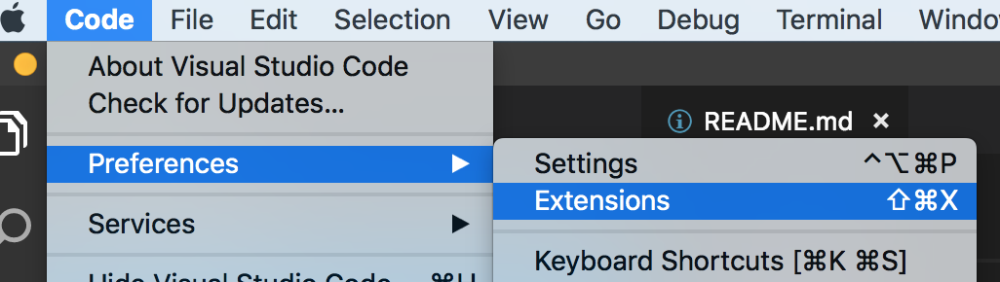
1. 搜尋 `markdown`，你會看到一堆可以選，基本上有`Preview`的都可以用
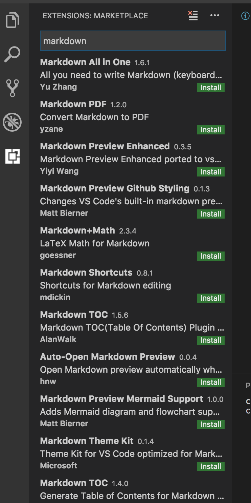
1. 我是選擇下載人數多的 `Markdown All in One`
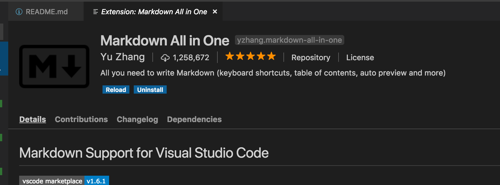
1. 在Markdown文件中，開啟Priview
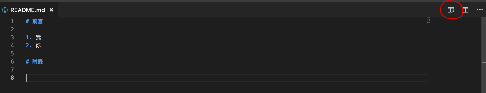
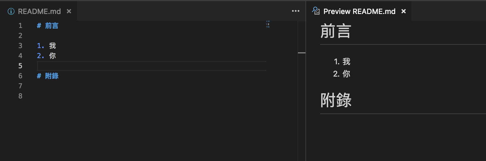

# draw.io
[draw.io](https://www.draw.io)我很推薦的工具之一，就是用來畫圖，可以釐清自己的想法或和別人溝通。
你可以很容易的畫出[UML](https://msdn.microsoft.com/zh-tw/library/dd409360.aspx?f=255&MSPPError=-2147217396)、心智圖(Mind Map)、架構圖…等。例如下面的UML 活動圖：
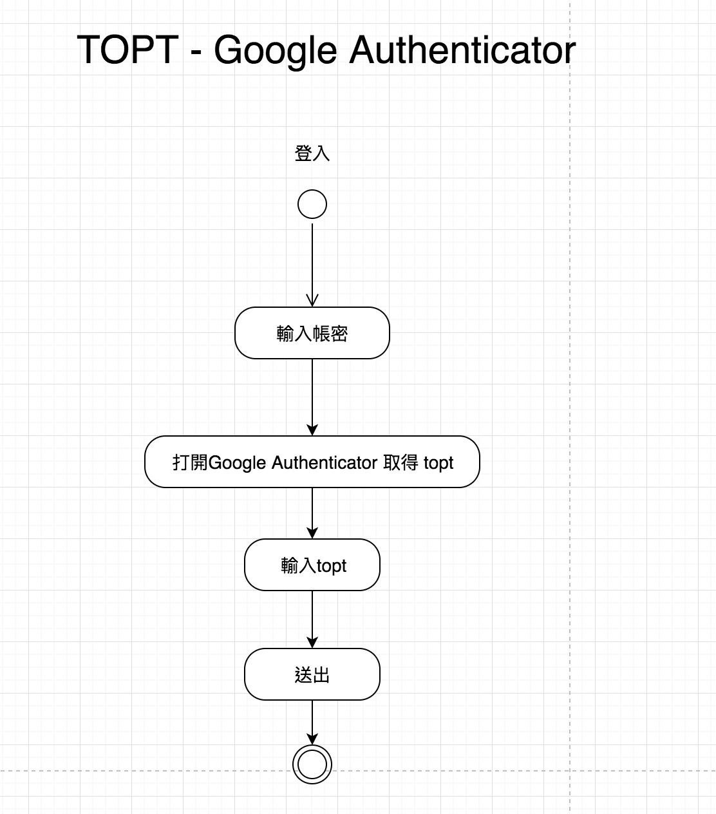

## draw.io 有什麼過人之處嗎？
1. 免費
1. 可以直接儲存在google drive, dropbox...等雲端空間，也可以本地儲存
1. 可以匯入匯出，轉存圖檔、PDF，也支援SVG
1. 支援鍵盤的複製貼上或拖拉，圖片也可以
1. 共同編輯
1. 可輸入中文、客製化風格
1. 元件可群組、快速排版、多選元件設定屬性
1. 多頁籤
1. 內件大量元件、也可以自製元件

# 總結
今天我們介紹常用指令和小抄[bash cheatsheet](https://devhints.io/bash)，讀者可以透過Markdown寫自己的專屬小抄、文件。最後，用 draw.io 製圖為文件增加更多色彩。
