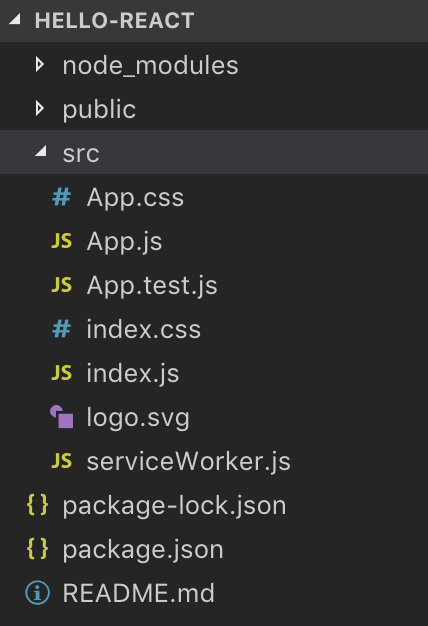
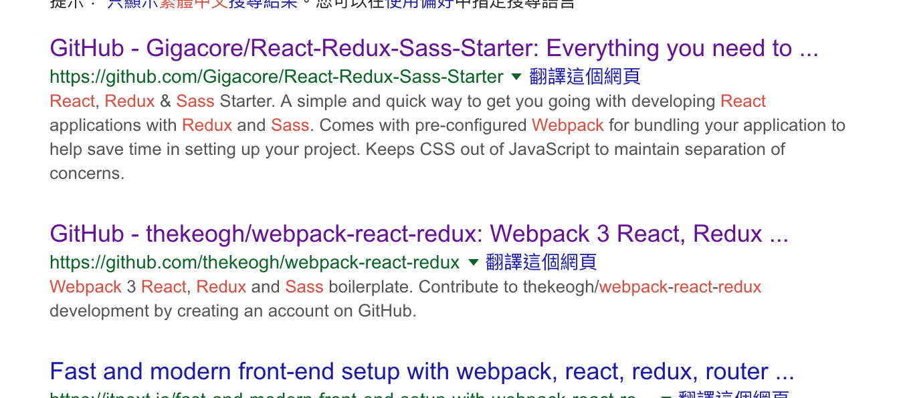
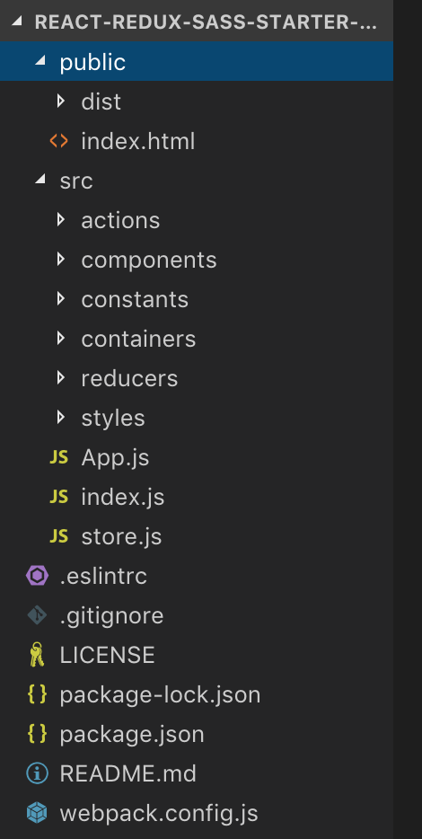
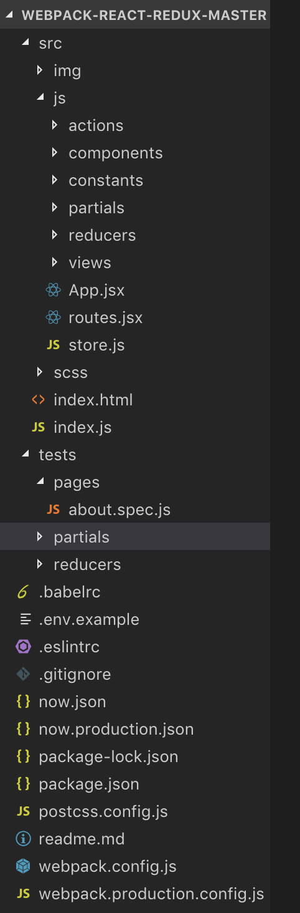
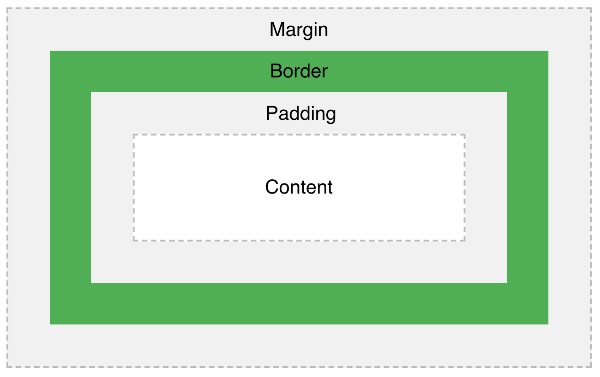
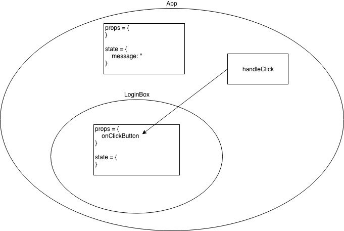
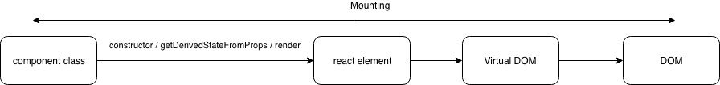
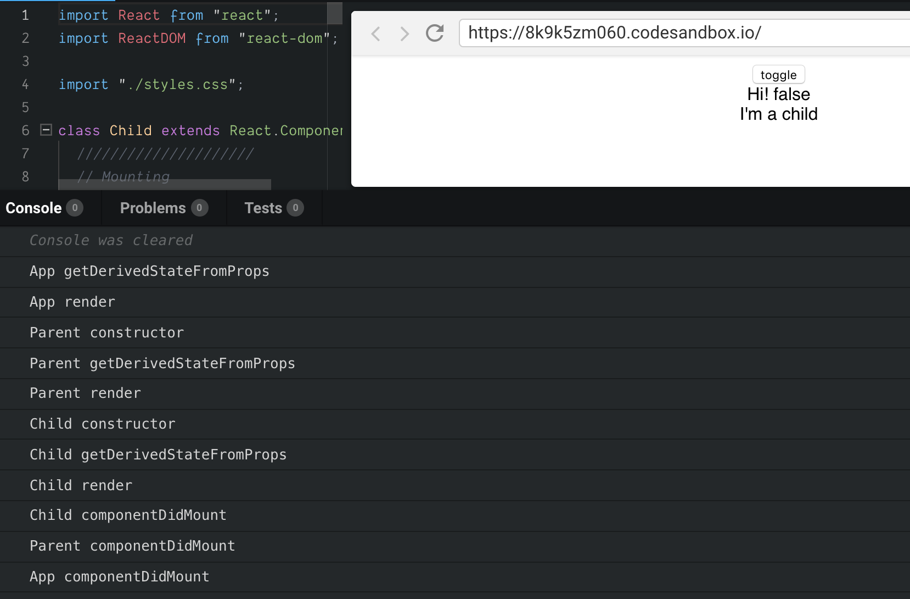
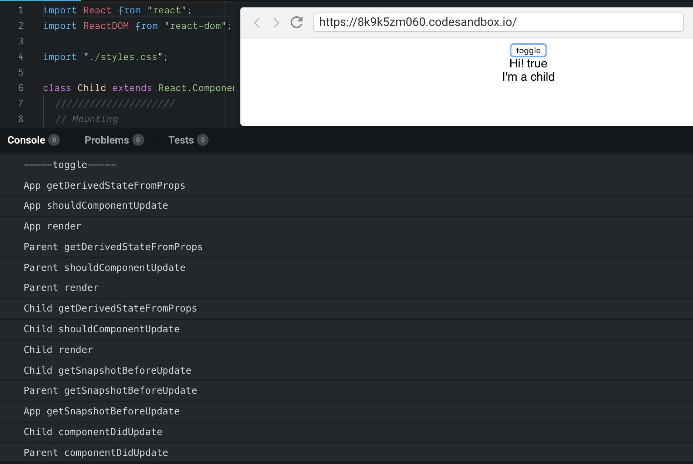

+++
title = "Day 21 - 二周目 - React 必備知識和效能議題"
date = "2018-10-21"
description = "React 快速入門"
featured = false
categories = [
]
tags = [
"2019 iT 邦幫忙鐵人賽",
"用js成為老闆心中的全端工程師"
]
images = [
]
series = [
"用js成為老闆心中的全端工程師 - 2019 iT邦幫忙鐵人賽"
]
+++

React 快速入門

<!--more-->

# 回憶

昨天我們以非同步函數測試的例子說明單元測試/整合測試的差異，到目前為止後端的部分打算先到這。之後的幾天，我們開始進入研究前端。

# 目標

在 [Day 11 - 一周目- 開始玩轉前端(二)](https://ithelp.ithome.com.tw/articles/10200933) 中，我們用 `create-react-app` 建立了前端專案，並打出非同步的 request 向後端索取資料。

1. 如何找專案結構
1. React 必需知道的事
    1. `state` 和 `prop` 的差異
    2. React component lifecycle (生命周期)
1. React 的效能議題
    1. 小心的在 `render()` 中用箭頭函數
    2. `key` 屬性在動態的 react element array 應該要使用

# 如何找專案結構？
我們用 `create-react-app` 建立了前端專案，它幫我們產生了專案，資料夾如下：

顯然只有基本的結構，我們未來要組織出自己的結構。

除了自己組識，上網找別人做好的也是個不錯的選擇，很多人會把初始專案結構放在 github 之類的，不過你得先知道你想要的組合套餐

Bundle tool： [webpack](https://webpack.js.org/) / [gulp](https://gulpjs.com/)
UI framework: [React](https://reactjs.org/) / [Vue.js](https://vuejs.org/)
State container: [Redux](https://redux.js.org/) / [Vue.js](https://vuejs.org/)
Asynchronous flow: [redux-observable](https://redux-observable.js.org/)([rxjs](https://rxjs-dev.firebaseapp.com/)) / [redux-saga](https://redux-saga.js.org/)
CSS extension: [sass](https://sass-lang.com/) / [less](http://lesscss.org/)

每個套件都有自己的特色、能不能搭配的問題、全部套件怎麼串起來、串起來的資料夾要怎麼組織…等問題，所以只能按照自己的需求查。

例如，上 google 查 `webpack react redux sass`，會看到



把它們下載看看，它們怎麼組織專案的


學習最快的方法就是模仿，從別人做好的專案架構學習、查文件資料，會學的很快的。

不過我們目前還是用 `create-react-app` 建立前端專案，沒有要下載別人的，未來會慢慢的建立起自己的專案架構。

# 網頁基本知識
HTML 和　CSS 基本知識可以自行上網查，但有點東西我覺得要了解才可以：

* HTML Tags： `<div />`、`<input>`
* HTML Attributes：`style`, `class`
* HTML Event Attributes: `onClick`
* CSS: Box Model (圖來自[CSS Box Model](https://www.w3schools.com/css/css_boxmodel.asp))
    

剩下的東西我覺得想要什麼再查就可以了。

下接來，我們要回到 javascript 的部分：前端框架 React

# React 必需知道的事

我們已經在 [Day 10- 一周目- 開始玩轉前端(一)](https://ithelp.ithome.com.tw/articles/10200734)介紹過 React，之後會針對一些重要的概念說明。

## 每個 React component class 都有 state. prop (props.children)

我們舉個例子：

``` javascript
class LoginBox extends React.Component {
    render() {
        return (
            <div>
                <button onClick={this.props.onClickButton}>送出</button>
            </div>
        );
    }
}

class App extends React.Component {
  constructor(props) {
    super(props);
    this.handleClick = this.handleClick.bind(this); // 讓 handleClick() 裡的 this 是 App 自已
  }
  
  state = {
    message: '',
  }
  
  handleClick() {
    this.setState({
      message: 'hi',
    });
  }
  
  render() {
    return (
      <div>
        {this.state.message}
        <LoginBox onClickButton={this.handleClick} />
      </div>
    )
  }
}
```
[Live Demo](https://jsfiddle.net/eugenechen/f5j3zo0p/25/)
> 請特別注意 `this.handleClick = this.handleClick.bind(this)` 這行，它一定要寫，因為引起 `this.props.onClickButton`(或者說 `this.handleClick`) 執行的人不是 `App`，所以 `handleClick` 裡面的 `this` 不是指向 `App`。因此，在 `constructor()` 中用 `bind(this)`，可以把 `this` 綁定成 `App`，如此 `this.setState()` 才能使用。

 `LobinBox` 和 `App`  它們各自有兩個一定有的屬性：
1. `props`： 是由呼叫者(caller)所送入元件中。例如 `LobinBox` 的 `onClickButton` 的值是由 `App` 在 `render()`時送入。`props` 在 `LoginBox` 中不會改變，從 `LoginBox` 角度看，`props` 就像是常數。
1. `state`： 是元件本身的狀態，它會隨著時間或行為改變。例如 `App` 的 `state.message` 點擊 `<button />` 後會執行 `this.props.onClickButton`，又因為其值是 `App` 中的 `handleClick`，所以 `handleClick()` 會執行，導致 `setState()`執行使  `App` 的 `state.message` 改變。



另外，`props.children` 這個很特別，它指向被 component 包著的內容，見下面
``` javascript
class LoginBox extends React.Component {
    render() {
        return (
            <div>
                <h3>in LoginBox</h3>
                {this.props.children}
                <button onClick={this.props.onClickButton}>送出</button>
            </div>
        );
    }
}

class App extends React.Component {
  ...略
  render() {
    return (
      <div>
        {this.state.message}
        <LoginBox onClickButton={this.handleClick}>
          <div>{this.state.message}</div>
        </LoginBox>
      </div>
    )
  }
}
```
[Live Demo](https://jsfiddle.net/eugenechen/hzo93qs4/5/)

`LoginBox` 裡面的 `this.props.children` 等於在 `App` 中被 `LoginBox` 標籤包著的所有內容。因此，為了渲染被 `LoginBox` 包著的內容，必需在 `LoginBox` 的 `render` 中 `{this.props.children}` 渲染，不然就看不到裡面的東西。

## React component lifecycle (生命周期)

它們是 component 的在建立和渲染的過程 (見官方文件：[Component lifecycle](https://reactjs.org/docs/react-component.html#the-component-lifecycle))，以 component class 出發，react 會做以下的過程：


依照 component 被掛入 DOM 的過程分類，過程中會依序執行 component 的函數如下：
* Mounting：component 被建立實體(即 react element)後，渲染到 DOM 的過程
    1. `constructor()`
    1. `static getDerivedStateFromProps()`
    1. `render()`
    1. `componentDidMount()`
* Updating：當 component 收到新的 props 時，更新狀態(state)，再重渲染到 DOM 的過程
    1. `static getDerivedStateFromProps()`
    1. `shouldComponentUpdate()`
    1. `render()`
    1. `getSnapshotBeforeUpdate()`
    1. `componentDidUpdate()`
* Unmounting：當 component 不被使用，從 DOM 移除的過程
    1. `componentWillUnmount()`
* Error Handling：當 component 錯誤發生時
    1. `componentDidCatch()`

[Live Demo - React lifecycle](https://codesandbox.io/s/8k9k5zm060)
範列中把所有的過程都印了出來，可以去看看


當你按下 **toggle**，就會看到 **Updating** 的過程


我們雖然不會一一解釋它們，但有東西要釐清一下：
1. `getDerivedStateFromProps(props, state)` 是指由使用者送入的 `props`(可能是Mounting 或 Updating 發生) 和目前 compoent 的 `state` 產生新的 `state`。我們之前過 `state` 是 compoent 本身的狀態，當有新 `props` 來到時自然需要改變。
2. [`render()`](https://reactjs.org/docs/react-component.html#render) 
    * 不單只能回傳一個 react element，它可以回傳更多型態(見[`render()`](https://reactjs.org/docs/react-component.html#render)。不過，比較常回傳一個 react element 或 react element array。
    * 一般而言，`render()` 回傳的 react element，只能有最上層的標籤
        ``` javascript
        render() {
          reutrn <root>{...}</root>
        }
        ```
        但 `React.Fragment` 可以讓你放更多 react element
        ``` javascript
        render() {
          return (
            <React.Fragment>
              <ChildA />
              <ChildB />
              <ChildC />
            </React.Fragment>
          );
        }
        ```
3. `componentDidMount()` 是react element 掛入 DOM 後才會被執行，適合拿來做為要求後端資料的觸發點
4. `getSnapshotBeforeUpdate()` 回傳的值，會在 `componentDidUpdate(prevProps, prevState, snapshot)` 的參數拿到。可以拿來保留畫面更新前的資料。

## React 的效能議題

### 在 `render()` 中用箭頭函數：每次都有新的函數
以前面的例子：
``` javascript
<LoginBox onClickButton={this.handleClick}>
  <div>{this.state.message}</div>
</LoginBox>
```

你可以寫成

``` javascript
<LoginBox onClickButton={() => {
    this.setState({
      message: 'hi',
    });
}}>
  <div>{this.state.message}</div>
</LoginBox>
```

是可以這樣做，也不用 `.bind(this)` 了，但要知道每次 `render()` 都會重新產生一個新的函數，有時對效能不是很好。因此，可以使用 `this.handleClick` 這個成員函數，這個就只有一個實體。記得! 若在`this.handleClick`實作中要用到 `this`，要記得 `.bind(this)`。

### Key Attribute 會用在 React Virtual DOM 比較：動態 react element array 要加 `key`
我們考慮 react element 放在 array 中，React Virtual DOM 在進行比較(新舊React Virtual DOM 比較)決定是否要更新 DOM 時，它可能會參考屬性 key，這東西很特別。

#### 沒有用 key 的 react element
``` javascript
          if (this.props.toggle) {
            return (
              <div>
                <Child text="3" />
                <Child text="4" />
                <Child text="5" />
              </div>
            );
          } else {
            return (
              <div>
                <Child text="3" />
                <Child text="5" />
              </div>
            );
          }
```
React Virtual DOM比較時是按照順序，若 toggle 從 false 到 true：

| false -> true           |false     |       true|     true -> false           |
| ----------|-------------|----------------------| ---|
| updating  | `<Child text="3" />` | `<Child text="3" />` | updating |
| updating  | `<Child text="5" />` | `<Child text="4" />` | updating |
| mounting   | null             | `<Child text="5" />` | unmounting|

一開始`toggle = false`
```
Child => 3 constructor 
Child => 3 getDerivedStateFromProps 
Child => 3 render 
Child => 5 constructor 
Child => 5 getDerivedStateFromProps 
Child => 5 render 
Child => 3 componentDidMount 
Child => 5 componentDidMount 
```

由 `false` -> `true`
```
Child => 3 getDerivedStateFromProps 
Child => 3 shouldComponentUpdate 
Child => 3 render 
Child => 4 getDerivedStateFromProps 
Child => 5 shouldComponentUpdate 
Child => 4 render 
Child => 5 constructor 
Child => 5 getDerivedStateFromProps 
Child => 5 render 
Child => 3 getSnapshotBeforeUpdate prev =3       -> updating, 一樣留著
Child => 4 getSnapshotBeforeUpdate prev =5       -> updating, 之前是 5 
Child => 3 componentDidUpdate 
Child => 4 componentDidUpdate 
Child => 5 componentDidMount                     -> mounting, 5
```

由 `true` -> `false`
```
Child => 3 getDerivedStateFromProps 
Child => 3 shouldComponentUpdate 
Child => 3 render 
Child => 5 getDerivedStateFromProps 
Child => 4 shouldComponentUpdate 
Child => 5 render 
Child => 3 getSnapshotBeforeUpdate prev =3       -> updating, 一樣留著
Child => 5 getSnapshotBeforeUpdate prev =4       -> updating, 之前是 4 
Child => 5 componentWillUnmount                  -> unmounting, 5
Child => 3 componentDidUpdate 
Child => 5 componentDidUpdate 
```


#### 當有 key 的 react element

``` javascript
          if (this.props.toggle) {
            return (
              <div>
                <Child key="b3" text="b3" />
                <Child key="b4" text="b4" />
                <Child key="b5" text="b5" />
              </div>
            );
          } else {
            return (
              <div>
                <Child key="b3" text="b3" />
                <Child key="b5" text="b5" />
              </div>
            );
          }
```

當 react element key 新舊 key 都一樣，表示 DOM element 存在，只要進行 DOM element 更新
當 react element key 新出現，表示要進行插入新的 DOM element。
當 react element key 在新的 React Virtual DOM 消失，表示移除 DOM element。

| false -> true   |false     |       true|     true -> false           |
| ----------|-------------|----------------------| ---|
| updating| `<Child key="b3"　text="3" />` | `<Child key="b3" text="3" />` | updating |
| mounting|　null | `<Child key="b4" text="4" />` | unmounting |
| updating | `<Child key="b5"　text="5" />`| `<Child　key="b5" text="5" />` | updating|


一開始`toggle = false`
```
Child => b3 constructor 
Child => b3 getDerivedStateFromProps 
Child => b3 render 
Child => b5 constructor 
Child => b5 getDerivedStateFromProps 
Child => b5 render 
Child => b3 componentDidMount 
Child => b5 componentDidMount 
```

由 `false` -> `true`
```
Child => b3 getDerivedStateFromProps 
Child => b3 shouldComponentUpdate 
Child => b3 render 
Child => b4 constructor 
Child => b4 getDerivedStateFromProps 
Child => b4 render 
Child => b5 getDerivedStateFromProps 
Child => b5 shouldComponentUpdate 
Child => b5 render 
Child => b3 getSnapshotBeforeUpdate prev =b3             -> updating, 一樣留著
Child => b5 getSnapshotBeforeUpdate prev =b5             -> updating, 一樣留著
Child => b3 componentDidUpdate 
Child => b4 componentDidMount                            -> mounting, 4
Child => b5 componentDidUpdate
```

由 `true` -> `false`
```
Child => b3 getDerivedStateFromProps 
Child => b3 shouldComponentUpdate 
Child => b3 render 
Child => b5 getDerivedStateFromProps 
Child => b5 shouldComponentUpdate 
Child => b5 render
Child => b3 getSnapshotBeforeUpdate prev =b3             -> updating, 一樣留著
Child => b5 getSnapshotBeforeUpdate prev =b5             -> updating, 一樣留著
Child => b4 componentWillUnmount                         -> unmounting, 4
Child => b3 componentDidUpdate 
Child => b5 componentDidUpdate 
```
[完整的程式見 Live Dome](https://codesandbox.io/s/x235rwqzq4)

#### Key Attribute 小總結
1. 一般我們不用刻意的設定 key 值，React 會儘量的重新使用 DOM element，但
2. 若你的 react element array 是會動態改動的，最好加入 `key`。React 也會對沒加 `key` 的  react element array 發出警告，因為不加key可能會使舊的 react element 留下來，它可能會有殘留的 `prop/state` 導致畫面殘留。

# 總結

今天我們先談了如何找前端專案結構，再深入談 React 的 `state` 和 `prop` ，以及生命周期。最後以箭頭函數和 `key` 屬性的效能議題做為結尾。
