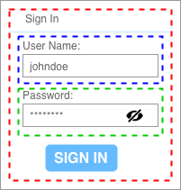
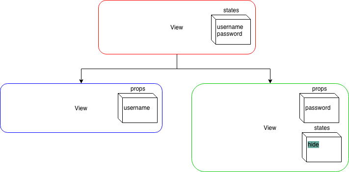
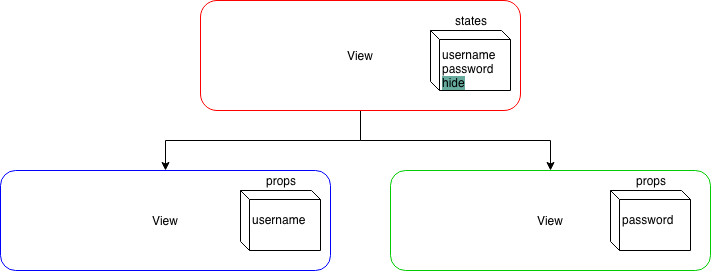
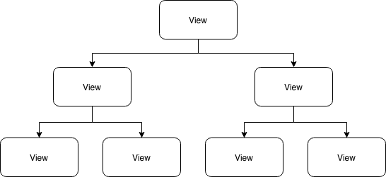
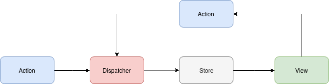
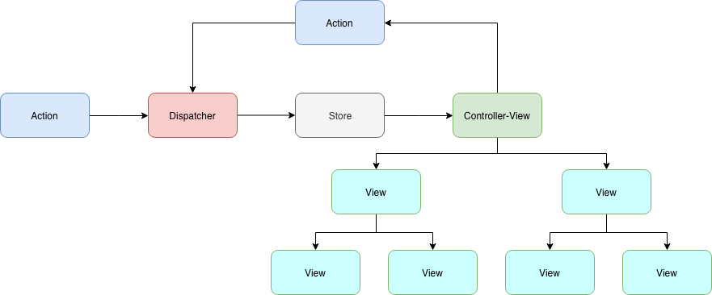
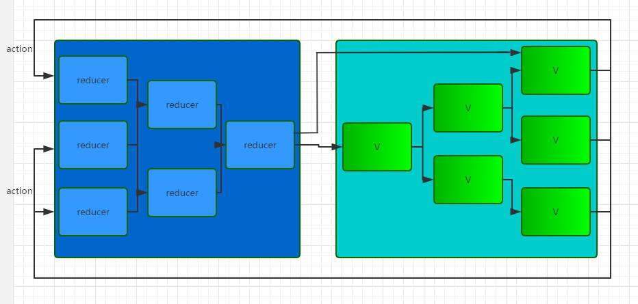

+++
title = "Day 22 - 二周目 - 解開 state:prop 的混亂：Flux 單向資料流暨 Redux 體驗"
date = "2018-10-22"
description = "介紹 Flux framework 和 Redux"
featured = false
categories = [
]
tags = [
"2019 iT 邦幫忙鐵人賽",
"用js成為老闆心中的全端工程師"
]
images = [
]
series = [
"用js成為老闆心中的全端工程師 - 2019 iT邦幫忙鐵人賽"
]
+++

介紹 Flux framework 和 Redux

<!--more-->

# 回憶

昨天介紹了 React 的基本概念 state/prop，它們是控制畫面渲染的變數。然而 component 的 state/prop 混合使用會使渲染邏輯變的混亂。

考慮登入畫面：


把 username 和 password 分成兩個 component後，關於 `hide` 值就有二種可能的 component tree 設計。
1. (component tree 1) 放在 password component 中的 state
    

1. (component tree 2) 放在最上層 component 中的 state，然後在送到  password component 的 prop
    

假如當使用者按下 **SIGN IN** 時，希望密碼是隱藏的也就是 `hide` 需要更動。因為 **SIGN IN** 是在最上層的 component， 在上面 component tree 1 就會有設定上的困難(因為 state 是在 password component 內部)，component tree 2 反而沒有。

試想當你的 component tree 更大時，你應該怎麼管理那些 state 呢？


# 目標

今天會介紹 Flux framework 和 Redux。

我覺得不要一開始就想要馬上把 Redux 和 React 串起來，因為你會誤以為 Redux 很複雜。我在本篇未會給出一個直接運作 Redux 的 Node.js 專案，裡面只有一隻程式，執行過程就是 Redux api 的最簡單的範例。

明天才會把 Redux 和 React 串起，你會看到 store, action 被拆到不同的檔案。

# Flux framework

Facebook 提出了 [Flux](https://facebook.github.io/flux/docs/in-depth-overview.html#content) framework(或稱架構)，來處理 state 和 prop 的混亂。

## Flux 的核心思想
Flux 希望資料的流動是單一的 (單向資料流)，使用者行為會產生 **Action** 送入 **Dispatcher**，**Dispatcher** 會把 **Action** 派分到「有註冊要監聽Action的 **Store**」，然後 **Store** 依照 **Action** 的 **識別字串** 決定如何修改 state，當 **Store** 修改完 state，會發出 ***change*** 訊息。最後， 註冊 ***change*** 訊息的 **View** ，收到來自  **Store**  的通知，就會執行 `setState()` 更新畫面(更新內部的component)。

它的流程如下：


1. Action：一次修改 state 的行為
2. Dispatcher：分派 Action 到 Store 的單元
3. Store：實際存 state 的單元
4. View：接收 state 並渲染畫面

### Flux 的特性
1. 資料流動的框架：從 Flux 流程上看， **Flux 和 React 其實是沒有關連性的**，因為它是提出資料流動的框架，跟畫面渲染無關。
2. 單向資料流：要修改 state 沒有其它方法，只能引起一個 **Action**
3. 單元非指向性：每個區塊都是獨立運作的，像是： 一個 **Dispatcher** 能被多個 **Store** 註冊、不同 **View** 可以監聽不同的 **Store**，任一個單元想接誰就接誰，沒有限定某一個store 只能接某一個 view。

我們注意看到「註冊 **Store** 的(***change***)訊息的 **View**」，它是 state 值流入的第一個 view，被稱成 `Controller-View` 它負責連結 **Store** 取出 state 值和引起 `setState()`，然後送入裡面的 view (即內部 view 的 props)。最後的架構圖如下：


## Flux 的實現套件

以下三個都是 Flux 的實現套件，他們的 API 用法和特性有很大的差異
1. [Facebook Flux](https://github.com/facebook/flux)：因為保留了Flux「非指向性」的特性，要做比較多 Flux API 串接的操作，用起來不太方更。用法可以看 [Flux 架構入門教程](http://www.ruanyifeng.com/blog/2016/01/flux.html)。
2. [Alt](http://alt.js.org/)：隱藏 `Dispatcher` 的概念，直接把 Action 綁定(bind) 在 Stroe 中，所以  Flux API 串接較方便。用法看[官網5分鐘上手](http://alt.js.org/guide/)就可以了。
3. [Redux](https://redux.js.org/)：簡化 Flux 完整的概念，API 不多，是我們要用的

### Redux 的特性

原本的 Flux Store 和 View 的關係下圖(截錄[淺談 React、Flux 與 Redux](http://imweb.io/topic/57711e37f0a5487b05f325b5))


然而 Redux 簡化 Flux 的概念，變成 (截錄修改[淺談 React、Flux 與 Redux](http://imweb.io/topic/57711e37f0a5487b05f325b5))


1. 只有一個 Store：所有 state 放在一個全局的 store 中。這也是最大的差別，不同於 Flux Store 可以有多個 Store，它們各自為戰。
2. 只有一個 Dispatcher：因為只有一個 Store ，所以全局也只需要有一個 dispatcher，它被隱藏在 store 中。只需 `store.dispatch(action)` 就可以引發分派 action。
2. 引入 Reducer 概念： 
    * 實際存放 state 的地方
    * store 收到 action 時，reducer 會依照 action type 處理 state 的改變
    * reducer是純函數([pure function](https://en.wikipedia.org/wiki/Pure_function))：同樣的輸入會有同樣的輸出
        ``` javascript
        const initState = {};
        const reducer = (state = initState, action) => {
          const {type, ...actionData} = action;
          switch (type) {
              default:
                  return state;
          }
        };
        ```
    * 只有一個根 reducer 對應 controller-view，其它的 reducer 會被合併，一同管理整個 store。
        ``` javascript
        // Reducer configuration
        const rootReducer = combineReducers({
            login: LoginReducer,
            account: AccountReducer,
        });
        ```
        > 注意：這裡不是說只能有一個 controller-view，subcomponent 也能是 controller-view

所以 Reducer 簡化 Flux 完整的概念，更容易使用。

# 體驗 Redux 的運作
Redux 是資料的流動，是改變 state 的框架，最後的 state 給誰用跟它沒有關係，View 是與它無關。因此，React 跟它的運作是沒有關係的。我們可以開一個 Node.js 來運作體驗 Redux。

1. 開一個空的 Node.js 專案，取名為 `hello-redux`
1. 初使化專案 `npm init`後，安裝 redux `npm install redux --save`
1. 建一個 `hello-redux.js` 檔案
1. 初使化 Redux，建立 store。我們假設 store 有一個 `message` state。
    建立 store 需要一個 root reducer，而 root reducer 當收到某個 action 後，會看 action type 修改 state
    ``` javascript
    const {createStore} = require('redux');
    
    // 定義 action type
    const identityChangeMessage = 'CHANGE_MESSAGE';
    
    // 建立一個 Reducer
    const initState = {
      message: 'init message',
    };
    const reducer = (state = initState, action) => {
      const {type, payload} = action;
      switch (type) {
          case identityChangeMessage: {
            const {message} = payload;
            return Object.assign({}, {message});
          }
          default:
              return state;
      }
    };
    
    // 建立一個 Store
    const store = createStore(reducer);
    ```
1. 印出初始的 state：`store.getState()`可以取出目前的 state
    ``` javascript
    // 印出初始的 state
    console.log(store.getState());
    ```
1. 建立 action
    ``` javascript
    // 建立一個 action
    const action = {
        type: identityChangeMessage,
        payload: {
            message: 'change',
        },
    }
    ```
    這裡我們要強調，在 Redux 中：
    * 一個 **action** 是一個 object，一般會帶有 `type` 屬性。
    * 一個 **action creator** 是產生 action 的函數，如: 
        ``` javascript
        function changeMessage(data) {
          return {
            type: identityChangeMessage,
            payload: {
                message: data,
            },
          }
        }
        ```
1. 分派(dispatch) action
    ``` javascript
    store.dispatch(action);
    ```
    分派 action 出去後，reducer 會收到 action，然後依照 action type (`identityChangeMessage`) 修改 state
1. 印出收到 action 後，被 reducer 修改的 state
    ``` javascript
    console.log(store.getState());
    ```

執行 `node hello-redux.js` 的結果：
```
{ message: 'init message' }
{ message: 'change' }
```

# 總結
今天介紹了 Flux 的基本概念和實現它的套件 Redux，也寫了簡單的程式體驗 Redux 的運作。明天就把 Redux 和 React 串接起來。

# 附錄

## 完整的 `hello-redux.js`
``` javascript
const {createStore} = require('redux');

// 定義 action type
const identityChangeMessage = 'CHANGE_MESSAGE';

// 建立一個 Reducer
const initState = {
  message: 'init message',
};
const reducer = (state = initState, action) => {
  const {type, payload} = action;
  switch (type) {
      case identityChangeMessage: {
        const {message} = payload;
        return Object.assign({}, {message});
      }
      default:
          return state;
  }
};

// 建立一個 Store
const store = createStore(reducer);

// 印出初始的 state
console.log(store.getState());

// 建立一個 action
const action = {
    type: identityChangeMessage,
    payload: {
        message: 'change',
    },
}

// 分派(dispatch) action
store.dispatch(action);

// 印出收到 action 後，被 reducer 修改的 state
console.log(store.getState());

```
