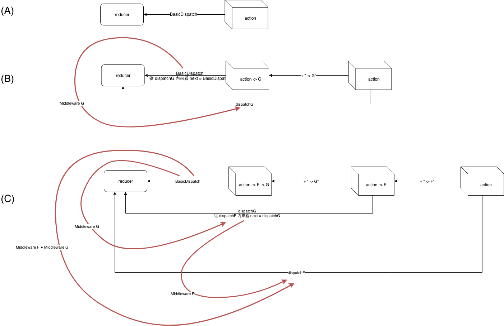
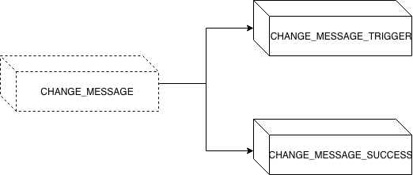
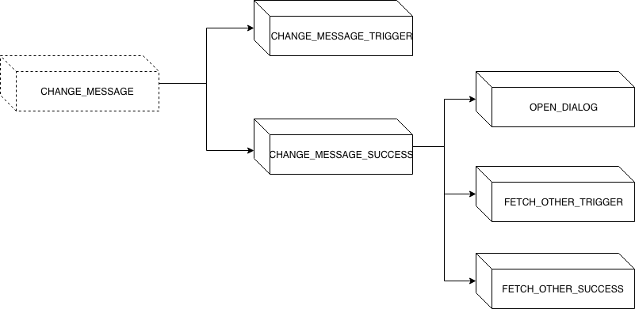

+++
title = "Day 24 - 二周目 - Redux 如何發出非同步 action：引入非同步 middleware"
date = "2018-10-24"
description = "介紹 Redux Middleware，實作同步/非同步 middleware"
featured = false
categories = [
]
tags = [
"2019 iT 邦幫忙鐵人賽",
"用js成為老闆心中的全端工程師"
]
images = [
]
series = [
"用js成為老闆心中的全端工程師 - 2019 iT邦幫忙鐵人賽"
]
+++

介紹 Redux Middleware，實作同步/非同步 middleware

<!--more-->

# 回憶
前天我們介紹了[Flux framework 套件 Redux](https://ithelp.ithome.com.tw/articles/10204180)，昨天實作 [Redux 和 React 做串接](https://ithelp.ithome.com.tw/articles/10204517)，裡面提到不少概念：
1. reducer： Redux 中實際存放 state 的單元
2. React Context: 任何地方的 subcomponent 中可以存取到的資料(store)，利用 [`react-redux`](https://github.com/reduxjs/react-redux) 就可以方便把 Redux 和 React 串接

今天要談的是最後也最重要的東西： Redux Middleware

# 目標
> 所有的範例程式放在 [ithelp-30dayfullstack-hello-redux](https://github.com/eugenechen0514/ithelp-30dayfullstack-hello-redux)，有需要的請自取。

學習完 middleware，我想當你在套用 Redux 相關套件 [react-router-redux](https://github.com/reactjs/react-router-redux#readme), [connected-react-router](https://github.com/supasate/connected-react-router)、[redux-thunk](https://github.com/reduxjs/redux-thunk)、[redux-observable](https://redux-observable.js.org/)、[redux-saga](https://redux-saga.js.org/)…等會有很大的信心和理解在做什麼。

1. Redux Middleware 概念：本篇講的 middleware 都是指  Redux Middleware，除非有出現 express middleware 會特別指明是誰的 middleware。
1. 實作同步 middleware **logger** 並學習套用 redux middleware
1. 實作非同步 middleware **PromiseMiddleware**，讓你可以延伸 action 的結構、派分出非同步 action

# Redux Middleware

Redux 也有 middleware，它類似 express middleware，我不得不說他更能難讓人理解，因為它是 higher-order function。不管理解到什麼程度，只要記得一件事：

**Redux middleware 內的實作要把 action 送到 `next(action)` 中**

Redux 在沒有引入 middleware 前的運作都是同步的，引入非同步的 middleware 就可以派分出非同步的 action。Redux Middleware 的威力很強，讓第三方的程式嵌入 Redux 的運作中。

Redux Middleware 和 Express Middleware 有一點相似之處：
* Express Middleware：處理 「request」 的 middleware， middleware 從 `res, req, next` 換到下一個 `res, req, next` middleware ，`res`、`req` 都是物件，呼叫 `next()` 換下一個 middleware 執行。
* Redux Middleware：處理 「dispatch」 的 middleware,  middleware 把 `dispatch` 產生一個新的 `dispatch`，`dispatch` 是(處理 action)函數，在它的實作中要把 action 送到 `next(action)` 中， `next` 是內層的 dispatch function。

文件是用 [Flow notation](http://flowtype.org/docs/quick-reference.html)定義，我也列出 JSDoc 定義，選你習慣的看

* Flow notation
    ``` typescript
    type Action = Object
    type AsyncAction = any
    type MiddlewareAPI = { dispatch: Dispatch, getState: () => State }
    
    type BaseDispatch = (a: Action) => Action
    type Dispatch = (a: Action | AsyncAction) => any
    
    type Middleware = (api: MiddlewareAPI) => (next: Dispatch) => Dispatch
    ```
* JSDoc
    ``` javascript
    Action: object (含有 type 屬性)
    AsyncAction: any
    MiddlewareAPI: { dispatch: Dispatch, getState: () => State }
    
    function BaseDispatch(a: Action): Action
    function Dispatch(a: Action | AsyncAction): any
    
    function Middleware(api: MiddlewareAPI): function(next: Dispatch): Dispatch
    ```
上面的 `BaseDispatch` 一般是指最內層的 dispatch function，會把 action 送到 reducer 中。由 Redux 提供，就是之前提的 `store.dispatch`。然而，一個 middleware 的作用，會在 `store.dispatch` 外層在套一個 dispatch function，類似：
``` javascript
const oldDispatch = store.dispatch // 留下舊的 dispatch function
const newDispatch = action => {
  return oldDispatch(action);
}
store.dispatch = newDispatch; // 替換成新的 dispatch function
```

用 middleware 來演示就像：
``` javascript
const oldDispatch = store.dispatch // 留下舊的 dispatch function
const middleware = dispatch => {
  const newDispatch = action => {
    return oldDispatch(action);
  } 
  return newDispatch;
}

store.dispatch = middleware(oldDispatch); // 替換成新的 dispatch function
```

以上就是 redux middleware 期望要做的事。

接下來，我們仔細的看 redux middleware 的簽章。 `Middleware` 會輸入一個 `api` 參數，回傳一個函數。 分別看它們的型態：
1. 「api」 是 `MiddlewareAPI`。它是一個物件，有 `dispatch`, `getState` 屬性。[原始碼](https://github.com/reduxjs/redux/blob/master/src/applyMiddleware.js#L33) 表示只為了把做出包含 `api` 的閉包。
2. 「回傳函數」 是`function(next: Dispatch): Dispatch`，送入 Dispatch 回傳 Dispatch，所以用箭頭函數寫實作就要出現型如：
    ``` javascript
    next => {
      return <Dispatch>
    }
    ```
    主要是這個才是 middleware 的本體。若再把 `<Deispatch>` 打開
    ``` javascript
    next => {
      return (action) => {
        return <any>
      }
    }
    ```
    這才是我們真的要實作的 middleware。此時的 `next` 其實就是內層的 dispatch function。

為了方便理解 middleware 我們先不要管 api，就直接看真的要實作的 middleware(即作用完 api 的回傳函數)。

## 簡化版 middleware
考慮兩個 middleware `F`,`G` 和 印出資料的 `baseDispatch`，這裡 `F`,`G`的簽章都是 `function(next: Dispatch): Dispatch` 所以它們可以串接，有兩種串法 `F ● G` 或 `G ● F`，我們只考慮 `F ● G` 合成，我可以得到最後的 dispatch function：
``` javascript
dispatchFG = F(G(baseDispatch));
```

若把 action 送到 `dispatchFG`，就是
``` javascript
dispatchFG(action) = F(G(baseDispatch))(action)
```

令 `dispatchF = F(G(baseDispatch))`
``` javascript
F(G(baseDispatch))(action) = dispatchF(action)
```

就是說 **`action` 會先被 `dispatchF` 作用**。

令`dispatchG = G(baseDispatch)`

得到
``` javascript
F(G(baseDispatch))(action) = F(dispatchG)(action)
```

Redux 要求：**`F` 內的實作也要把 action 送到 `dispatchG(action)` 中** 。

若把 `dispatchG` 改叫 `next` 重寫上面一句話： **`F` 內的實作也要把 action 送到 `next(action)` 中** 。
因此，就得到重要的規則：
**Redux middleware 內的實作要把 action 送到 `next(action)` 中**
這就和 express middleware 要求：
**Express middleware 內的實作一定要呼叫 `next()`** 一樣

``` javascript
// mimicBasic.js
/**
 * 
 * @callback Dispatch
 * @param {Action} action
 * @returns {any}
 */

/**
 * 
 * @param {Dispatch} next 
 * @returns {Dispatch}
 */
function F(next) {
  return function dispatchF(action) {
    console.log('dispatchF');
    action = action + ` -> F`;
    next(action); // next = dispatchG = G(baseDispatch)
  };
}

/**
 * 
 * @param {Dispatch} next 
 * @returns {Dispatch}
 */
function G(next) {
  return function dispatchG(action) {
    console.log('dispatchG');
    // action
    action = action + ` -> G`;
    next(action); // next = baseDispatch
  };
}

/**
 * 
 * @type {Dispatch} 
 */
function baseDispatch(action) {
  console.log(action);
}

/**
 * 合成 middleware F, G
 * @type {Dispatch} 
 */
const dispatchFG = F(G(baseDispatch));

dispatchFG('action');
console.log('done');
```

結果：
```
dispatchF
dispatchG
action -> F -> G
done
```

圖解就是如下：

(C) 是才是範例的圖，(B) 是只看 G 的作用，(A) 是沒有任何 middleware 的圖。(你可能需要花時間自己想圖的作用)

## Redux 原版 middleware
還原成 Redux 原來的定義，把 api 弄進來，最後再寫成箭頭函數，就是 Redux middleware 最完整的簽章。

``` javascript
// mimic.js
const f = (api) => next => action => {
  console.log('dispatchF');
  action = action + ` -> F`;
  next(action); // next = g(api)(baseDispatch)
};
const g = (api) => next => action => {
  console.log('dispatchG');
  action = action + ` -> G`;
  next(action); // next = baseDispatch
};
const baseDispatch = (action) => console.log(action);

function applayMiddleware(f, g) {
  const api = {};
  const G =  g(api);
  const F = f(api);

  const dispatchG = G(baseDispatch);
  const dispatchFG = F(dispatchG);
  return dispatchFG; // F(G(baseDispatch)) = f(api)(g(api)(baseDispatch))
}

const dispatchFG = applayMiddleware(f, g);

dispatchFG('action');
console.log('done');
```

## Redux middleware 小總結
Redux middleware 一定長成 `(api: MiddlewareAPI) => (next: Dispatch) => Dispatch`，才可以做合成  `F ● G`。

我們觀察到：
* `next` 是指內層的 dispatch function，因為 `(F ● G(BaseDispatch))(action) = F(dispatchG)(action) = F(next)(action)`
* Redux middleware 實作規定，一定要呼叫 `next(action)`，action 才能一直往內層送，不然就會斷掉，reducer 就收不到 action 了。
* 最後一個把 action 送到 reducer 的 dispatch 就叫做 **BaseDispatch**，它的一定是 `action => action`，其它中間過程是 action 被改成長什麼樣子都可以，所以你才會看到 `AsyncAction: any` 這特別的定義。
* middleware 的目地是把 dispatch function 合併成新的 dispatch function。
* `return next(action)` 在非同步的 middleware 比較少用。


# 使用 Redux middleware: 同步 middleware logger

前面我們分析了 redux middleware，看不懂沒關係可能是我寫的不好 ><。

只要記得一件事：
**Redux middleware 內的實作要把 action 送到 `next(action)` 中**
這樣才能引起一連串的內部 dispatch function 運作。剩下的只要知道 middleware 簽章，你也可以寫出自己的 middleware。

接下來，我們來套用 redux middleware 到 store 中，只需要 `createStore()` 中使用 `applyMiddleware()`。

當沒有用任何 middleware 時，像
``` javascript
const store = createStore(reducer, initState);
```
此時的 store 的 dispatch function `store.dispatch` 是「某個 BaseDispatch 的實體」(我們暫時稱為 `aBaseDispatch`)，這是最內層的 dispatch function，內部會把 action 送入 reducer 中。

假如，套用 logger middleware，
``` javascript
function logger({ getState }) {
  return next => action => {
    console.log('will dispatch: ' + JSON.stringify(action));

    // 送 action 到內層 dispatch function
    const returnValue = next(action);

    console.log('state after dispatch: ' + JSON.stringify( getState()));

    // 在同步的 middleware 才有用  
    return returnValue;
  }
}
```

``` javascript
const { createStore, applyMiddleware } = require('redux');
const store = createStore(reducer, initState, applyMiddleware(logger));
```
把 middleware 用到 store dispatch function 中，要用 `applyMiddleware` 這函數。 `applyMiddleware(...middleware)` 會回傳 [enhancer](https://redux.js.org/glossary#store-enhancer)，給 `createStore` 使用 (就是 `enhancer(createStore)` 變成新的 store)。
此時 store 的 dispatch function `store.dispatch` 的真實身份是 `logger(aBaseDispatch)`，

若送出一個 action,
``` javascript
const action = {
  type: identityChangeMessage,
  payload: {
    message: 'change',
  },
}
```

action 經過 logger middleare 會印出

```
will dispatch: {"type":"CHANGE_MESSAGE","payload":{"message":"change"}}
state after dispatch: {"message":"change"}
```

[完整的程式見 `middlewareSync.js`](https://github.com/eugenechen0514/ithelp-30dayfullstack-hello-redux/blob/master/middlewareSync.js)

# 寫自己的非同步 middleware：發出非同步 action

這裡雖然是自己做非同步 middleware 但只是學習用，除非你有獨到的見解或其它考量，否則還是建議使用 middleware 套件：[redux-thunk](https://github.com/reduxjs/redux-thunk)、[redux-observable](https://redux-observable.js.org/)、[redux-saga](https://redux-saga.js.org/)。

## **promise action** : 帶有 promise 的 action
假設我們可以發出一個帶有 promise 的 action，例如：
``` javascript
const promiseAction = {
  type: 'CHANGE_MESSAGE',
  promise: Promise.resolve({message: 'changed'})
}

store.dispatch(promiseAction);
```

## `PromiseMiddleware`: 可以處理 pomise 的 middleware
我們需一個 middleware，它要做以下的事
* 它可以判斷 action 是否是 promise action
* 若不是 promise action，不要做任何事，傳 action 到內層 middleware 做事 (即 `return next(action)`)
* 若是 promise action，它會為 action 加入三種狀態 (`_TRIGGER`, `_SUCCESS`, `_FAIL`)
    1. 觸發 action: `CHANGE_MESSAGE_TRIGGER`
    1. promise resolve: `CHANGE_MESSAGE_SUCCESS`，且 resolve data 放在 `action.payload`
    1. promise reject: `CHANGE_MESSAGE_FAIL`，且 reject error 放在 `action.error`
* 除了第一次的 trigger action，Promise 得到結果後也要引起 `next(action)` 讓內層 dispatch fuction 作用

把上述寫成程式
``` javascript
// PromiseMiddleware
function PromiseMiddleware(action) {
  return next => {
    return function dispatchAsync(action) {
      if (action.promise instanceof Promise) {
        console.log('Promise action');
        const { type, promise, ...others } = action;
        promise
          .then(data => {
            next({
              type: success(type),
              payload: data,
              promise,
              ...others
            });
          })
          .catch(error => {
            next({
              type: fail(type),
              error: error,
              promise,
              ...others
            });
          });
        return next({
          type: trigger(type),
          promise,
          ...others
        });
      } else {
        console.log('Not promise action');
        return next(action);
      }
    }
  }
}
```

修改一下之面的 `logger` 方便我們觀察 action
``` javascript
function logger({ getState }) {
  return next => action => {
    console.log('========== action dispatching(start) ===============');
    console.log('will dispatch: ' + JSON.stringify(action));
    const returnValue = next(action);
    console.log('state after dispatch: ' + JSON.stringify(getState()));
    console.log('========== action dispatching(end) ===============');
    return returnValue;
  }
}
```

## 使用 `PromiseMiddleware` 和 `logger` middlewares
接下來，使用 `PromiseMiddleware` 和 `logger`
```
const store = createStore(reducer, initState, applyMiddleware(PromiseMiddleware, logger));
```
要小心，middleware 順序不能換，因為 promise action 要先進到　`PromiseMiddleware`　的 dispatch function（dispatchAsync） 作用， action 才能進到內層的 `logger` 中 dispatch function 印出。
> 你也可以試試看順序倒過來會怎麼樣。

## 發出一個 promise action
定義一個 promise action
``` javascript
const identityChangeMessage
// Case 1: 建立一個 resolve action
const resolvePromiseAction = {
  type: identityChangeMessage,
  promise: Promise.resolve({
    message: 'changed',
  })
};
```

派分 promise action
``` javascript
store.dispatch(resolvePromiseAction);
```

結果如下：
```
========== action dispatching(start) ===============
will dispatch: {"type":"CHANGE_MESSAGE_TRIGGER","promise":{}}
state after dispatch: {"message":"identityChangeMessage trigger"}
========== action dispatching(end) ===============
waiting...
========== action dispatching(start) ===============
will dispatch: {"type":"CHANGE_MESSAGE_SUCCESS","payload":{"message":"changed"},"promise":{}}
state after dispatch: {"message":"changed"}
========== action dispatching(end) ===============
```

我們發現產生了兩個 action，action type 分別是 `CHANGE_MESSAGE_TRIGGER`, `CHANGE_MESSAGE_SUCCESS`，這也符合 Promise 的運作過程，就像是我們模擬 Redux 版本的 `fetch()` request。當派分 promise action 後，在 reducer 就要收到一個 `_TRIGGER` 的 action，然後取回資料後，reducer 就要收到一個 `_SUCCESS` 的 action。


> reject promise action 和 normal action 的完整的範例見 [middlewareAsync.js](https://github.com/eugenechen0514/ithelp-30dayfullstack-hello-redux/blob/master/middlewareAsync.js)

## 總結非同步的 middleware：`PromiseMiddleware`

非同步的 middleware 有下列的特性：

1. 新形態的 action：它讓我們可以派分 promise action 這種新形態的 action，例如：在 `PromiseMiddleware` 中解讀 promise action, 就可以產生其它 action 來模擬 Promise 的運作過程。
1. 派分任意次 action：我們可以派分任意多次的 `next(action)`，就像我們發出了二個 actions
    
    > 實務上，在發出 某 action 後可能又要發出其它 action，如下圖
        
      雖然這大量產生的 action 讓人有點詬病，但使用良好的非同步 action 套件，可以一定程度控制我們的程式碼，避免程式碼混亂。
1. action 自由性：`next(action)` 中的 action 可以在 middleware 中任意建立、修改、更換，例如：我們建立新的 action `{type: success(type),  payload: data, promise, ...others}` ( action type 加入後綴詞) 

# Redux 生態系

Redux 是很小的套件，以它為核心已經發展出大量的相關套件，當然你想要什麼功能除了自己實作，也可以用別人的套件。
> 我的學習方法是先自己試寫看看體驗一下痛苦，再套用大神們的套件，因為自己臨時寫的 API 我不覺得會比大神們經過時間粹煉的套件好用、穩定。

Redux 生態系列表如下：
* [Redux exosystem(offical)](https://redux.js.org/introduction/ecosystem)：裡面可以看到套件程式碼火力展示
* [Redux 生態系(中文)](https://chentsulin.github.io/redux/docs/introduction/Ecosystem.html)：當功能的英文關鍵字都不知道就可以查看看

我還是可以小小的註解一下：

## 非同步 middleware 套件：用來發出非同步 action 的套件
[redux-thunk](https://github.com/reduxjs/redux-thunk)：我第一個用的非同步 middleware 套件。它的原始碼很簡單，把 action 結構改成一個函數(物件)，然後派分函數 action。我覺得 action 連發、維護不太好處理，我就轉為 `redux-observable`。
[redux-observable](https://redux-observable.js.org/)：要用 reactive programming 的概念，[RxJS](https://rxjs-dev.firebaseapp.com/) 是 javascript 的 reactive programming 實現套件。 `redux-observable` 把它們引入 Redux 中。
[redux-saga](https://redux-saga.js.org/)：使用 ES6 的生成器函式(generator function)/ `yield` 語法不用學新的語法。

## Routing：頁面切換
[react-router](https://github.com/ReactTraining/react-router) 是 react compoent 套件，用來依照網址選擇要渲染的 component。它是 React 相關套件，它與 redux 沒關西。

因為篇福有限，我只點出一件很重要的事： `使用 react-router 要小心版本號`

若你要用 **react-router 4.x** 請用以下組合：
* [history](https://github.com/ReactTraining/history#readme)：
* [react-router 4.x](https://github.com/ReactTraining/react-router)
* [connected-react-router](https://github.com/supasate/connected-react-router)

若你要用 **react-router 2.x and 3.x** 請用以下組合：
* [react-router 2.x and 3.x](https://github.com/ReactTraining/react-router/releases/tag/v3.0.5)
* [react-router-redux](https://github.com/reactjs/react-router-redux#readme)


# 總結
今天主要介紹 Redux Middleware，並分別給出了同步和非同步的 middleware 的範例 `logger` 和 `PromiseMiddleware`，並在建立 store 時使用 middleware，最後以Redux 生態系為結尾。
