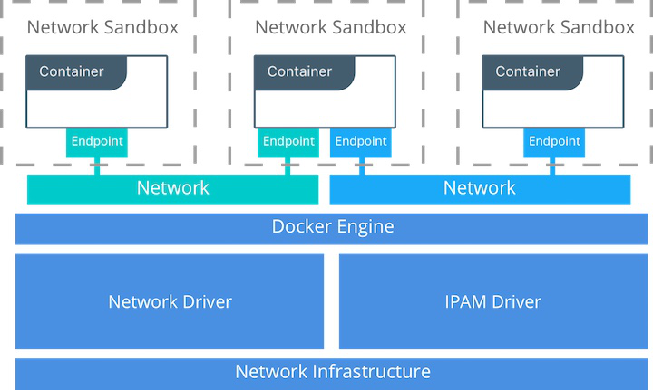

+++
title = "Day 26 - 三周目 - Docker 基本使用：看完就會架 docker 化的服務"
date = "2018-10-26"
description = "快速入門 Docker 的操作"
featured = false
categories = [
]
tags = [
"2019 iT 邦幫忙鐵人賽",
"用js成為老闆心中的全端工程師"
]
images = [
]
series = [
"用js成為老闆心中的全端工程師 - 2019 iT邦幫忙鐵人賽"
]
+++

快速入門 Docker 的操作

<!--more-->

# 回憶
昨天介紹完了 Material-UI 後，整個二周目深入前後端也告一段落了，接下來我們要進到第三周目：發佈、維運篇。

# 目標
今天的文章看完後我預期你就會：在本機端安裝並執行任何映像檔，可以架任何 dockerize (docker 化) 的服務，像 mysql, mongodb, nginx, apache …等。

我們曾在 [Day 15 - 二周目 - 用 Docker 玩轉 MongoDB](https://ithelp.ithome.com.tw/articles/10201657) 簡單的介紹 docker 及用它來架設 MongoDB。開始前我們假設你已經安裝 [Docer Desktop](https://www.docker.com/products/docker-desktop)，它的功能比較多。

今天就來深入 Docker 的操作。

下列的問題是我在學習 docker 時想問的問題，它們有順序性，由淺入深。
1. 怎麼執行執映像檔？
1. 怎麼開啟 port？
1. 怎麼留下資料？
1. 怎麼做自己的映像檔？
1. 怎麼同時啟動多個服務？
1. 多個服務之間怎麼通訊？它們的 IP 是什麼？

你可以先想一下，我馬上就給出簡單的回答

1. 怎麼執行執映像檔？ `docker run`
1. 怎麼開啟 port？ Compose file: `port:`, Container: `-p XXXX:XXXX`
1. 怎麼留下資料？ Compose file: `volumes:`, Container: `-v`
1. 怎麼做自己的映像檔？ `Dockerfile`
1. 怎麼同時啟動多個服務？`docker-compose`
1. 多個服務之間怎麼通訊？它們的 IP 是什麼？Compose file: `networks:`, Container: `--network`

> 完整的 [docker 文件](https://docs.docker.com/)真的很龐大又難讀，所以我們只能介紹常用的東西。有了基本的認識和操作，再來自己深入研究。這也符合邊做邊學的原則。

# Docker 是什麼

Docker 的架構圖如下：

上圖截取自 [Docker Reference Architecture: Designing Scalable, Portable Docker Container Networks](https://success.docker.com/article/networking)

## 容器(container)
Docker 關鍵的技術是 **容器(container)**。 容器像是個沒有硬體環境的輕量虛擬機器，但與虛擬機器不同，它就像是執行在 host 的行程(process)，可能獨立網路、共享單一/多個網路或活在 host 的網路空間。容器的運作跟作業系統無關，因為它是運作在 Docker Engine上，不同的作業系統都有對應的 Docker Engine。 容器是映像檔的實際執行單位，它可以 run(建立並執行)/start(執行)/restart(重新執行)/stop(停止)/rm(移除)。

當容器建立時，它會執行在一個沙箱環境，可以想像他有自己的檔案系統。另外，我們還可以為它裝上 network, volume。

network 是讓我們從此容器外部存取容器內的服務，可能是從 host (我們執行 docker engine 的環境，一般直接開 ternimal 的環境就是 host)，也可能是來自別的 container。

volume 是容器與別人共享的資料區，我們可以把資料放在裡面，可以：
1. 供在 host 存取
1. 供其它 container 掛載(mount)使用，共享同樣的資料區
1. 它是獨立於 container，當 container 移除時，volume 裡的資料一樣留下來。

## 映像檔(image)
映像檔打包著相關程式碼、函式庫、環境配置檔。總之，就是一群檔案集合。

當要建立並執行 container 時一定要指定「唯一」的一個映像檔，如下格式
```
docker run <IMAGE>
```
其它的設定全部是可選，而有些本來就預設值，像 network 預設是 [bridge](https://docs.docker.com/network/#network-drivers)。

> `docker run --help` 可以看到一堆嚇人的設定
    

## 所以最基本的 Docker 有什麼單元?

由執行 container 出發，跟它有關的單元(包含自己)如下：
1. container
2. image
3. network
4. volume

用 class diagram 來表達如下：


每個單元都可以獨立管理，一但被 container 關連就無法輕易刪除。你可以 `docker --help` 查看 **Management Commands** 有哪此單元可以管理。


若你要管理 container，鍵入 `docker container --help` 查看有哪些指令


更進一步，假如要建立 container， `docker container create --help` 查看指令怎麼使用


一般而言，不同的單元(針對實體)都有以下指令：`ls`、`create`、`rm`、`prune`、`inspect`。

* `ls`：列出所有單元實體
* `create`：建立單元實體
* `rm`：刪除單元實體
* `prune`：刪除未被(容器)使用的單元實體
* `inspect`：這個很推薦用看看，查看單元實體的描述，例如用在容器就可以看到，它用的 network, volume之類的資訊

## 下載映像檔(image): nginx
nginx 是用來架設網頁伺服器，我們以它為例子。

在使用容器前一定要有映像檔(image)，你有以下方法可以取得：
1. [Docker Hub](https://hub.docker.com/)下載：
    你可以想像它和 [NPM](https://npmjs.com) 類似，它就是個公開(public)的 Repository 的集合，所有人都可以上傳下載某個 Repository 裡面的映像檔。假如你在 docker hub 找到 [nginx repository](https://hub.docker.com/_/nginx/)，想要下載它們的映像檔，只要下指令 `docker pull nginx` (等於 `docker pull nginx:latest`) 就會下載 nginx 的映像檔。
    完整個映像檔的格式是 `<image>:<tag>` ，你可以指定下載的版本號 `docker pull nginx:1.15`。若沒有指定映像檔版本號就會下載最新版本 **nginx:latest** ，但要小心每個人的 **latest 都不一樣**，所以能的話還是指定一下版本號。
    
2. 自己做：這個 **Day 28** 再說

我們實際下載 `nginx:1.15` 看看：
``` shell
docker pull nginx:1.15
```

就完成了

下載完的映像檔是由 docker 統一管理，要用 `docker` 指令才能管理

### 常用映像檔管理
* 查看 docker 中所有映像檔： `docker images` ，它是 `docker image ls` 短語。可以用它查看是否下載映像檔。
    
* 刪除不要用的映像檔：`docker rmi <id or image_name>`，它是 `docker image rm` 短語

## 建立並執行容器: `nginx_1`

### 建立並執行容器指令: `docker run`
我們已經下載了 `nginx:1.15` 映像檔，接來來要建立容器並執行它。只要 `docker run nginx:1.15` 即可，但建立起來的容器名稱是 docker 亂數取名的，所以我們要加入 `--name` 參數(參數值用 "=" 或空白區隔)：`docker run --name nginx_1 nginx:1.15`，指令是指：
```
用 nginx:1.15 映像檔建立名為 nginx_1 的容器
```

> 建議容器要取名字，讓自己辨別

但我們還是沒辨法訪問它，因為目前網路結構：


我們沒連入容器的方法，就像是沒辨法訪問監聽某個 port 的 process，因此要指定 port 號 (建立一個連通的 **EndPoint**)。因此，
``` shell
docker run --name nginx_1 -p 8080:80 nginx:1.15
```
`8080:80` 就好像把 `8080 port` 放到 **network(host)** 中，當外部流量來的時後就從 `8080 port` 流到容器內的 `80 port`，所以外界不會察覺 容器 `80 port` 的存在。


接下來，打開瀏覽器，訪問 `http://localhost:8080/`，就會看到以下畫面：


訪問後，會看到 terminal 出現：

這是 nginex 的 **console log**。

先等等，我怎麼會知道 `nginx_1` 容器內是開 `80 port`，每個映像檔的實現方法 (Dockerfile 內會寫 `EXPOSE <port>`)不一樣，使用方法也不一樣，要看映像檔的 docker hub repository 說明。

到目前為止，我們建立了一個 nginx container，並執行它啟動網頁伺服器。 

### 移除容器
只需要把 ternimal 關掉(`ctrl + c`)後，`http://localhost:8080/` 就訪問不到了。

你可以用 `docker ps`(它是 `docker container ls` 短語)查看正在執行的容器，會發現 `nginx_1` 不在執行中的 container 中。若也要列出停止執行的容器，要加 `--all` (`-a`)，如 `docker ps --all` 或 `docker container ls --all`，才會看到它。

當你不要 `nginx_1` 時，輸入 
```
docker rm nginx_1
```
就可以刪除(它要先停止它才能移除)。


### 讓容器在背景執行
若你已經建立好容器且假設它已經停止，如：

`STATUS` 欄位中說他已經 **exited** 了。

若你要讓容器再次執行 `docker start <id or container_name>`，
``` shell
docker start nginx_1
```
之後再 `docker ps`，就會看到它 **Up** (running)。


> 容器的生命周期和指令關係如下圖(來自[Lifecycle of Docker Container](https://medium.com/@nagarwal/lifecycle-of-docker-container-d2da9f85959))
    
    
這時的容器就會在背景執行。可是這樣很麻煩阿! 

我們還有其它辨法，可以在建立並執行容器時脫離(detach) console log，只要加入 `-d` (`--detach`) 參數：
``` shell
docker run --name nginx_1 -d -p 8080:80 -d nginx:1.15
```

因此我們有兩個方法可以讓容器在背景執行：
1. 建立好容器後，再次執行容器  `docker start <id or container_name>`。
2. 建立並執行容器時立刻脫離。

> 若你希望在停止容器後自動刪除容器要加入 `--rm` 參數，如：`docker run --name nginx_1 -d --rm -p 8080:80 nginx:1.15`，就會在停止後自己刪除。

### 常用容器管理

我們整理一下常用容器管理指令：

| 用途      | 指令             | 常用可選參數                      |
|---------|----------------|-----------------------------|
| 建立並執行容器 | `docker run`    | `--name`, `-d`, `-rm`, `-p` |
| 查看容器    | `docker ps`    | `--all`                     |
| 執行容器    | `docker start` |                             |
| 停止容器    | `docker stop`  |                             |
| 刪除容器    | `docker rm`    |                             |

# Volume：獨立於容器的檔案空間

我們有時會希望：
1. 容器移除時檔案可以留下   -  資料庫類型的容器常會需要
2. host 的檔案可以在容器存取到   -  常用於共享 host 和 容器檔案
3. 同個檔案可以在不同容器間共享 - 容器間可以用共用的組態檔

總之就是為了 「共用」和「留下」的目地，此時就要想到 : **Volume**

volume 在容器內要指定要掛入目標(target)，然後就可以在容器內使用。

Docker 提供三種掛載類型(mount types)：
1. bind mount：掛入現有的 host filesystem，用在容器 與 host 共享資料夾或檔案
2. volume：掛入 volume 實體
3. tmpfs mount：從 memory 掛載

上圖來自 [Manage data in Docker](https://docs.docker.com/storage/#more-details-about-mount-types)

我們只提 bind mount 和 volume。

## 與 host 共享(bind mount)

這是比較常用的，例如， `nginx_1` 要在根目錄多出一個資料夾 `/mydata`。在 **建立容器** 時，用 `-v` (`--volume`)參數指定要掛入的 host 資料夾(或檔案)及掛入在容器中哪個目標(位置)。直接看例子：
``` shell
docker run --name nginx_1 -d -p 8080:80 -v /Users/eugenechen/mydata:/mydata nginx:1.15
```
這裡 `/Users/eugenechen/mydata` 是主機來源(可能是資料夾/檔案)，`/mydata` 是容器內要掛入的目標。
> 一般情形下，容器必需重新建立，雖然有別的方法，但很麻煩。

> 若要更多 volume 就多寫幾個 `-v`，如： `-v /Users/eugenechen/mydata1:/mydata1 -v /Users/eugenechen/mydata2:/mydata2`

你可以放一些檔案在主機資料夾中，然後去看容器內的 `/mydata` 看有沒有檔案。

### "ternimal" 進入容器： `docker exec`
進入容器我們需要用到 `docker exec` 指令，它是在容器中執行指令，例如
```
docker exec -it nginx_1 bash
```
就是在 `nginx_1` 容器中執行 `bash` 指令。`-it` 分別是兩個參數 `--interactiv` 和 `--tty`，有興趣自己查。

指令 `docker exec -it <id or container_name> bash` 用起來就像是在容器開一個 ternimal。

### 驗証主機資料夾中檔案，出現在容器中
因此，我們就可以查看 `/mydata` 資料夾

若要離開就打 `exit` 指令。

> 你可以自行驗証容器移除後，檔案還在

## 掛載 Volume 實體 (volume)

前面是直接把 host 的來源(source)掛載到容器的目標(target)，另一個方法是建立一個 volume，再掛載到容器的目標。

1. 建立一個 volume
    ``` shell
    docker volume create mydata2
    ```
1. 在 **建立容器** 時，一樣用 `-v`，只是來源(source)改成用 volume name
    ``` shell
    docker run --name nginx_1 -d -p 8080:80 -v /Users/eugenechen/mydata:/mydata -v mydata2:/mydata2 nginx:1.15
    ```

### 驗証容器移除後，檔案還在
1. 進入容器，建立 `hi_container.txt`，離開
    ``` shell
    # in host
    docker exec -it nginx_1 bash
    
    # in nginx_1
    cd mydata2/
    touch hi_container.txt
    exit
    ```
    
1. 刪除容器，再重新建立
    ``` shell
    docker stop nginx_1
    docker rm nginx_1
    docker run --name nginx_1 -d -p 8080:80 -v /Users/eugenechen/mydata:/mydata -v mydata2:/mydata2 nginx:1.15
    ```
1. 進入容器，會發現檔案還在
    ``` shell
    # in host
    docker exec -it nginx_1 bash
    
    # in nginx_1
    ls /mydata2/
    ```
    
## volume 小總結

`-v` 參數的格式是：`-v <source>:<target>`，source 可以來自 host 或 volume，不管來自哪都不會因為容器刪除而消失，並且
來自 host ：容器與 host 就可以共享檔案/資料夾，
來自 volume ：容器與 其它容器 就可以共享資料夾

最後，重新整理常用容器管理表格，加入 `-v`：

| 用途      | 指令             | 常用可選參數                      |
|---------|----------------|-----------------------------|
| 建立並執行容器 | `docker run`    | `--name`, `-d`, `-rm`, `-p`, `-v` |
| 查看容器    | `docker ps`    | `--all`                     |
| 執行容器    | `docker start` |                             |
| 停止容器    | `docker stop`  |                             |
| 刪除容器    | `docker rm`    |                             |


# 總結

常用指令如下：

| 用途      | 指令             | 常用可選參數                      |
|---------|----------------|-----------------------------|
| 下載映像檔    | `docker pull`    |                             |
| 刪除映像檔    | `docker rmi`    |                             |
| 建立並執行容器 | `docker run`    | `--name`, `-d`, `-rm`, `-p`, `-v` |
| 查看容器    | `docker ps`    | `--all`                     |
| 執行容器    | `docker start` |                             |
| 停止容器    | `docker stop`  |                             |
| 刪除容器    | `docker rm`    |                             |
| 進入容器    | `docker exec -it <id or container_name> bash`    |                             |
| 建立 volume    | `docker volume create`    |                             |


今天介紹了 docker 的基本元件：image, container, volumn，以及常用的指令。到目前為止，你應該會在本機端架任何 dockerize (docker 化) 的服務。

未來我們在來談 network，它可以只讓特定容器放在某網路中，不需要限定安裝在本機端。
