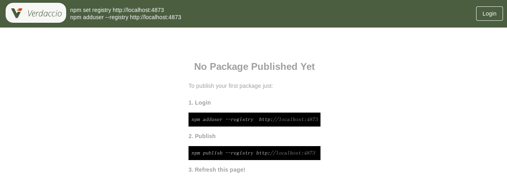
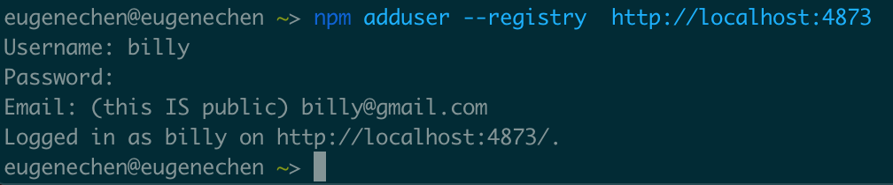
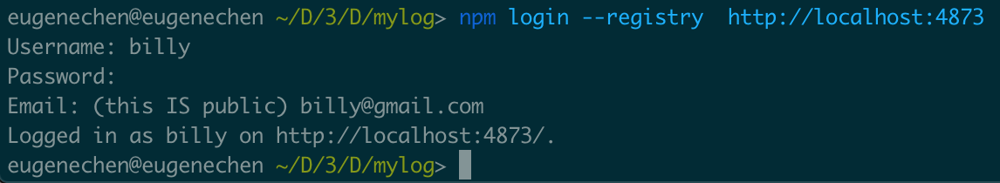
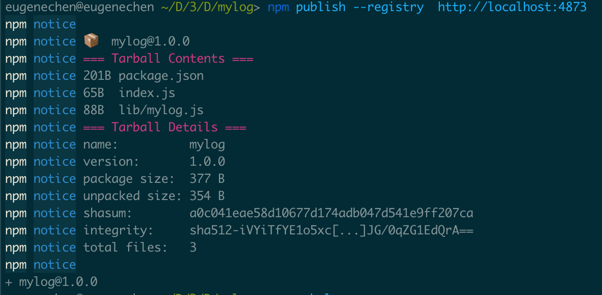
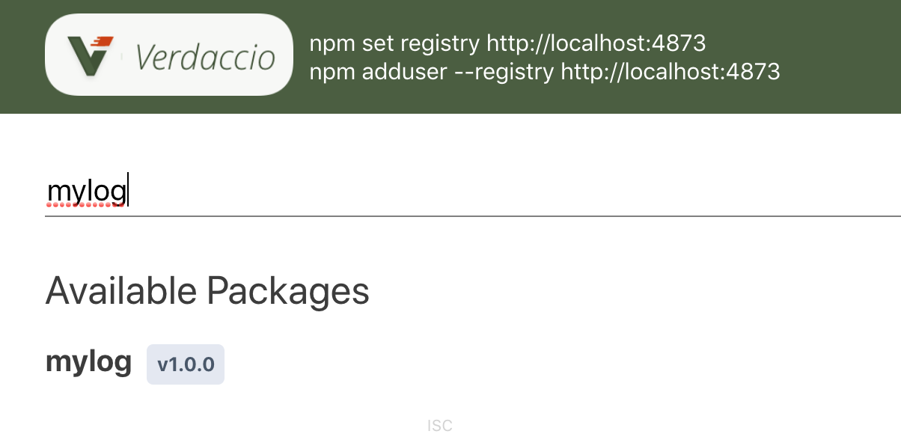
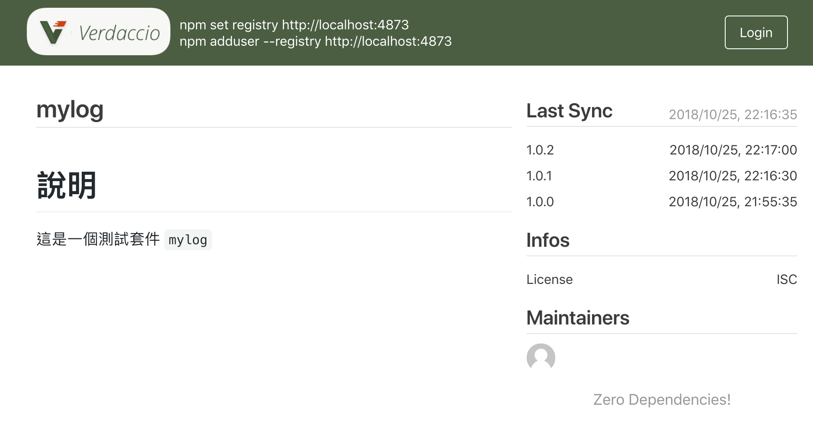

+++
title = "Day 27 - 三周目 - 五分鐘建立私有 NPM: verdaccio"
date = "2018-10-27"
description = "五分鐘建立私有 NPM: verdaccio"
featured = false
categories = [
]
tags = [
"2019 iT 邦幫忙鐵人賽",
"用js成為老闆心中的全端工程師"
]
images = [
]
series = [
"用js成為老闆心中的全端工程師 - 2019 iT邦幫忙鐵人賽"
]
+++

五分鐘建立私有 NPM: verdaccio

<!--more-->

# 回憶

昨天介紹 Docker 的基本使用，那些內容已足夠你下載映像檔並建立容器執行它們。

# 目標
今天要使用 Docker 基本操作，安裝使用私有 NPM：**verdaccio**

verdaccio 是一個輕量級的私有NPM proxy registry，你可以：
1. 發佈自己的私有套件，不用上傳到 npmjs
2. 跟往常一樣下載 npm registry (https://registry.npmjs.org) 的套件，而不用刻意切換 registry
3. 不同的專案可以使用同一個套件，以後更新只要重發佈套件，使用的專案只要 `npm upgrade` 就可以更新套件。
4. 你的套件就有版本號管理

# 架設 verdaccio 伺服器並建立一個帳號
1. 安裝 [verdaccio 映像檔](https://hub.docker.com/r/verdaccio/verdaccio/)
    ``` shell
    docker pull verdaccio/verdaccio
    ```
1. 執行 verdaccio 伺服器
    ```
    docker run -d --name verdaccio -p 4873:4873 verdaccio/verdaccio
    ```
    > 若不懂參數請見 [Day 26 - 三周目 - Docker 基本使用：看完就會架 docker 化的服務](https://ithelp.ithome.com.tw/articles/10205481)

1. 用瀏覽器打開 `http://localhost:4873`，看到畫面就安裝完成了
    
1. 之後的 npm 操作需要帳號登入，所以為 verdaccio 伺服器加入一個帳號
    ``` shell
    npm adduser --registry  http://localhost:4873
    ```
    接下來按照指示建立一個帳號就可以了
    

有了一個帳號才可以做登入網站、發佈的動作。

> 我們接下來 `npm` 指令的動作都會加  `--registry  http://localhost:4873`，這因為要指定使用我們 verdaccio 伺服器，不加的話就是預設的 `https://registry.npmjs.org`

# 發佈套件

## 建立一個套件 `mylog`

我們隨便開一個 Node.js 專案叫 `mylog`

1. 開一個資料夾 `mylog` 並初始化
    ``` shell
    npm init
    ```
    package.json 的內容如下：
    ``` javascript
    {
      "name": "mylog",
      "version": "1.0.0",
      "description": "",
      "main": "index.js",
      "scripts": {
        "test": "echo \"Error: no test specified\" && exit 1"
      },
      "author": "",
      "license": "ISC"
    }
    ```
    注意看 `"main": "index.js"`， 這行是指：當我們 `const mylog = require('mylog')` 的入口檔就是根目錄的 `index.js`。
1. 建立兩個檔案，當作套件實作：lib 資料夾放實作的檔案 `mylog.js`， `index.js` 負責做對外的接口
    * `lib/mylog.js`
        ``` javascript
        function mylog() {
            console.log('mylog: ', ...arguments);
        }
        
        module.exports = mylog;
        ```
    * `index.js`
        ``` javascript
        const mylog = require('./lib/mylog');
        
        module.exports = {mylog};
        ```

## 發佈
接下來我們要登入帳號後才能發佈到 verdaccio 伺服器。只要登入過一次以後就不用了，除非你 `npm logout` 登出。

1. 登入 verdaccio 伺服器
    ``` shell
    npm login --registry  http://localhost:4873
    ```
    
    > `npm whoami --registry  http://localhost:4873` 可以確入登入帳號

1. 發佈
    ``` shell
    npm publish --registry  http://localhost:4873
    ```
    
    
這樣就發佈完成了，刷新網站就會出現了

別人只要 `npm install mylog --registry  http://localhost:4873` 就可以安裝私有套件。

# 更新版號

當套件要更新，需要更新版號後，再發佈一次。

npm 使用 Semantic Versioning (版號是有語義的)。 見下表：

| 程式碼狀態       | 階段(Stage)     | 規則               | 範例    | 用途                |
|-------------|---------------|------------------|-------|-------------------|
| 第一次釋出       | New product   | 從 1.0.0 開始       | 1.0.0 | 第一次釋出套件           |
| bug 修正且向後相容 | Patch release | 增加第三碼            | 1.0.1 | 微小的修正或更改          |
| 新功能增加且向後相容  | Minor release | 增加第二碼且第三碼重設成 0   | 1.1.0 | 新的功能出現或修正         |
| 可能會有無法向後相容  | Major release | 增加第一碼且第二、三碼重設成 0 | 2.0.0 | 可能有巨大的改變，可能無法向後相容 |

你可以手動改版號(改 `package.json` 的 `version`)，也可以用 `npm version` 指令：
``` shell
`npm version [<newversion> | major | minor | patch | premajor | preminor | prepatch | prerelease | from-git]`
```
例如：原來是 `1.0.0`，用 `npm version minor` 後就變成 `1.1.0`
> 請注意，若你有用 `git`， `npm version` 除了改 `package.json` 的 `version` 還會 git commit

改成版號後，請記得重新發佈 `npm publish --registry  http://localhost:4873`。之後使用套件的人 `npm upgrade <package>` 就可以升級套件。

# 發佈要注意
1. 你可以加入 `README.md` 檔說明套件
    
1. 不能重覆發佈同樣的版號，你的版號一般要遞增，雖然可以 `unpublish` 但還往上加比較單純。
1. 好好決定你的版號，這會影響到用你套件的人，如何進行更新。
    使用你套件的人若版號是從 `1.0.4` 開始，他可以在 `package.json` 中 `dependencies` 設定更新套件版號的範圍，例如：
    * `1.0` 或 `1.0.x` or `~1.0.4` : 表示只可以做 **Patch releases** 。如：`1.0.5`, `1.0.6` 可更新， `1.1.0` 不更新。
    * `1` or `1.x` or `^1.0.4`：表示只可以做 **Minor releases**。如：`1.0.5`, `1.1.0` 可更新， `2.0.0` 不更新。
    * `*` or `x`：表示可以做 **Major releases**。任何版號都可以更新。

# 全域修改 registry
每次都要手動加 `--registry  http://localhost:4873`，有點煩的話可以改成全局的。
``` shell
npm set registry http://localhost:4873/
```
原來 `https://registry.npmjs.org/` 改成是 `http://localhost:4873/`。

因為 verdaccio proxy registry，找到不的套件會自動去 npmjs 下載，你一樣可以下載到 npmjs 裡的套件。

> 你也可以用 npm 組態檔，見 [npmrc](https://docs.npmjs.com/files/npmrc)

# 留下資料

因為是用容器執行，所以要留下資料要保留 verdaccio 容器的 **storage** 和 **conf** 資料夾，文件中沒有明寫在哪，我發現在容器中的：
1. `/verdaccio/conf`
2. `/verdaccio/storage`

請用 [Day 26 - 三周目 - Docker 基本使用：看完就會架 docker 化的服務](https://ithelp.ithome.com.tw/articles/10205481) 的掛載 volume 的方法留下它們。

# 總結

今天練習 Docker 的操作，實戰安裝私有 NPM registry。你可以重構你的程式，抽出可以重覆使用的套件，供自己或別人使用。

# 參考資料
* [How to use Semantic Versioning](https://docs.npmjs.com/getting-started/semantic-versioning)
