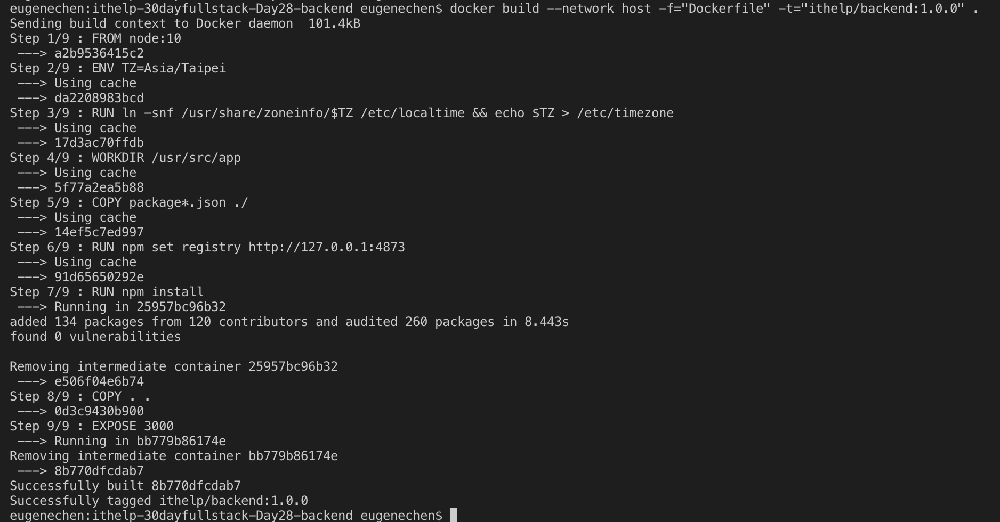
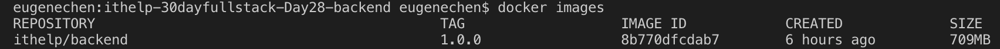
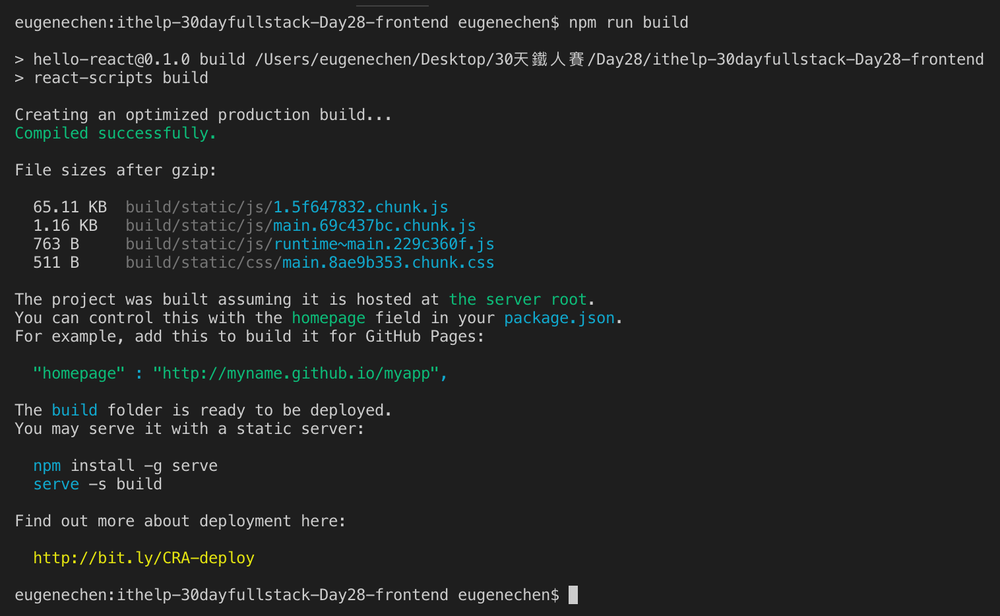
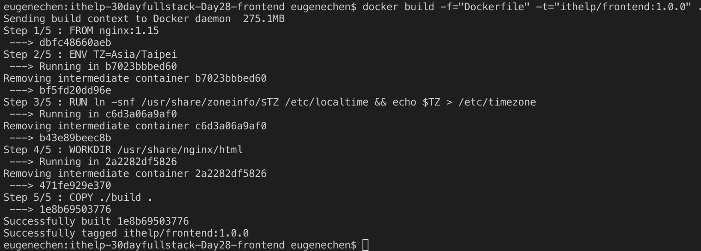
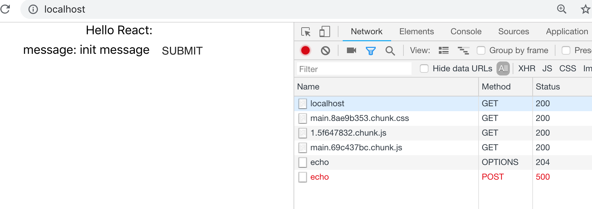
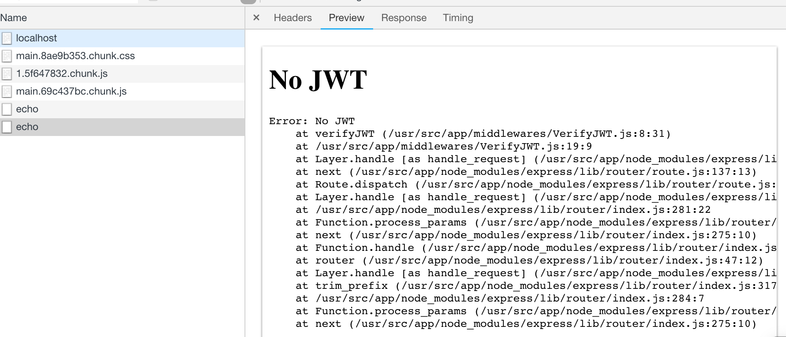

+++
title = "Day 28 - 三周目 - 製作自己的映像檔：包打前後端映像檔"
date = "2018-10-28"
description = "製作自己的映像檔：包打前後端映像檔"
featured = false
categories = [
]
tags = [
"2019 iT 邦幫忙鐵人賽",
"用js成為老闆心中的全端工程師"
]
images = [
]
series = [
"用js成為老闆心中的全端工程師 - 2019 iT邦幫忙鐵人賽"
]
+++

製作自己的映像檔：包打前後端映像檔

<!--more-->

# 回憶

昨天學了如何利用 verdaccio 建立自己的私有庫，今天要自己做映像檔。

# 目標

可能很多人會遇到以下問題：
* 怎麼在無對外網路的環境下發佈程式
* 相依套件太多怎麼辨
* 怎麼隨時切換版本

以上問題，在 Docker 的世界可以容易克服：把你的程式打包成 **映像檔**

今夾就要來學習打包我們的前後端專案 `hello-mongo`、`hello-react`。

請分別拷貝
1. `hello-mongo`：見 [Day 19 - 二周目 - 帳密認証與JWT (JSON Web Token)傳遞](https://ithelp.ithome.com.tw/articles/10203292)
1. `hello-react`： 見 [Day 25 - 二周目 - React component 套件 Material-UI： Google Material Design 的實作套件](https://ithelp.ithome.com.tw/articles/10205147)

> 過程請參考 commit log：
    1. [ithelp-30dayfullstack-Day28-backend](https://github.com/eugenechen0514/ithelp-30dayfullstack-Day28-backend)
    2. [ithelp-30dayfullstack-Day28-frontend](https://github.com/eugenechen0514/ithelp-30dayfullstack-Day28-frontend)


# Docker image
打包映像檔需要一個 `Dockfile` 來描述打包過程，之後再執行 `docker build` 就可以進行製作映像檔。

`Dockfile` 就像是在 terminal 中打指令一樣，Docker 使用一行一行的操作(instruction)來建立映像檔。每個操作用大寫命名。

我們用到的操作不多，全部操作見[Dockerfile reference](https://docs.docker.com/engine/reference/builder/)

你可以想像現在有一個容器的File System 且 進入它，你想放什麼檔案？執行什麼指令？

## 製作後端映像檔

### 建置操作檔 `Dockerfile` 和 建置忽略檔`.dockerignore`
1. 在根目錄下建立一個名為 `Dockerfile` 的檔案
    ``` dockerfile
    FROM node:10
    
    # Localtime
    ENV TZ=Asia/Taipei
    RUN ln -snf /usr/share/zoneinfo/$TZ /etc/localtime && echo $TZ > /etc/timezone
    
    # Create app directory
    WORKDIR /usr/src/app
    
    # Install app dependencies
    COPY package*.json ./
    
    # Use private registry
    RUN npm set registry http://127.0.0.1:4873
    
    RUN npm install
    # If you are building your code for production
    # RUN npm install --only=production
    
    # Bundle app source
    COPY . .
    
    # Main server
    EXPOSE 3001
    
    # Default command for executing container
    #CMD [ "npm", "start" ]
    ```
    Dockerfile 設定了基底映像檔([`FROM`](https://docs.docker.com/engine/reference/builder/#from))、系統時區([`RUN ln...`](https://docs.docker.com/engine/reference/builder/#run))、工作目錄(`WORKDIR`)、把本機端檔案拷貝到映像檔裡面([`COPY`](https://docs.docker.com/engine/reference/builder/#copy))、執行指令([`RUN`](https://docs.docker.com/engine/reference/builder/#run))、容器欲監聽的port ([`EXPOSE`](https://docs.docker.com/engine/reference/builder/#expose))、容器執行時欲執行的指令([`CMD`](https://docs.docker.com/engine/reference/builder/#cmd))。因為都很直接，我就不多說了
    > 這 `CMD [ "npm", "start" ]` 被我註解了，因為我想用另一種方法執行後端伺服器

1. 加入 `.dockerignore`：建置時忽略的檔案清單
    ```
    node_modules
    .git
    .vscode
    ```
    `COPY . .` 會拷貝所有檔案，但 `node_modules`、`.git`和`.vscode/` 不用拷貝進入，所以要加入到 `.dockerignore` 中忽略檔案。
    > `node_modules` 不應該放進映像檔，因為某些套件可能會跟作業系統有關。取而代之，我們要在建置映像檔時才安裝(`RUN npm install`)。
    
有幾點注意：
1. 若基底映像檔(`FROM`)不存在，docker 會自動去 docker hub 下載。
1. `RUN` 可以分行 `\` (backslash)：
    ``` shell
    RUN /bin/bash -c 'source $HOME/.bashrc; \
    echo $HOME'
    ```
1. `RUN` 是獨立地單一執行，不是像 terminal 可以一直下指令
    ``` shell
    RUN TEST=hi
    RUN echo $TEST # 抓不到值
    ```
    要併成一行
    ``` shell
    RUN TEST=hi; echo $TEST
    ```
1. 系統時區一定要記得設，不然你看到的日期會是 `UTC +0:00`，跟我們的 `UTC +8:00` 差八小時。
1. `COPY . .` 是指拷貝本機端「當前目錄的所有檔案」到 映像檔的「`WORKDIR` 的當前目錄」(即 `/usr/src/app`)。
1. 若希望進容器後可以有更多指令，你可以安裝環境套件，如 `RUN apt-get install -y vim`。
1. `EXPOSE` 只是註明映像檔可能要暴露的 port，用來做文件使用，沒有實質的作用。因為 `-p` 會覆寫 port 設定。
1. 若你有用私有 NPM，記得 `RUN npm set registry http://127.0.0.1:4873` 設定套件庫來源，且在 `docker build` 時可能要指定**建置時的網路** (見下一節)。

### 執行建置映像檔
只要簡單下指令： `docker build --network host -f="Dockerfile" -t="ithelp/backend:1.0.0" .`



這裡的
* `--network host`：使用**私有 NPM 時要小心**。設定建置時的網路為 host。 時，`http://127.0.0.1:4873` 才能訪問到 host 的私有庫。不然， `http://127.0.0.1` 會是建置時的沙盒環境。
* `-f`：指要讀入的操作檔。當檔名是預設 `Dockerfile` ， `-f` 才可省。
* `-t`：是映像檔的 tag。格式是 `<repository name>:tag`。
* `.` 是指本機端當前的目錄。

用 `docker images` 查看是否有建立


### 測試是否可以執行後端映像檔

跟之前一樣， 用 `docker run` 建立並執行容器：

``` shell
docker run --rm -p 3001:3001 --name ithelp.backend ithelp/backend:1.0.0 npm run start
```
然後就用瀏覽器開 `http://localhost:3001`，即可以訪問到後端。

> 若你需要 detach 在背景運作，請自行加 `-d` 參數

我們建立容器並執行，帶以下參數
1. `--rm` ： 容器停止後自動刪除
2. `-p`   : 外部 port 是 *3001*，容器內是 *3001*。這裡因為 `npm run start` 我們有設定 `PORT=3001`，所以後端會監聽 *3001*。
3. `--name` ：容器名 `ithelp.backend`。
4. `npm run start` ：這個緊接在映像檔 `ithelp/backend:1.0.0` 後，容器建立完後「執行容器」時要執行的指令(command)。 
    `docker run` 的格式如下：
    ```
    Usage:  docker run [OPTIONS] IMAGE [COMMAND] [ARG...]
    ```
    因此，「**COMMAND**」 是 `npm`，「**ARG...**」 是 `run start`。這就是我們不寫死 `CMD [ "npm", "start" ]`的原因，希望可以保留執行指令的彈性。

下面指令也可以執行後端：
``` shell
docker run --rm -p 3001:4000 --env PORT=4000 --name ithelp.backend ithelp/backend:1.0.0 node bin/www
```
這裡我們用 ` --env` 參數設定環境變數 `PORT`，把後端的監聽port改成 *4000*，但因為對外 port 還是 *3001*，所以從瀏覽器還是用 `http://localhost:3001` 訪問後端，外界察覺不到容器內 *4000* port 的存在。

另外，你可能會想知道： `bin/www` 是從哪個目錄開始算的？ 這問題的答案就在建立映像檔時的 `WORKDIR /usr/src/app`，我們指定了當前目錄。 不過，當前目錄也可以在 `docker run` 用 `--workdir` 覆寫指定當前目錄。

## 製作前端映像檔
製作方法大同小異，但這次我們程式碼不是前端的原始碼，而是 `npm run build` 打包後的檔案。

### 打包前端程式，建立 `Dockerfile`
前端的打包後的檔案也要放在網頁伺服器，別人才能從瀏覽器訪問。我們使用 Nginx 網頁伺服器基底，它也要包入我們的前端映像檔。

1. 先進行打包 `npm run build`
    
    它產生了一個 `build` 的資料夾，裡面放著打包後的所有檔案，所以這就是前端要發佈的所有檔案。
1. 在根目錄建立 `Dockerfile`
    ``` dockerfile
    FROM nginx:1.15
    
    # Localtime
    ENV TZ=Asia/Taipei
    RUN ln -snf /usr/share/zoneinfo/$TZ /etc/localtime && echo $TZ > /etc/timezone
    
    # Nginx default public folder
    WORKDIR /usr/share/nginx/html
    
    # Copy public files
    COPY ./build .
    
    # Package (options)
    # RUN apt-get update
    # RUN apt-get install -y vim
    # RUN apt-get install -y curl
    # RUN apt-get install -y wget
    ```

### 建置前端映像檔
下指令： `docker build -f="Dockerfile" -t="ithelp/frontend:1.0.0" .`


### 建立並執行
跟之前一樣

``` shell
docker run --rm -p 80:80 --name ithelp.frontend ithelp/frontend:1.0.0
```
> 若你需要 detach 在背景運作，請自行加 `-d` 參數

### 小技巧：腳本化你的工作
每次製作映像檔都要先把前端打包，才能製作映像檔，可以將這些步驟寫在shell script 中。

根目錄建立一個檔案 `images.sh`
``` shell
npm run build
docker build -f="Dockerfile" -t="ithelp/frontend:1.0.0" .
```

然後，在 `package.json` 的 `scripts` 加入 `image` 腳本
``` json
scripts: {
  ...略
  "image": "sh images.sh"
}
```
以後，只要 `npm run image` 就可以製作映像檔

## 完成串接前後端
同時開啟前後端，即完成我們在 [Day 11 - 一周目- 開始玩轉前端(二)](https://ithelp.ithome.com.tw/articles/10200933) 做的事：串接前後端。

``` shell
# 後端
docker run --rm -p 3001:3001 --name ithelp.backend ithelp/backend:1.0.0 npm run start

# 前端
docker run --rm -p 80:80 --name ithelp.frontend ithelp/frontend:1.0.0
```


> `POST /api/echo` 是回應 *500* 耶？ 別怕，那是我們曾在 [Day 19 - 二周目 - 帳密認証與JWT (JSON Web Token)傳遞](https://ithelp.ithome.com.tw/articles/10203292) 加入的 JWT 驗証。
    

# 總結

今天我們學會了打包屬於自己的前後端映像檔，並且執行它們完成前後端串接。

雖然完成了前後端串接，但我們的後端其實還需要 mongoDB 才算是完整的服務。因此，明天將引入 `docker-compose` 這工具來組織我們的容器：`ithelp.frontend` 、`ithelp.backend`、`mongo4`
