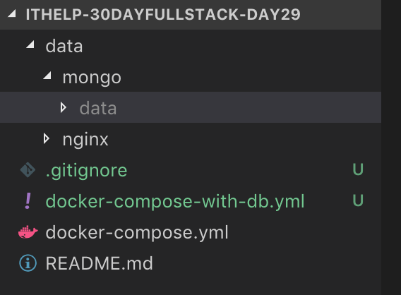
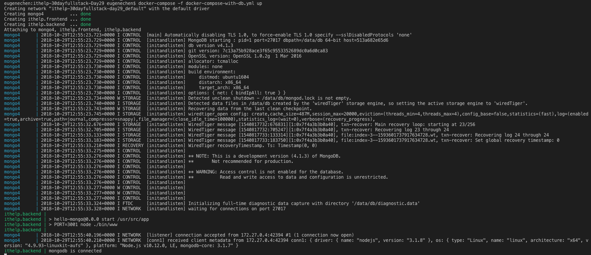

+++
title = "Day 29- 三周目 - Docker Compose：一次管理多個容器"
date = "2018-10-29"
description = "用 Docker Compose 一次管理多個容器"
featured = false
categories = [
]
tags = [
"2019 iT 邦幫忙鐵人賽",
"用js成為老闆心中的全端工程師"
]
images = [
]
series = [
"用js成為老闆心中的全端工程師 - 2019 iT邦幫忙鐵人賽"
]
+++

用 Docker Compose 一次管理多個容器

<!--more-->

# 回憶
昨天學了打包前後端映像檔，也完成了串接，但還缺了 MongoDB。一次要控制三個容器運作，很不方便。透過 Docker Copmose 可以輕鬆地一次管理多個容器，

# 目標

1. 學習寫 docker compose 組態檔
1. 發佈在單一主機

Docker Compose 很適合用在單一主機的發佈、開發或測試(見[Common use cases](https://docs.docker.com/compose/overview/#common-use-cases))，它也是建立叢集(cluster)的基本工具之一(見：[Deploy a stack to a swarm](https://docs.docker.com/engine/swarm/stack-deploy/)

> [完整的專案，請點我](https://github.com/eugenechen0514/ithelp-30dayfullstack-Day29)

# Docker Compose

Docker Compose 可以讓我們用一個描述檔(預設名稱是 `docker-compose.yml` )管理多個容器， 同時管理、操作它們，甚至分開管理。描述檔是用 [YAML](https://zh.wikipedia.org/wiki/YAML) 格式撰寫的。

Docker Compose 描述檔目前有三個版本 [version 1](https://docs.docker.com/compose/compose-file/compose-file-v1/)、 [version 2](https://docs.docker.com/compose/compose-file/compose-file-v2/)、 [version 3](https://docs.docker.com/compose/compose-file/)。 Docker Engine 對它們有不同的支援度([Compose and Docker compatibility matrix](https://docs.docker.com/compose/compose-file/#compose-and-docker-compatibility-matrix)，而且不同版支援的功能可能會不一樣，像是：[`ipam-gateway`](https://docs.docker.com/compose/compose-file/#ipam) 這個目前只在 version 2 支援，version 3 不支援，所以使用前可能要查一下能不能用。


## 用 Docker Compose 串接前後端

### 配置前後端 service
> 記得先把之前的建立的容器：`ithelp.backend`、`ithelp.frontend` 刪除

昨天我們使用下面的指令建立並執行容器

``` shell
# 後端
docker run --rm -p 3001:3001 --name ithelp.backend ithelp/backend:1.0.0 npm run start

# 前端
docker run --rm -p 80:80 --name ithelp.frontend ithelp/frontend:1.0.0
```

全部的參數可以寫成 docker compose 描述檔：

``` yml
// docker-compose.yml
version: '2'
services:
    frontend:
        image: ithelp/frontend:1.0.0
        container_name: ithelp.frontend
        ports:
            - "80:80"
    backend:
        image: ithelp/backend:1.0.0
        container_name: ithelp.backend
        ports:
            - "3001:3001"
        command: "npm run start"
        environment:
            PORT: 3001
            NODE_ENV: "development"
```

在 Compose 世界裡，application 是由一群 service 組成的，每個 service 就像是容器一樣，可以設定它的 image, container 相關參數。當要建立容器時，就會以 service 當樣版產生容器。我們要注意，因為容器名只能唯一的，所以當發佈在[swarm mode](https://docs.docker.com/engine/reference/commandline/stack_deploy/)時，`container_name` 可能會被忽略或出錯。目前我們假設每個 service 只會產生一個容器，所以就放心使用。

雖然前後端的容器設定好了，我們還缺 MongoDB。

### 加入 MongoDB service

``` yml
// docker-compose-with-db.yml
version: '2'
services:
    database:
        image: mongo:4.1
        container_name: mongo4
        ports:
            - "27017:27017"
        volumes:
            - "./data/mongo/data:/data/db"
    frontend:
        image: ithelp/frontend:1.0.0
        container_name: ithelp.frontend
        ports:
            - "80:80"
        volumes:
            - "./data/nginx/log:/var/log/nginx"
    backend:
        image: ithelp/backend:1.0.0
        container_name: ithelp.backend
        ports:
            - "3001:3001"
        command: >
            /bin/bash -c "
            sleep 15;
            npm run start;"
        environment:
            PORT: 3001
            NODE_ENV: "development"
            MONGODB_URL: "mongodb://database:27017"
```

`database` 做了以下的調整:
1. `database` 使用 `volumes`：把 `./data/mongo/data` 掛載到容器 `/data/db`，它是 MongoDB 的資料位置。

`frontend` 做了以下的調整:
1. `frontend` 使用 `volumes`：把 `./data/nginx/log` 掛載到容器 `/var/log/nginx`，它是 Nginx 的 log 資料夾。

`backend` 做了以下的調整：
1. `command` ： 之前的容建立完立刻執行 `npm run start`；現在改成 sleep 10 秒才執行`npm run start`。 我們這樣做是因為 MongoDB 不是一執行就可以連線，要等到 MonoDB 「ready」，後端才可以執行並連線。 
    > 有人可能會發現 [depends_on](https://docs.docker.com/compose/compose-file/compose-file-v2/#depends_on) 這個設定，但它是指 service 的執行順序，不是指資料庫 「ready」可以連線的設定。因此，只能延遲後端的執行。
1. 加入 `MONGODB_URL` 環境變數：在 `hello-mongo` 後端專案中的 `configs/config.js` 設定檔：
    ``` javascript
    // configs/config.js
    const config = {
        mongodb: {
            url: process.env.MONGODB_URL || 'mongodb://localhost:27017',
            dbName: process.env.MONGODB_DB_NAME || 'myproject',
        }
    }
    ```
    這是我們為了可以由外部設定後端的參數之一 (若`process.env.XXX` 需要幫助，請看 [Day 17 的 **環境變數 process.env**](https://ithelp.ithome.com.tw/articles/10202513))。
1. `MONGODB_URL` 的值：Compose 允許我們 **直接用 service name**，所以我們可以不用知道 `database` 被配置的 ip。

## `docker-compose` 執行 application

### 準備階段：
1. 建一個 `ithelp-30dayfullstack-Day29` 資料夾，再用 VSCode 開啟
2. 建立 `data/mongo` 資料夾，把之前的 `mongo4` 的 `data` 放到 `data/mongo` 裡
3. 建立 `data/nginx` 資料夾

最後如下圖：


### 執行階段：
建立並執行容器
``` shell
docker-compose -f docker-compose-with-db.yml up
```
這裡用 `-f` 指定使用的組態檔。



這樣就執行成功了，一次開了三個容器。

若要停止容器，只要 `ctrl + c`。 若要再次執行，可以直接：
1. `docker-compose -f docker-compose-with-db.yml up` ：重新執行且 attach 到前景。
1. `docker-compose -f docker-compose-with-db.yml start` ：重新執行且放到背景。

`docker` 和 `docker-compose` 有很多相似之處，運作模式、參數也差不多，只是變成一次控制一群容器。常用指令如下：

| 用途      | 指令                                   | 常用可選參數    | 類似指令                                          |
|---------|--------------------------------------|-----------|-----------------------------------------------|
| 建立並前景執行容器 | `docker-compose up`                  | `-d`、`-f` | `docker run`                                  |
| 查看容器運作    | `docker-compose ps`                  | `-f`      | `docker ps`                                   |
| 執行容器    | `docker-compose start`               | `-f`      | `docker start`                                |
| 停止容器    | `docker-compose stop`                | `-f`      | `docker stop`                                 |
| 刪除容器    | `docker-compose down`                | `-f`      | `docker rm`                                   |
| 印出log   | `docker-compose logs`                | `-f`      | `docker logs`                                 |
| 進入容器    | `docker-compose exec <service> bash` | `-f`      | `docker exec -it <id or container-name> bash` |


`docker-compose` 也可以針對某個 service 控制，大概都是 `docker-compose up <service>` 這類的格式，更多細請自己節查 `--help`，如：`docker-compose up --help`

# 發佈你的 application

發佈前，你必需有以下東西

1. image
2. docker-compose file

## 映像檔的輸出/輸入

映像檔雖然由 docker 統一管理，但它可以用 `docker save` /  `docker load` 輸出/輸入映像檔。

``` shell
# 建立映像檔資料夾
mkdir images

# 輸出：mongo:4.1、ithelp/backend:1.0.0 和 ithelp/frontend:1.0.0 打包成 ithelp.tar
docker save -o images/ithelp.tar mongo:4.1 ithelp/backend:1.0.0 ithelp/frontend:1.0.0

# 輸入：從 ithelp.tar 一次輸入三個映像檔
docker load -i images/ithelp.tar
```

## 發佈
只要拷貝
1. images 資料夾 : `ithelp.tar`
2. docker-compose file: `docker-compose-with-db.yml`
3. 其它初始化腳本或其它組態檔：可能要用腳本產生預設資料夾或其它組態檔(nginx 組態檔之類的)

再放到發佈的主機，就可以在任何有 Docker Engine 的環境執行、運作。

> 你可以用 shell script 或 npm script 譔寫屬於自己的腳本，減少打指令，像是建置時立刻輸出映像檔、用 shell variable 設定版號、腳本化讀入映像檔。

# 總結
今天使用 Docker Compose 組態檔述描容器，隨後就可以用 `docker-compose` 指令一次管理一批容器。我們還使用 `docker save/load` 輸出/輸入映像檔。因此，有了映像檔和 Compose 組態檔就可以發佈在任何 Docker Engine 環境執行。

另外，別忘了開主機防火牆讓別人連進來
``` shell
firewall-cmd --add-port=80/tcp --permanent
```
