+++
title = "Day 3 - 一周目- 建立第一個Node.js 專案"
date = "2018-10-03"
description = "建立第一個Node.js 專案"
featured = false
categories = [
]
tags = [
"2019 iT 邦幫忙鐵人賽",
"用js成為老闆心中的全端工程師"
]
images = [
]
series = [
"用js成為老闆心中的全端工程師 - 2019 iT邦幫忙鐵人賽"
]
+++

今天我們要正式使用 VSCode 來建立 Node.js 專案，未來的前後端專案都是用Node.js 專案建立的。

<!--more-->

# 回憶
昨天介紹指令的使用和用Markdown 做筆記、draw.io 畫圖，這些技能可以發揮在所有專案

# 目標
今天我們要正式使用 VSCode 來建立 Node.js 專案，未來的前後端專案都是用Node.js 專案建立的。

1. 建立Node.js 專案及了解`package.json`
2. 安裝其它套件
3. 執行腳本
4. VSCode 執行組態

# Node.js 是什麼
[Node.js官方網站](https://nodejs.org/en/)說：

> Node.js® is a JavaScript runtime built on Chrome's V8 JavaScript engine.

Node.js 只是一個基於 Chrome 的 V8 engine 的 JavaScript 執行環境。程式碼寫的就是 JavaScript，也就是大部分瀏覽器執行的程式語言。因此，有了 Node.js 就也可以開發後端程式，也因為用同樣的語言，所以「某些程度上」可以共用程式，像是常用來操作資料的 [lodash](https://lodash.com/)，就是前後端都可以使用的套件。

# 準備 Node.js 執行環境
1. https://nodejs.org/en/，下載 Node.js
1. 一進去會看到
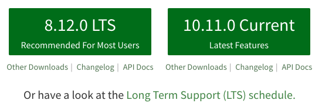
LTS (Long Term Support) 是長時間的維護，點擊 [***Long Term Support (LTS) schedule***](https://github.com/nodejs/Release#release-schedule) 可以查看維護時間表。想安裝哪個都可以，因為本主題用的都是精典的 Node.js 模組。我的話會選10版的，因為[N-API](https://nodejs.org/dist/latest-v10.x/docs/api/n-api.html#n_api_n_api) (C++編譯出的執行程式在Node.js環境中使用，且與Node.js版本無關)正式支援，多學點不錯阿！若你考慮到長期維護可以選8版的。
1. 安裝完成後，來看看你安裝的版本。開啟 ***hello-nodejs*** 的 VSCode 專案資料夾，再開打開 terminal(需要幫助的人可以看[Day 1 - 前言／開發環境準備](https://ithelp.ithome.com.tw/articles/10199491))，輸入 `node --version`
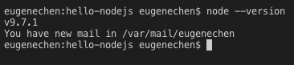
我的版本是 9.7.1。若昨天有看[Day 2 - 一輩子受用的工具](https://ithelp.ithome.com.tw/articles/10199703)的人會發現這裡的 `node` 就是指令，`--version`就是選項(options)。


> 題外話：Node.js 的版本釋出真快，一不小心就被超過了QQ。為了可以確保程式可以在新版執行，建議平時寫好測試保護

------

# 建立第一個 Node.js 專案
準備好環境後，就可以來建 Node.js 專案

## 什麼是Node.js 專案？
Node.js 的專案是一個資料夾，內部可以放很多檔案，像是程式、文件…等，放什麼都可以，但在根目錄一定有一個叫 **package.json** 的檔案，它記錄專案的基本資訊，如專案名，專案版本、專案相依的套件…等(更多的訊息見[package.json](https://docs.npmjs.com/files/package.json))，常見 package.json 如下：
```
{
  "name": "hello-nodejs",
  "version": "1.0.0",
  "description": "",
  "main": "index.js",
  "scripts": { 
    "start": "node index.js"
  },
  "author": "eugenechen",
  "license": "ISC",
  "dependencies": {
    "lodash": "^4.17.5"
  },
  "devDependencies": {
    "jest": "^22.4.2"
  }
}
```

package.json 參數說明如下：

* name： 專案名
* version：專案版本
* scription：專案描述
* main：專案/套件程式入口
* scripts： shell 腳本。透過 `npm run <腳本名>` 執行
* dependencies：相依的套件。以上面的例子來說，***hello-nodejs*** 有用到一個相依的套件 ***lodash***， ***^4.17.5*** 指的是 ***hello-nodejs*** 需要 ***4.17.5*** 以上的版本且只支援到主版本 ***4.X.X*** , ***5.0.0*** 以上不支援。更多版本號的語義見[The semantic versioner for npm](https://docs.npmjs.com/misc/semver)
* devDependencies：開發時的相依的套件，對於 ***hello-nodejs*** 專案執行來說無關。以上面的例子來說， ***jest*** 是測試框架套件，本身跟 ***hello-nodejs*** 執行無關。版號規則跟上面一樣。

## 快速建立 Node.js 專案
package.json 有一堆參數，每次都要自己來嗎？不用。只要在terminal輸入
```
npm init
```
指令就會出現初始化專案的設定提示。
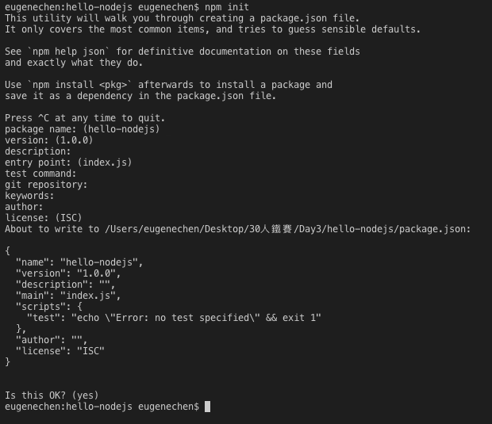

完成後就會自動產生 `package.json`。

`npm` 這個指令會隨著安裝 Node.js 一併安裝，npm 是 Node.js 的 套件管理員，可以為你的專案安裝其它套件，也可以拿來初始化專案…等。還想知道更多嗎？快輸入`npm --help` 可以看到指令訊息。

-----

# 套件(package)安裝
在 Node.js 的生態系中別人寫好的程式打包起來，就是所謂的套件，在別的程式語言可能有別的名稱，像C++中會叫程式庫(library)。套件可以廣為傳送給別人使用，使我們少寫不少程式。當你學的套件越多就可能做的越快，甚至可以做出自己套件(未來我們會談談怎麼用[verdaccio](https://verdaccio.org/)建立自己的私有庫。

## 安裝你的第一個套件 ***lodash***
在terminal輸入
```
npm install lodash --save
```
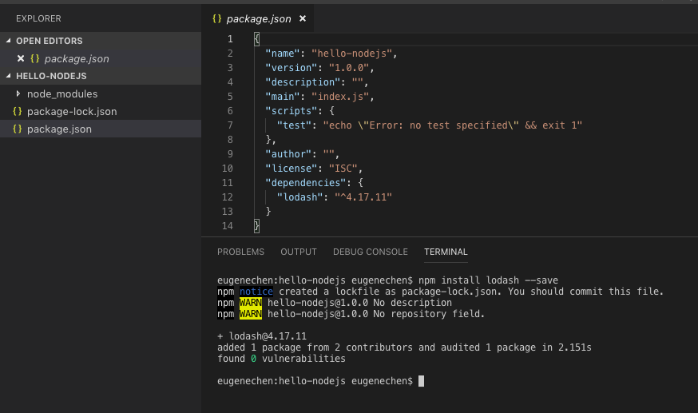
npm 會從 [npmjs registry](https://www.npmjs.com/)下載套件，你會發現多出 ***package-lock.json*** 和 ***node_modules*** 資料夾。
***package-lock.json*** 用來記錄各套件的相依版本號記錄；而 ***node_modules*** 就是存放套件程式碼的資料夾，所以打開後你可以看到 lodash 套件的所有程式碼。
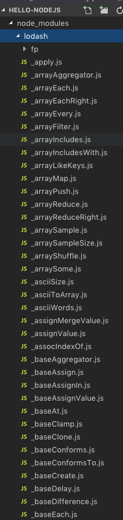
很多吧! 自己寫不知道要寫多久。

除了上面多出的檔案和資料夾，***package.json*** 也被修改了，多出
``` json
"dependencies": {
    "lodash": "^4.17.11"
}
```
表示我們的專案有一個相依的庫 ***lodash***

## 指令 `npm install lodash --save` 是什麼意思？
指令 `npm install lodash --save` 其實有兩個意思
1. `install lodash`的部份是指下載安裝 lodash (不指定版號就是最新版)到 ***node_modules***
2. `--save` 的部份加入相依資訊到 ***package.json*** 的 **dependencies** 中

### `npm install` 可以做什麼？
1. 初始化專案的所有相依套件
若是 `npm install` 不加 `lodash --save`，就會安裝 ***package.json*** 中 **dependencies** 和 **devDependencies** 裡面的所有套件。當拿到別人的 Node.js專案 第一件事就是 `npm install` 安裝所有套件
1. 重新下載 ***package.json*** 的相依套件
你也可以手動打**dependencies** 和 **devDependencies** 裡面的資訊，再`npm install`重新下載套件

###  `npm install` 還有什麼祕密？
1. 簡寫 `install` 成 `i` ，如：`npm install` 改成 `npm i`
2. 安裝新的shell指令
`npm install jest -g` 可以安裝 jest 指令，我們就有 `jest`指令，下 `jest` 指令 就會找所有測試程式執行測試
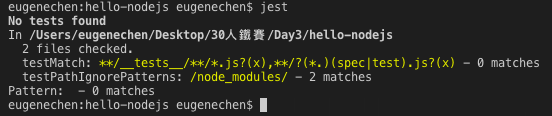
3. 安裝開發時相依套件
`npm install jest --save-dev` 會安裝jest且加入 ***package.json*** 中 **devDependencies**中

------
# 在 VSCode 執行 hello nodejs
前面終於安裝好相依套件，我們要執行我們的第一隻程式

## 建立第一隻程式：index.js
1. 建立名為 index.js 的檔案

1. 輸入以下內容
    ```
    console.log('Hello Node.js'); // 在terminal 印出 Hello Node.js
    ```
## 執行 index.js
我們介紹三種執行它的方法
1. 用 `node index.js` 指令執行
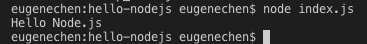
1. 透過 npm 腳本執行
    加入一個名為 **start** 的腳本
    ``` json
    "scripts": {
        "start": "node index.js"
    },
    ```
    接下來執行 `npm run start`
    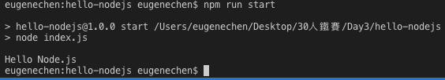
1. 用 VSCode 執行
    1. 開啟 debug 頁籤
    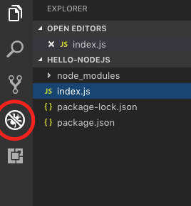
    1. 建立 VSCode 執行組態
    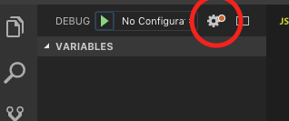
    1. 執行debug
    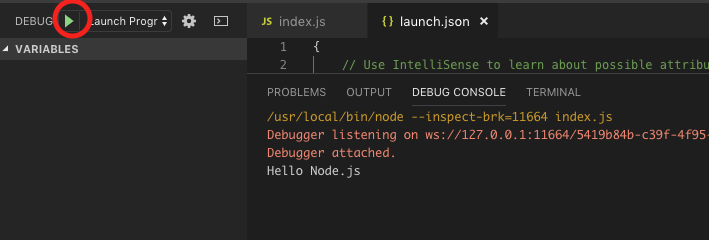

## VSCode 執行組態
我們之前用VSCode 執行後，會發現專案資料夾多個一個資料夾 `.vscode` 且裡面多出一個 `launch.json` 檔案。

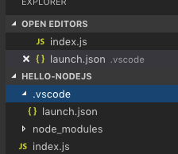

### Node.js 執行組態
還記得我之前說的嗎？ VSCode的一個專案就是一個資料夾，然而 `.vscode` 裡面就會放 VSCode 專案的設定檔。如果你是用[WebStorm](https://www.jetbrains.com/webstorm/)編輯器，編輯器的設定檔會放在`.idea`裡。 

`launch.json` 裡面會放可以執行的組態，按小綠箭頭便會執行所選的組態。下圖
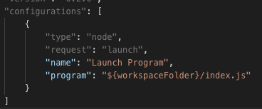
就是有一個執行組態，名為 ***Launch Program***，執行類型是[***node***](https://code.visualstudio.com/docs/editor/debugging#_launchjson-attributes) ，執行 `${workspaceFolder}/index.js` 的程式，這裡 `${workspaceFolder}` 是VSCode的變數(Variable substitution)，指向專案根目錄。更多屬性設定見[Launch configurations](https://go.microsoft.com/fwlink/?linkid=830387)。

### 加入新的組態：透過 npm 執行腳本
VSCode 可以幫我們快速加入一個組態
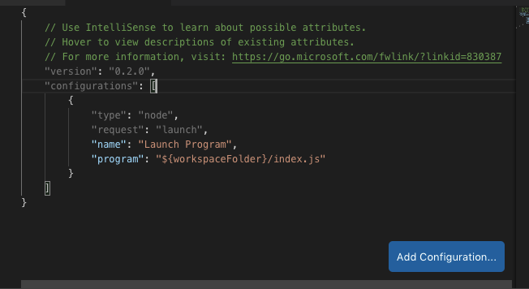

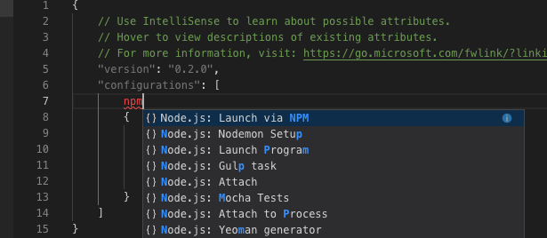

多出一個透過 npm 執行`debug`腳本的組態
``` json
{
  "type": "node",
  "request": "launch",
  "name": "Launch via NPM",
  "runtimeExecutable": "npm",
  "runtimeArgs": [
    "run-script",
    "debug"
  ],
  "port": 9229
}
```
可以改成我們之前設定的`start`腳本

``` json
{
  "type": "node",
  "request": "launch",
  "name": "Launch via NPM",
  "runtimeExecutable": "npm",
  "runtimeArgs": [
    "run",
    "start"
  ],
  "port": 9229
}
```
接下來，執行 **Start Without Debugging**，相當於在terminal執行 `npm run start`
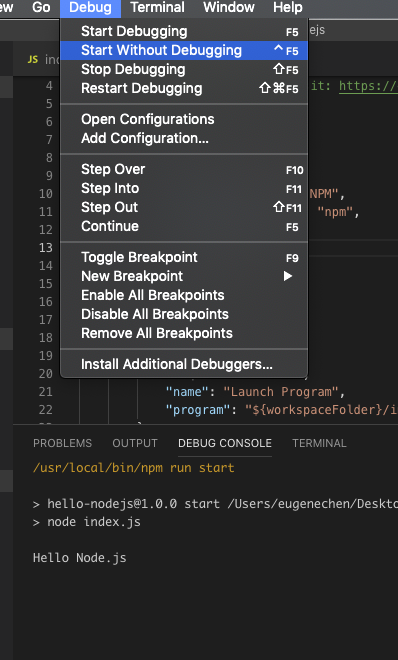
我們沒辨法用 **Start Debugging**，因為npm 沒有支援debug功能。

# 總結
今天介紹了 Node.js 專案，還有如何執行 **.js** 程式碼。透過VSCode的執行組態我們可以更靈活、方便的執行程式，也可以用來執行特殊的工作。
