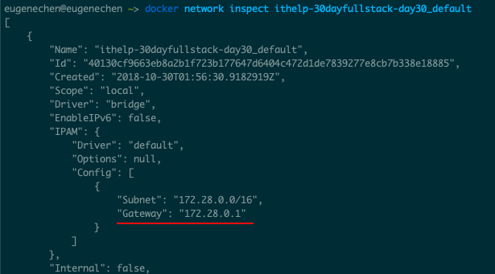

+++
title = "Day 30- 三周目 - Docker network 暨完賽回顧"
date = "2018-10-30"
description = "介紹 Docker Network mode 和三十天的回顧"
featured = false
categories = [
]
tags = [
"2019 iT 邦幫忙鐵人賽",
"用js成為老闆心中的全端工程師"
]
images = [
]
series = [
"用js成為老闆心中的全端工程師 - 2019 iT邦幫忙鐵人賽"
]
+++

介紹 Docker Network mode 和三十天的回顧

<!--more-->

# 回憶

昨天我們用 Compose file 一次描述三個容器， Compose file 如下：

``` yml
// docker-compose-bridge.yml
version: '2'
services:
    database:
        image: mongo:4.1
        container_name: mongo4
        ports:
            - "27017:27017"
        volumes:
            - "./data/mongo/data:/data/db"
    frontend:
        image: ithelp/frontend:1.0.0
        container_name: ithelp.frontend
        ports:
            - "80:80"
        volumes:
            - "./data/nginx/log:/var/log/nginx"
    backend:
        image: ithelp/backend:1.0.0
        container_name: ithelp.backend
        ports:
            - "3001:3001"
        command: >
            /bin/bash -c "
            sleep 15;
            npm run start;"
        environment:
            PORT: 3001
            NODE_ENV: "development"
            MONGODB_URL: "mongodb://database:27017"

```
在用指令 `docker-compose` 建立並執行它們：


仔細看有一行：`Creating network "ithelp-30dayfullstack-day30_default" with the default driver`。這是什麼呢？
這就是今天要討論的內容：**network** 。 network 很重要，因為關係它各服務間的通信。

# 目標

我們會重心放在如何使用，而不是放在解析 docker network。先學會使用，再去深究其原理。有興趣的人可以挑戰看看這篇 [Docker Reference Architecture: Designing Scalable, Portable Docker Container Networks](https://success.docker.com/article/networking)。

今天的內容全是指在單一主機用 Docker Compose 可能會發生的 network 情況。在還沒進到叢集的世界之前，不同主機的連線，用 IP 連就可以了。光是用 Docker Compose 你就能感受到 docker 的威力。

在開始前，我們開一個 `ithelp-30dayfullstack-Day30` 資料夾，所有的 Compose file 都會放在裡面。

> [完整的專案，請點我](https://github.com/eugenechen0514/ithelp-30dayfullstack-Day30)

# Docker Network mode

## Bridge mode
這是 Docker Compose 預設的網路模式，所有有 service 預設 `network_mode:` 都是 **bridge** (見 [network_mode](https://docs.docker.com/compose/compose-file/compose-file-v2/#network_mode))。當我們 `docker-compose up` 時，會建立一個名為 `<dir_name>_default` 的 network 出來，所有 bridge mode 的 container 會自己配網路卡並接上那個預設的 network。

我們在回憶中的 Compose file，用圖解如下：

圖片重繪自：[Networking for Docker Containers (a Primer) Part I](https://mesosphere.com/blog/networking-docker-containers/)

> `172.28.0.0/16` 是指一網路的網段從 `172.28.0.1 ~ 172.28.255.255`，子網路的主機可以互相通訊。 16 是指 16 bits 的子網路遮罩 `255.255.0.0`。

> 你可以用 `docker network ls` 列出所有 network

###  Container 間如何通訊： Container <->  Container
Container 間的通訊有幾個方法：
1. 用 service/container name：直接寫 serivce name/container。
    就如同前面寫的
    ``` yml
    backend:
            …略
            environment:
                PORT: 3001
                NODE_ENV: "development"
                MONGODB_URL: "mongodb://database:27017"
    ```
    `backend` 可以訪問 `database`。
1. 用 IP: 我們也可以直接指定 IP。 
    指令 `docker network inspect ithelp-30dayfullstack-day30_default` 可以查詢「接上此 network 的 container 資訊」
    
    `ithelp-30dayfullstack-day30_default` 有三個容器及它們配置的 IP。另外還有 gateway 和 subnet。

### 外界(NET-0)如何存取 container： 外界(NET-0) -> Container 

若外界 `192.168.0.5` 要訪問我們的主機 `192.168.0.2:80` 的 `ithelp.front` 服務，我們要設定 `--publish`/`-p`。就是我們在 Docker file 中的 `ports:` 或 `docker run -p` 設定 publish。同時， [Network Address Translation(NAT)](https://zh.wikipedia.org/wiki/%E7%BD%91%E7%BB%9C%E5%9C%B0%E5%9D%80%E8%BD%AC%E6%8D%A2) 也會自動設定內外部 network 的轉換。


從外界來看，邏輯上就像：

外界不會發現內部的網路。

### 存取 host/外界 ： Container -> 外界(NET-0)/HOST

若 container 要與外界通訊，可以跟往常一樣用 hostname / ip。除非你刻意去調整 dns/host 之類的設定，不然正常使用就可以了，我們不打算深究。

反而， Container 存取 HOST 是有可能發生的，因為在還沒完全引入 docker 前，我們可能在 HOST 已架好 MongoDB / MySQL 之類的服務。接下來考慮兩種可能的情況。

#### 非固定 IP 情況
container 建立時會配置網路設定，沒重建立的話 IP 是不會變的。 在 bridge mode 下，NAT 那單元可以直接看成是 HOST，所以 HOST 的 IP 在 `DOCKER0 BRIDGET` network 中的位置就是 `gateway IP` 。因此，在容器中，要訪問到 HOST 是 `DOCKER0 BRIDGET` 下的  `gateway IP` 而不是 `127.0.0.1` (`127.0.0.1` 是指容器本身)。

> 你可以登入 container (`docker run -it <id/container_name> bash`) 試打看看(ex: telenet/ping/wget/curl)，就可以知道有沒有通。

指令 `docker network inspect ithelp-30dayfullstack-day30_default` 就可以查到 gateway IP。


#### 固定 IP 情況
> 練習時，你可能要 `docker-compose -f docker-compose-bridge.yml down` 刪除之前的容器、網路。

容器內的環境有時需要 hard code 寫 HOST 的 IP，像是 Nginx 要導轉到 HOST 的舊網址、Nginx 要導轉轉到某個 Container 或 MonoDB 連線網址寫死在 Compose file。這時候每次重建 containers 網路就會變了。因此，我們可以客製化 bridge 的設定固定 IP，一方面可以固定 Container IP 又可以固定 HOST IP。

為了固定 IP，我們要建立一個 network `ithelp_application` 設定裡面的 `subnet:` 和 `gateway:`，接著，每個容器使用 `ithelp_application` network 並指定固定 IP。 如下：

``` yml
version: '2'
services:
    database:
        image: mongo:4.1
        container_name: mongo4
        networks:
            ithelp_application:
                ipv4_address: 172.28.0.2
        ports:
            - "27017:27017"
        volumes:
            - "./data/mongo/data:/data/db"
    frontend:
        image: ithelp/frontend:1.0.0
        container_name: ithelp.frontend
        networks:
            ithelp_application:
                ipv4_address: 172.28.0.3
        ports:
            - "80:80"
        volumes:
            - "./data/nginx/log:/var/log/nginx"
    backend:
        image: ithelp/backend:1.0.0
        container_name: ithelp.backend
        networks:
            ithelp_application:
                ipv4_address: 172.28.0.4
        ports:
            - "3001:3001"
        command: >
            /bin/bash -c "
            sleep 15;
            npm run start;"
        environment:
            PORT: 3001
            NODE_ENV: "development"
            MONGODB_URL: "mongodb://database:27017"
networks:
    ithelp_application:
        driver: bridge
        ipam:
            driver: default
            config:
                - subnet: 172.28.0.0/16
                  gateway: 172.28.0.1
```

執行 `docker-compose -f docker-compose-bridge-static.yml up`，完成後去看看 ` docker network inspect ithelp-30dayfullstack-day30_ithelp_application`，就是我們固定的 IP


## Host mode
> 練習時，你可能要 `docker-compose -f docker-compose-bridge-static.yml down` 刪除之前的容器、網路。

這是最簡單的模式，直接想成 container 執行在 HOST 的 process，它監聽什麼 port ， HOST 什麼 port 就會被使用，連 `--publish`/`-p` 都不用了。

這模式的通訊比較簡單，不像 bridge mode 複雜。`127.0.0.1` 就是指 HOST，所以每個容器可以用 `127.0.0.1:<port>` 通訊，與其它的 HOST 服務也是一樣；外界就是用 `192.168.0.2`。

``` yml
version: '2'
services:
    database:
        image: mongo:4.1
        container_name: mongo4
        network_mode: "host"
        volumes:
            - "./data/mongo/data:/data/db"
    frontend:
        image: ithelp/frontend:1.0.0
        container_name: ithelp.frontend
        network_mode: "host"
        volumes:
            - "./data/nginx/log:/var/log/nginx"
    backend:
        image: ithelp/backend:1.0.0
        container_name: ithelp.backend
        network_mode: "host"
        command: >
            /bin/bash -c "
            sleep 15;
            npm run start;"
        environment:
            PORT: 3001
            NODE_ENV: "development"
            MONGODB_URL: "mongodb://127.0.0.1:27017"

```


圖片重繪自：[Networking for Docker Containers (a Primer) Part I](https://mesosphere.com/blog/networking-docker-containers/)

##  Docker Network mode 小總結
我們介紹了 **Bridge mode**、**Host mode**，它們有各自的特色：

bridge mode: 
* 高彈性的網路設定
* 不同容器間的 port 號可以一樣，因為容器有自己的 IP
* 可以降低 HOST port 相衝的可能
* 用起來設定複雜
* 容器、 HOST 、外界不容易通訊

Host mode：
* 容易與 HOST port 、容器 port 的相衝、
* 用起來設定簡單
* 容器、 HOST 、外界容易通訊

到這裡為止，我打算就結束今天的內容。今天的最後我們來回顧一下，我們做了什麼事、什麼事沒做？

----------

# 三十天的回顧

先恭喜看到這的你，熬過三十天的疲勞轟炸。我們歷經了三個周目：
1. 一周目 - 一次串完所有的服務
    在本地端建立前端和後端並把它們串接起來
1. 二周目 - 深入了解前後端
    我分別從前後端挑選了重要的概念或是工具作為二周目的主題。
3. 三周目 - 發佈、維運
    以 Docker 為基礎，製作、發佈自己的前端和後端程式。


在 [Day 1 - 前言／開發環境準備](https://ithelp.ithome.com.tw/articles/10199491) 曾提過我們三十天要涵盖的內容如下，若有提到我們就把它們劃掉

1. ~~前言~~
1. ~~一輩子受用的工具~~
    1. ~~shell常用指令~~
    1. ~~markdown - 打筆記~~
    1. ~~draw.io - 畫圖~~
1. ~~一周目 - 一次串完所有的服務~~
    1. ~~js/nodejs project~~
    1. ~~js 速成 - es6語法、模組化~~
    1. ~~eslint - 程式碼品質工具~~
    1. ~~quick backend~~
    1. ~~Postman - api 測式工具~~
    1. ~~quick frontend~~
1. 二周目
    1. ~~開發流程~~
    1. 後端
        1. ~~基本知識~~
        1. ~~awilix - 依賴注入~~
        1. ~~process.env~~
        1. ~~middleware / router / request / response~~
        1. ~~建立與連線 MongoDB~~
        1. 後端多工/ 叢集/child process
        1. ~~Auth: token - JWT~~
        1. 常用庫: lodash, monent, mongoose
        1. 可研究方向: GraphQL, websocket, redis, server-side rending, Oauth
    1. 測試
        1. ~~基本知識 - 依賴注入~~
        1. ~~單元測試、整合測試~~
        1. 替身
        1. 常用庫
        1. sinon.createFakeServer()
        1. unexpected/ unexpected react
    1. 前端
        1. ~~基本知識~~ - ~~打包~~, sass, rwd(mdiea query, boostrip)
        1. ~~tooles: chrome extension~~
        1. ~~google devtools~~
        1. snadbox - codesandbox
        1. ~~React - pure/container, Fragments, lifecycle, Context, loop/condition expression, [lifecycle sandbox](https://codesandbox.io/s/8k9k5zm060), loop key strategy~~
        1. ~~Redux - flux~~
        1. RxJs - 非同步action
        1. ~~material-ui - UI元件庫~~
        1. 可研究方向: PWA, functional programing
    1. 串連前後端
        1. 串接api
        1. 單元測試、整合測試(puppeteer)
        1. nginx, single page application(spa) 設定
1. 三周目 - 發佈、維運
    1. 發佈
        1. ~~Docker, Docker-compose: volumn, ps, image, network~~
        1. ~~打包 image, shell script~~
        1. ~~verdaccio - 建立自己的私有庫~~
    1. 維運
        1. ELK
        1. Zabbix - email, slask
        1. vegeta - 壓測工具
        1. MongoDB 備份

我想達成率只有 65% 左右，有些內容還被我刪減，離我想寫完整的東西還有一段路。每天的內容一直調整，很多時候因為時間不夠、篇幅有限、考慮到完整性、可讀性，我只能做刪減。但是，不論我怎麼調整，目標只有一個： ***帶讀者瀏覽從前端到後端再到 DevOps 的歷程***。

本主題只是打開你在各個技術的大門，能否或需不需要踏入就要由你自行決定了。我相信一定有很多專門的主題或文章可以說的更好，希望我能作為你看那些文章的墊腳石。

因為寫的很趕，寫完後，只能校稿一次，也許會有不通順的地方請見諒。內容不完整或缺少的部分，我目前在計畫找時間補上。未來的文章，有可能會在 [Medium](https://medium.com/@yujiechen0514) 或 [iT邦幫忙](https://ithelp.ithome.com.tw/users/20110371/articles) 同時發佈，喜歡的話可以 Follow，謝謝各位。
