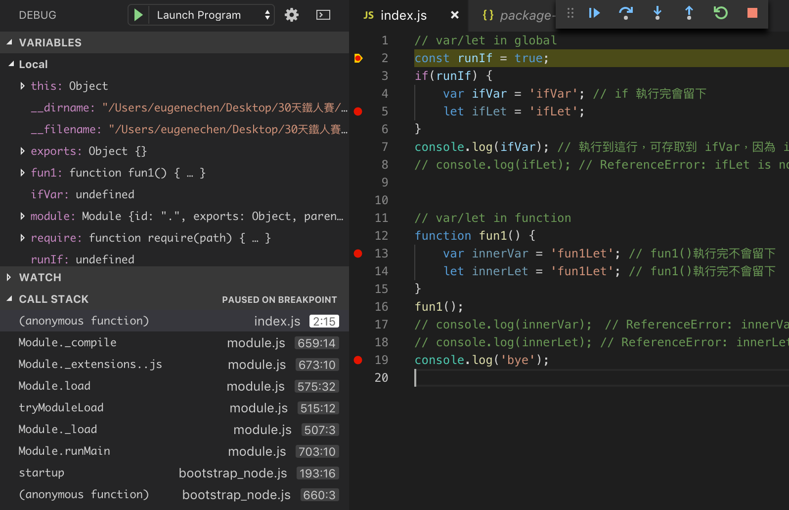

+++
title = "Day 5 - 一周目- 從VSCode debug 模式看作用域(Scope)、this、閉包(Closure)"
date = "2018-10-05"
description = "以 VSCode dubug 模式來看，經典的觀念：作用域(Scope)、this、閉包(Closure)"
featured = false
categories = [
]
tags = [
"2019 iT 邦幫忙鐵人賽",
"用js成為老闆心中的全端工程師"
]
images = [
]
series = [
"用js成為老闆心中的全端工程師 - 2019 iT邦幫忙鐵人賽"
]
+++

以 VSCode dubug 模式來看，經典的觀念：作用域(Scope)、this、閉包(Closure)

<!--more-->


# 回憶
昨天提到了用 debug 模式玩ES6的基本語法。

# 目標

以 VSCode dubug 模式來看，經典的觀念：作用域(Scope)、this、閉包(Closure)

# 函數(function)

函數可看成一群程式碼的集合，可以幫我們包裝 routine 的工作 (可以重複呼叫)，命名後可以增加程式碼可讀性。
函數也引發了變數作用域、閉包、this 的問題。

## 基本宣告
有兩種方法可以宣告函數
1. 函數物件
    ```
    function sayHi() {
        console.log('Hi!)');
    }
    ```
2. 箭頭函數arrow function
    ```
    const sayHi = () => {
        console.log('Hi!');
    }
    ```
##  `var/let/const` 作用域(Scope): 變數生存的空間

接下來會用 debug 模式，觀察 `var/let` 的特性。

在 ES6 出來以前只有 `var` 可以用，這是指在宣告在函數內的變數，在這函數的執行過程中會一直在，不管包幾層區塊。

### 在區塊 (`{…}`) 內宣告的變數可以在區塊外使用嗎？

我們觀察以下程式碼：
``` javascript
// var/let in global
const runIf = true;
if(runIf) {
    var ifVar = 'ifVar'; // if 執行完會留下
    let ifLet = 'ifLet';
}
console.log(ifVar); // 執行到這行，可存取到 ifVar，因為 ifVar 是在主程式函數中宣告的
// console.log(ifLet); // ReferenceError: ifLet is not defined


// var/let in function
function fun1() {
    var innerVar = 'fun1Let'; // fun1()執行完不會留下
    let innerLet = 'fun1Let'; // fun1()執行完不會留下
}
fun1();
// console.log(innerVar);　// ReferenceError: innerVar is not defined
// console.log(innerLet); // ReferenceError: innerLet is not defined
console.log('bye');

```

在第2,5,13,19行下中斷點，執行 debug，如下圖：

停在第2行後，看看 ***CALL STACK*** ，目前執行在匿名函數中 (anonymous function)中，也就是，當程式執行時，我們可以假想它們被包在某個函數中且立刻被執行，像是：
``` javascript
(anonymousFunction() {
  // …上面程式碼…
})()
```
此外， ***VARIABLES->Local*** 中有在函數內可以存取的變數，但會發現 ***沒有 `ifLet`*** ，也就是第8行不能讀到`ifLet`的原因。

再往下執行到第5行，

多出 ***VARIABLES->Block*** ，裡面有`ifLet`，而 ***VARIABLES->Local*** 還留著。

再往下執行到第13行，

 ***CALL STACK*** 現在進入到 `fun1` 中， ***CALL STACK*** 自然就只剩下 `innerLet` 和 `innerVar` ( **this** 晚點說)
 
再往下執行到第19行，

離開 `fun1()` 後 `innerLet` 和 `innerVar`就會被消毀，當再次回到「進來前的函數空間」， `innerLet` 和 `innerVar` 當然就存取不到了，也就是第17,18行不能讀到他們。

> 可以試試把第 8, 17, 18註解拿掉，會丟出例外

我們整理結論：
1. `var` 是屬於函數作用域(function scope)，活在函數中，出現在 ***VARIABLES->Local*** 中
2. `let` 是屬於區塊作用域(block scope)，活在 `{…}` (curly brackets)，出現在 ***VARIABLES->Block*** 中

那…`const` 呢？ 它跟 `let` 一樣，只是變數不能再次被賦值(`=`)。
所以結論：
1. `var` 是屬於函數作用域(function scope)，活在函數中，出現在 ***VARIABLES->Local*** 中
2. `let/const` 是屬於區塊作用域(block scope)，活在 `{…}` (curly brackets)，出現在 ***VARIABLES->Block*** 中

### 要怎麼選用它們？
我的做法是變儘量限制它們的 scope，以降低無法預期的效果，像是：var 變數生存太久佔用記憶體、本應該是常數的東西不小心執行時被改到、存取到本不應該存在的變數…等
1. 能用 `const` 儘量用
2. 可能要改值，就用 `let`
3. 最後才用 `var`

## this：呼叫函數的人
`this` 在OO(物件導向)技術被用來當做實例(instance)的代理變數。在 javascript 也有類似的功用，但 `this` 是可以被我們動態替換的，所以可以做的更多，見：[JavaScript - call，apply，bind](https://ithelp.ithome.com.tw/articles/10195896)。現階段只要了解：**this就是呼叫函數的人**

看以下的程式，下中斷點觀察
``` javascript
const funA = () => {
    console.log(this);
};
function funF () {
    console.log(this);
};

const obj = {
    funA: funA,
    funF: funF,
}

funA();
funF();

obj.funA();
obj.funF();
```
下面這張圖，程式是從第14行進入至第3行，呼就叫的人是誰？因為沒有指明人，就會拿最上層的人(物件)，所以就叫 `global`，此時 `this` 是 `global`


下面這張圖，程式是從第17行進入至第3行，呼就叫的人是誰？是 `obj`，所以 `this` 是 `obj` 且它的型別是 `Object`，打開來看看真的是它


## 閉包(Closure)：把外面的變數關在函數中使用

我們考慮以下問題：
1. 函數外宣告的變數，能不能在函數內使用？
2. 函數內如何使用外部變數的值？
3. 閉包域中的外部變數值可以被修改嗎？

回答這些問題

1. 可以，每個建立一個函數物件時，會會有一個閉包域產生。當函數物件執行時可以存取外部變數
1. 一般有兩個方法
    1. 用參數，把值傳入
        ``` javascript
        const outer = 'outer';
        function fun(a){
          console.log(a);
        }
        fun(outer);
        ```
    2. 透過閉包，把外部變數包入閉包域
        ``` javascript
        const outer = 'outer';
        function fun(){
          console.log(outer); // 引用到外部變數，所以會放到 fun()函數中的閉包域
        }
        fun();
        ```
  1. 可以，因為閉包域中的變數和外部變數是相同的記憶體位置，所以可以被修改。見下面說明。

執行以下程式，並下中斷點，為了看的更清楚我們很刻意的放到 **main()** 中執行，
``` javascript
function main() {
    let outer = 'outer'; // 外部變數
    function funA() {
        console.log(outer);　// 讀取到外部變數
    };

    function funB() {
        const inner = outer;　// 內部變數，指向 outer 的值
        outer = outer + '-fix'; // 修改 outer 的值
        console.log(inner, outer);
    };

    funA();
    funB(); // outer 值被修改
    funA();
};

main();

```

下圖中，`outer` 放入  ***VARIABLES->Closure*** 閉包域中，使我們可以存取它的值。


下圖中，因為宣告了 `const inner`，它是屬於 ***VARIABLES->Local*** ，並設定成`outer`的值，所以 `inner = 'outer'`。然而，`outer = outer + '-fix'`，把 `outer` 改成了 `outer-fix`的值。此外，`outer` 也被放入 ***VARIABLES->Closure*** 閉包域中。

用記憶體圖示來說，就會很清楚了，白正方形是記憶體空間，裡面會放字串值。


最後在呼叫一次 `funA()`，得到 `outer` 被修改後的結果。


### 什麼時候用？
可以用閉包包入定值，但很煩，ES6 引入的 let 可以簡化不少。

``` javascript
// i, j loop 完，變成定值
let funs = [];
for (var i = 0; i < 3; i++) {
    var j = i;
    funs.push(function () {
        console.log(i, j); // loop 完才用到 i, j
    });
}
funs.forEach(fun => fun());

// 用閉包
funs = [];
for (var i = 0; i < 3; i++) {
    (function () {
        var j = i; // 把值存入一個匿名函數的閉包
        funs.push(function () {
            console.log(i, j);
        });
    })();
}
funs.forEach(fun => fun());

// 用 let
funs = [];
for (var i = 0; i < 3; i++) {
    let j = i;
    funs.push(function () {
        console.log(i, j);
    });
}
funs.forEach(fun => fun());
```
結果：
```
3 2
3 2
3 2
3 0
3 1
3 2
3 0
3 1
3 2
```
只有後面兩種寫法會正確。

### 復雜習題
可以猜看看下面的結果：
``` javascript
const funs = [];
for (var i = 0; i < 3; i++) {
    const j = i;
    funs.push(function () {
        const inner = i;
        console.log(inner, i, j);
    });
}

funs.forEach(fun => fun());
```

# 總結

今天用 debug 模式，觀察作用域(Scope)、this、閉包(Closure)的例子，並發現下面的關連性。
 ***VARIABLES->Local***  - var
 ***VARIABLES->Block***  -  let/const
 ***VARIABLES->Closure***   - 閉包

# 參考連結
* [The Difference Between Function and Block Scope in JavaScript](https://medium.com/@josephcardillo/the-difference-between-function-and-block-scope-in-javascript-4296b2322abe))
* [用9種辦法解決 JS 閉包經典面試題之 for 循環取 i](https://segmentfault.com/a/1190000003818163)


