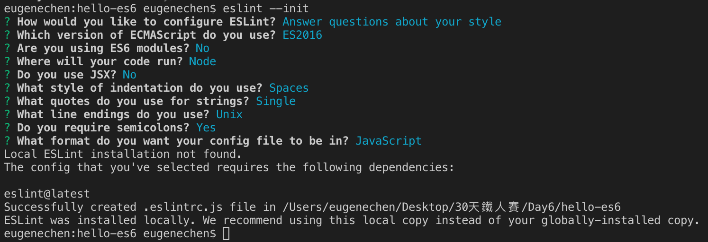
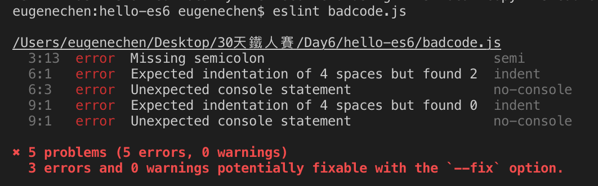
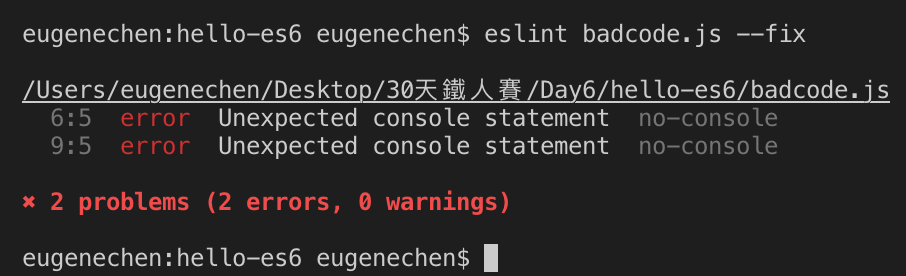
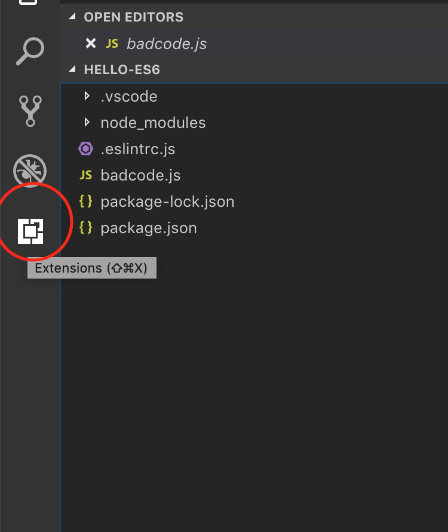
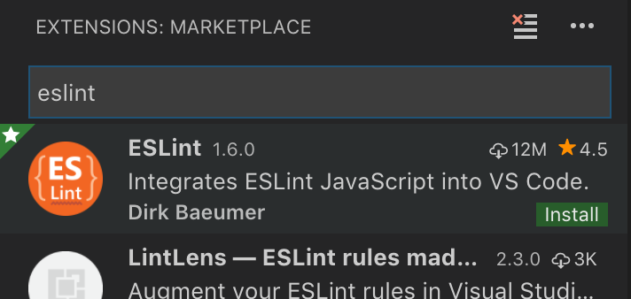
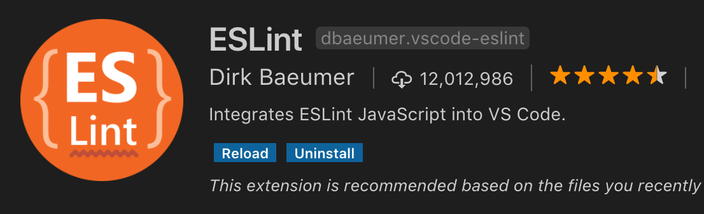
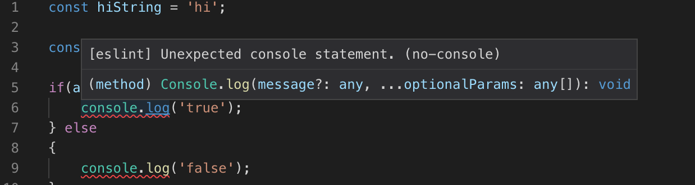
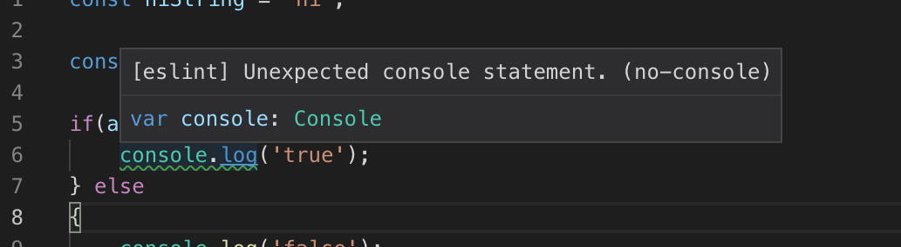
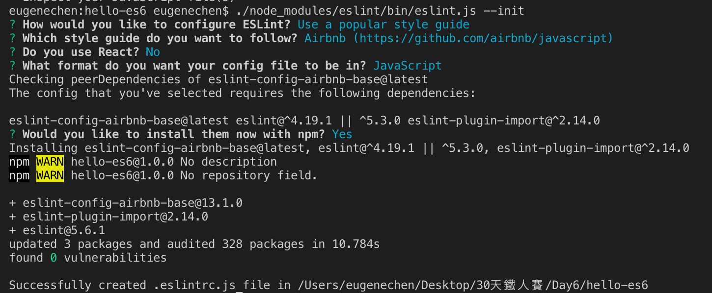

+++
title = "Day 6 - 一周目- 程式碼品質工具ESLint，照顧程式碼風格"
date = "2018-10-06"
description = "安裝程式碼品質工具、修改檢查規則組態檔"
featured = false
categories = [
]
tags = [
"2019 iT 邦幫忙鐵人賽",
"用js成為老闆心中的全端工程師"
]
images = [
]
series = [
"用js成為老闆心中的全端工程師 - 2019 iT邦幫忙鐵人賽"
]
+++

安裝程式碼品質工具、修改檢查規則組態檔

<!--more-->

# 回顧
昨天我們介紹了作用域(Scope)、this、閉包(Closure)如何影響 VSCode debut 模式。終於可以寫程式了，但在開始寫程式前先來決定程式風格。

# 目標
1. 安裝程式碼品質工具 - ESLint
2. 修改檢查規則組態檔


# 程式碼品質工具 - ESLint

## 為什麼要用 ***程式碼品質工具*** ?
javascript 的語法很鬆散，可以任意放空白行或是多放空白字元、換行，沒有一個統一的寫法風格
``` javascript
// badcode.js
const hiString = 'hi';

const a='hi'

if(a ===hiString) {
  console.log('true');
} else
{
console.log('false');
}
```
上面程式是真的可以執行，但看的很痛苦吧？若是多人協作，真的是使人抓狂，就算是單人開發也會希望有統一的風格。

程式碼品質工具有很多 [ESLint](https://eslint.org)、 [JSLint](https://www.jslint.com/)、[JSHint](http://jshint.com/), [Standard](https://standardjs.com/)，但我也只用過 ESLint。


## ESLint 可以做什麼？

1. 可以有統一的風格：像縮排幾個空白、空白行最多多少、換行、物件宣告的風格...等等。見[ESLint rules](https://eslint.org/docs/rules/)
2. 動態程式碼檢查：可能的語法錯誤、潛在的危險，像是從來不被改的變數沒設 `const`，`if` 沒有所有路徑都有回傳、變數型別有誤、存取可能不存在的屬性
3. 語法建議：宣告了一個從來不使的變數、可以用三元運算ternary operation 簡化 `if`
4. 自動修改程試碼符合風格：`eslint --fix`
5. 客制化風格：你可以設定專屬風格，像是縮排用 ***Tab*** 還是 ***空白***

## 怎麼安裝ESLint？

ESLint 它也是一隻程式，可以透過指令執行。

### 指令模式

1. 安裝指令：我們選擇全域安裝，terminal 就可以使用 `eslint` 指令
    ```
    npm install -g eslint
    ```
1. 設定組態檔：移到專案根目錄(可以繼續用 `hello-es6`專案)，初始化 eslint 組態檔 `.eslintrc.js` ，裡面就會放風格設定
    ```
    eslint --init
    ```
    之後會跑出提示，可以選要使用的規則。為了方便學習你可以照我選的，也可以自設，甚至使用Airbnb/Standard/Google這些流行的風格。通常讓人困擾的問題是： [ES6 與 ECMAScript 2015 的關係](http://es6.ruanyifeng.com/#docs/intro#ES6-%E4%B8%8E-ECMAScript-2015-%E7%9A%84%E5%85%B3%E7%B3%BB)
    
    選完後就會產生一個 `.eslintrc.js` 檔案
1. 執行程式碼檢查：把上面的 `badcode.js` 存下來，用 `eslint badcode.js` 執行檢查 `badcode.js` 看看

    它報出一堆問題，你就可以手動修正或自動修正
1. 自動修正：執行 `eslint badcode.js --fix` 後，程式碼變
    ``` javascript
    const hiString = 'hi';
    
    const a='hi';
    
    if(a ===hiString) {
        console.log('true');
    } else
    {
        console.log('false');
    }
    ```
    有進步!只剩兩個 error，程式也變漂亮了
    
    另外，有哪些可以自動修正的規則？請見 [rules](https://eslint.org/docs/rules/) 的扳手圖案
    

> ESLint 也可以安裝在專案裡面 `npm install eslint --save-dev`，此時執行檔在 `./node_modules/bin/eslint.js`裡

### VSCode Extenstion
前一節用指令檢查一個檔案，總不能每次寫完程式就執行一次吧？所以大部分的編輯器(VSCode, Atom, WebStorm, Sublime)都可以安裝 ESLint Extension，把 Eslint 整合進編輯器。

1. 進入 Extensions 頁
    
1. 找esint，後安裝eslint
    
1. 再 Reload

1. 回到程式碼就會「看」到出問題的地方
    

## 設定 ESLint 組態檔

程式碼我們還留下 `console.log()` 的 error，可以做以下的事
1. 刪除報錯的程式碼不用
2. 關掉檢查項目
3. 弱化警告等級(level)

在修改前，先來談談組態檔規則

### 組態檔規則
打開 `.eslintrc.js` 看到除了 `eslint:recommended` 裡預設的規則，`rules` 還自設了幾個規則
``` javascript
{
    "extends": "eslint:recommended",
    "rules": {
        "indent": [
            "error",
            4
        ],
        "linebreak-style": [
            "error",
            "unix"
        ],
        "quotes": [
            "error",
            "single"
        ],
        "semi": [
            "error",
            "always"
        ]
    }
};
```

`rules` 裡面的元素，使用格式如下：
```
<rule name>: [<error level>, <...options for the rule>]
```
所以  `"quotes": ["error", "single"]`, 是指字串套用 [**quotes** 規則](https://eslint.org/docs/rules/quotes)，而用 **單引號(single)**，不合格的錯誤等級為 **error**。

### 弱化 console.log 的錯誤等級訊息
1. 到 [rules頁](https://eslint.org/docs/rules/)，找到 [***no-console***](https://eslint.org/docs/rules/no-console)這個role，確認有這個規則存在
1. 加入 `"no-console":["warn"]` 到 `rules` 裡面
1. 變成警告的樣子，而不是嚇人的紅線了


# 完整的修正 `badcode.js`：採用 Airbnb 風格
1. 安裝本地ESLint，用本地程式設定組態
    ```
    npm i eslint --save-dev
    ./node_modules/eslint/bin/eslint.js --init
    ```
1. 我使用 Airbnb 風格，安裝完後重開 VSCode

1. 自動修正
    ```
    ./node_modules/eslint/bin/eslint.js badcode.js --fix
    ```
    修正完變的更漂亮了
    ``` javascript
    const hiString = 'hi';
    
    const a = 'hi';
    
    if (a === hiString) {
      console.log('true');
    } else {
      console.log('false');
    }
    
    ```
# 總結
今天用 ESLint 來確保程式碼品質，透過 `.eslintrc.js` 裡面設定規則 ESLint 就可以進行檢查。為了方便檢查，安裝 VSCode 的 ESLint extension 幫助我們做到 **即時** 的檢查。最後，採用流行的風格來修正程式碼。
