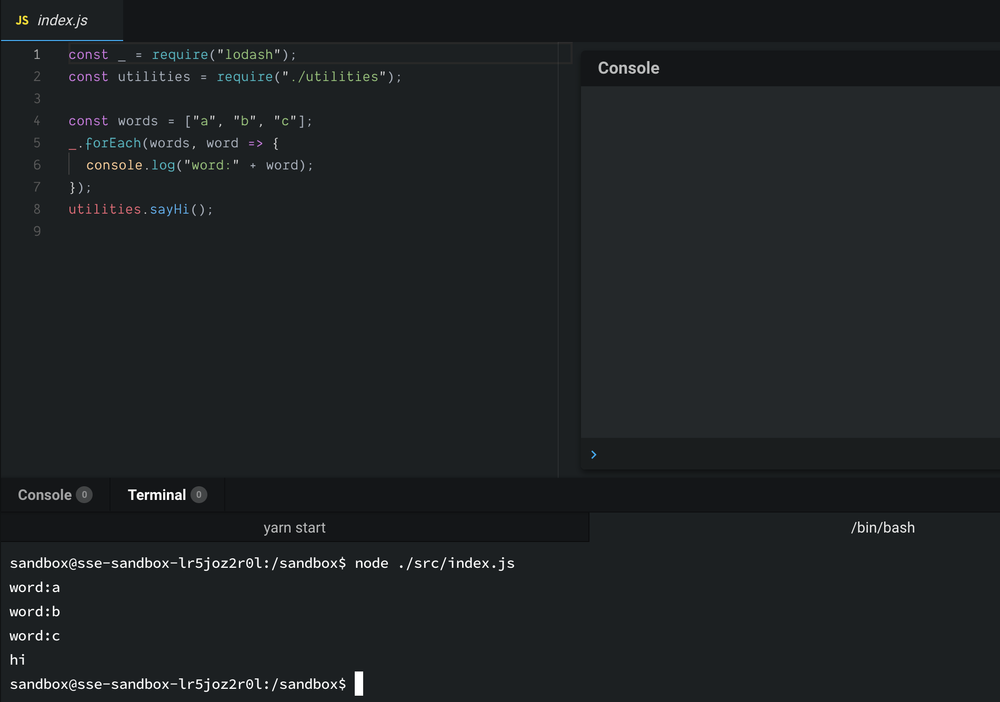

+++
title = "Day 7 - 一周目- ES6 讓人欲罷不能的語法"
date = "2018-10-07"
description = "ES6 有些讓人欲罷不能的語法"
featured = false
categories = [
]
tags = [
"2019 iT 邦幫忙鐵人賽",
"用js成為老闆心中的全端工程師"
]
images = [
]
series = [
"用js成為老闆心中的全端工程師 - 2019 iT邦幫忙鐵人賽"
]
+++

ES6 有些讓人欲罷不能的語法

<!--more-->

# 回顧
昨天用ESLint，照顧程式碼風格，今天真的要來寫程式了

# 目標
ES6 有些讓人欲罷不能的語法，它們超超超…常用，不能不會：

1. 模組(module) / 套件(package)的使用
2. 箭頭函數(Arrow function)
3. 解構賦值 (Destructuring Assignment)
4. 擴展語法(Spread syntax)
5. 類別(Class)
6. JSON 物件：序列化(serialization)物件

# 讓人欲罷不能的語法

## 模組(module) / 套件(package)的使用
在 [Day 3 - 一周目- 建立 第一個Node.js 專案](https://ithelp.ithome.com.tw/articles/10199745) 我們安裝了人生第一個套件 **lodash**，在我們的程式中要怎麼用呢？

不幸的，javascript 程式碼是否能正常執行是由執行環境境決定的，所以不同的環境語法可能有些微的不同。Node.js 和多數瀏覽器用的ES6 有不同的模組引入方法

總結如下：(截錄自[exports、module.exports和export、export default到底是怎回事](https://segmentfault.com/a/1190000010426778))
* `require`: Node.js 和 ES6 都支援的引入
* `export` / `import` : 只有ES6 支援的導出引入
* `module.exports` / `exports`: 只有 Node.js 支援的導出

從環境的角度：
* Node.js
  * 模組引入 `require`
     ``` javascript
      const _ = require('lodash');
      ```
  * 模組導出 `module.exports` / `exports`
      ``` javascript
      module.exports = {
        myFun: ()=>{}
      }
      ```
* ES6
  * 模組引入`require` / `import`
      ``` javascript
      import _ from 'lodash'; // 或 const _ = rquire('lodash');
      ```
  * 模組導出 `export`
      ``` javascript
      export default  {
        myFun: ()=>{}
      };
      ```
Node.js雖然是CommonJS規範, 但不久的將來也可以用 **import** 了，見[Node.js v10.11.0 - ECMAScript Modules](https://nodejs.org/api/esm.html#esm_ecmascript_modules)

下面可以看到完整的範例：
1. [Node.js module usage](https://codesandbox.io/s/lr5joz2r0l?view=editor)：可以在裡面開一個terminal，輸入 `node ./src/index.js`，看到結果

1. [ES6 module usage](https://codesandbox.io/s/29j1rppo0?view=editor)：可以看 Console 頁籤看到結果


## 箭頭函數(Arrow function)
這曾在[Day 5 - 一周目- 從VSCode debug 模式看作用域(Scope)、this、閉包(Closure)](https://ithelp.ithome.com.tw/articles/10200107)介紹過，他的外型如同他名字有箭頭 `() => {}`


### 常用在哪
1. 不用命名的函數/暱名函數：有些時候命名函數是多此一舉的事
    ``` javascript
    const names = ['billy', 'may'];
    const persons = names.map(name => {
      return {name: name};
    });
    ```
    這裡的箭頭函數表明了把字串(ex: `'billy'`) 轉成物件(ex: `{name: 'billy'}`)，函數命名是多些一舉的
1. 簡化表達式： 除了 `function` 字拿掉了，若回傳值可以用一行程式碼表達，連  `{…}` 和 `return` 也可以拿掉
    ``` javascript
    const names = ['billy', 'may'];
    const persons = names.map(name => ({name: name}));
    ```
    是不是更簡化了阿～ 
    注意，因為回傳是物件，但物件的 `{…}` 會和函數的`{…}`區塊弄混，所以要用 `(…)` 包起來
1. 清楚的函數表達作用：常出現在 [Functional programming](https://en.wikipedia.org/wiki/Functional_programming) 中，像是 [Ramda](https://ramdajs.com/docs/#equals)文件中經常會出現用來表達作用。

我們舉線性函數例子，你覺得哪個清楚表達作用呢？

    ``` javascript
    // Statements - 一般函數版本
    function plus(b, x) {
        return x + b;
    }
    function mult(a, x) {
        return a * x;
    }
    function linear(a, b, x) {
        return plus(b, mult(a, x));
    }
    console.log(linear(2, 1, 3));
    
    // Declarative programming　－　箭頭函數版本
    const linearGen = a => b => x => a * x + b;
    const linear21 = linearGen(2)(1);
    console.log(linear21(3));
    
    // linearGen 用一般函數就像下面
    function _linearGen(a) {
        return function (b) {
            return function (x) {
                return a * x + b;
            };  
        };
    }
    console.log(_linearGen(2)(1)(3));
    ```

> 其實 一般的函數和箭頭函數還是有些微的不同，可以見 [Arrow function vs function declaration / expressions: Are they equivalent / exchangeable?](https://stackoverflow.com/questions/34361379/arrow-function-vs-function-declaration-expressions-are-they-equivalent-exch)。通常是發生在 `this` 被動態修改時就會出現差異(像是：`call`, `apply` …之類的)。

## 解構賦值 (Destructuring Assignment)
[Destructuring Assignment](https://developer.mozilla.org/en-US/docs/Web/JavaScript/Reference/Operators/Destructuring_assignment) 我覺得是 ES6 最酷的語法(我目前只在 ES6 看到，其它語言沒見過)，一行程式碼做兩件事(以物件為例)：
1. 解構：取出值
    ``` javascript
    const person = {name: 'Billy'};
    const name = person.name // 取出值
    ``` 
2. 賦值：沒值就預設
    ``` javascript
    const person = {name: 'Billy'};
    const id = person.id || 'No ID'
    ``` 
用 **Destructuring Assignment** 就是
``` javascript
const person = {name: 'Billy'};
const {name, id = 'No ID'} = person;
```

若 `name` 已被宣告過可以換變數名字，用 `:` 符號
``` javascript
const person = {name: 'Billy'};
const {name: nickname, id = 'No ID'} = person;
console.log(nickname, id); // Billy, No ID
```

Destructuring Assignment 可以對 Array 或 Object 使用，文件 [Destructuring Assignment](https://developer.mozilla.org/en-US/docs/Web/JavaScript/Reference/Operators/Destructuring_assignment) 舉了很多用法，我只列我常用的

### 物件解構 Object destructuring
1. 一般用法
    ``` javascript
    const person = {name: 'Billy', gender: 'man'};
    const {name: nickname, id = 'No ID'} = person;
    ```
2. 保留剩餘：取出要處理的部分，剩下的可以留下做之後的事
    ``` javascript
    const person = {name: 'Billy', gender: 'man'};
    const {name, ...others} = person;
    console.log(others); // { gender: 'man' }
    ```
1. 函數簽章參數解構：用於顯式的指明[函數簽章(Signature)](https://developer.mozilla.org/en-US/docs/Glossary/Signature/Function)
    ``` javascript
    const person = {name: 'Billy', gender: 'man'};
    function welcomePerson({name = 'guest'} = {}) {
      console.log(`Hi! ${name}`);
    }
    welcomePerson(person); // Hi! Billy
    welcomePerson(); // Hi! guest
    ```
    這裡 `welcomePerson({name = 'guest'} = {})` 中的 `= {}`，是函數參數若沒傳就是空物件 `{}`
1. 函數物件參數解構：用物件當參數，未來可以任意的放入新的屬性，而不用改呼叫者(caller)，例如：函數簽章 `f(a, b)` 改成 `f(obj)`。經常被用在 ***options***
    ``` javascript
    const options = {type: 'type1'};
    function welcomePrefix(options = {}) {
      const {type} = options;
      return type === 'type1' ? 'Hi! ' : 'Hello! ';
    }
    console.log(welcomePrefix(options) + 'Billy');
    ```
1. 函數回傳解構
   ``` javascript
    function getPerson() {
      const person = {name: 'Billy'};
      return type === 'type1' ? 'Hi! ' : 'Hello! ';
    }
    const {name} = getPerson();
    console.log(name); // Billy
    ```

### 陣列解構 Array destructuring

陣列解構依於 **順序** ，我反而少用
``` javascript
function getPair() {
  return ['a', 1];
}
const [word, number] = getPair();
console.log(word, number); // a 1
```

## 擴展語法(Spread syntax)
`...` [Spread syntax](https://developer.mozilla.org/en-US/docs/Web/JavaScript/Reference/Operators/Spread_syntax) 也是 ES6 必用的語法。可以用在 React component 中，把值「展開」送到 component中，例如：假設 `props = {name: 'Name', price: 1}`，放到 `<MyComonent/>` 中 `<MyComonent title='Title' {...props} />`， 相當於 `<MyComonent title="Title" name="Name" price=1 />`。

以下是我常用的情況

1. 保留剩餘：「物件解構-保留剩餘」中的 `const {name, ...others} = person` 就是用到 Spread syntax
1. 用建立新陣列/物件
    ``` javascript
    // object
    const options = {type: 'type1', auto: true};
    const newOptions1 = {enable: true, ...options};
    const newOptions2 = {enable: true, ...options, auto: false};
    console.log(newOptions1); // { enable: true, type: 'type1', auto: true }
    console.log(newOptions2); // { enable: true, type: 'type1', auto: false }，這裡後出現的 auto 會蓋住前面的
    
    // array
    const words = ['b', 'c'];
    const allWords = ['a', ...words, 'd'];
    console.log(allWords);
    ```
    > 注意：Object 的同名屬性可能是被後面的覆蓋

2. 不定長度參參數呼叫： 有沒有發現 `console.log` 可以輸入不同長度的參數？
    ``` javascript
    console.log('a'); // a
    console.log('a', 'b'); // a b
    ```
    可以利用 Spread syntax，把陣列展開
     ``` javascript
    const words = ['a', 'b'];
    
    // 送入一整個陣列
    console.log(words); // [ 'a', 'b' ]
    
    // 展開元素，這等價於 console.log(words[0], words[1])
    console.log(...words); // a b
    ```
    所以，`words`的長度改變，`console.log(...words)` 也不用修改了

    > **Bonus**：製做非固定長度的函數 -  [arguments](https://developer.mozilla.org/zh-TW/docs/Web/JavaScript/Reference/Functions/arguments) 是存在於一般函數(非箭頭函數)的區域變數(local variable)，它是 array-like(可以用 `arguments[0]` 取值，但沒有 Array 的所有函數)，可以來定義非固定長度的函數，像是 `console.log`
    
    ``` javascript
    function mylog() {
      // const badPrefixArgs = arguments.map(arg => '=>' + arg); // 這拿掉會丟出錯誤：TypeError: arguments.map is not a function
    
      // 這裡呼叫空陣列[]的 map函數，把 this 換成 arguments
      const prefixArgs = [].map.call(arguments, arg => '=>' + arg); 
      console.log(...prefixArgs);
        
      // 或用 lodash
      //const _ = require('lodash');
      //const prefixArgs = _.map(arguments, arg => '=>' + arg);
    }
    mylog('a', 'b'); // =>a =>b
    ```

## 類別(Class)
這是大家常用的物件編程語法，更多內容可以看 [ECMAScript 6 入門](http://es6.ruanyifeng.com/#docs/class)
``` javascript
class MyError extends Error {
    constructor() {
        super(...arguments);
    }

    toJson() {
        return {
            message: this.message
        }
    }
}

const error = new MyError('my error');
console.log(error.toString());
console.log(error.toJson());
```

## JSON 物件：序列化(serialization)物件
[JSON](https://developer.mozilla.org/en-US/docs/Web/JavaScript/Reference/Global_Objects/JSON) 這內建物件，不用 ***new*** 就可以直接使用，在序列化(serialization)物件和還原物件很好用

`JSON.stringify` 和 `JSON.parse` 分別是序列化和還原，其中序列化的對像是 objects、arrays、numbers、strings、booleans, 和 null的值。

它們執行失敗時可能會丟例外(exception)，一個穩健(robust)的程式應該要處理它們。

``` javascript
const person = {name: 'billy', orderIds: ['0A', '0B']}

let serializedPerson = '';
try {
  serializedPerson = JSON.stringify(person);
  console.log(serializedPerson); // {"name":"billy","orderIds":["0A","0B"]}
} catch(e) { // TypeError exception
  console.error(e);
}

let newPerson = {};
try {
  newPerson = JSON.parse(serializedPerson);
  console.log(newPerson); // Object {name: "billy", orderIds: Array(2)}
} catch(e) { // SyntaxError exception
  console.error(e);
}
```

# 總結

今天提的所有語法，在未來一定會一直出現，尤其是 **模組使用** 、 **箭頭函數**、 **解構賦值** 會一直陪伴著你。

# 參考連結
* 模組化
  * [Node中沒搞明白require和import，你會被坑的很慘](http://imweb.io/topic/582293894067ce9726778be9)
  * [exports、module.exports和export、export default到底是怎回事](https://segmentfault.com/a/1190000010426778)
  
