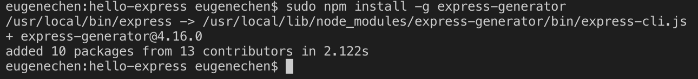
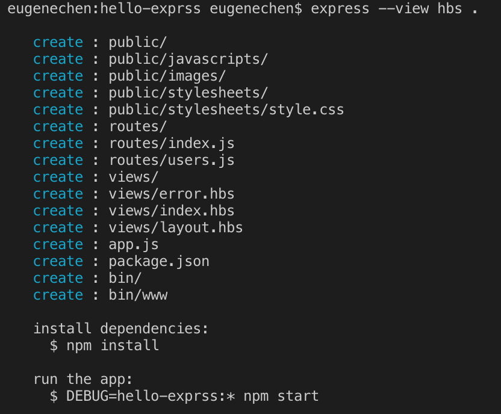
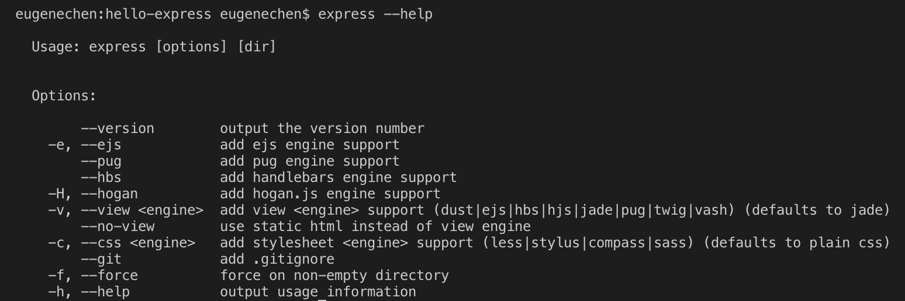
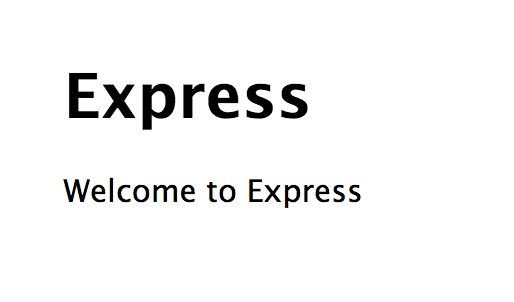
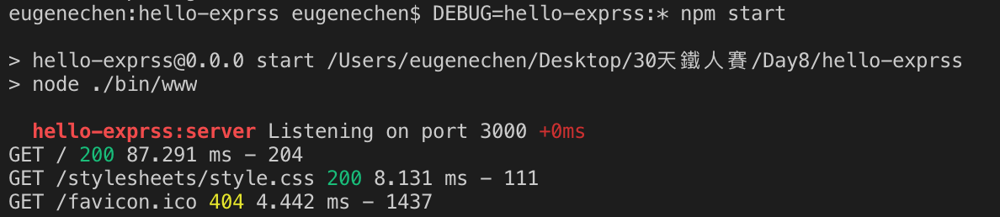
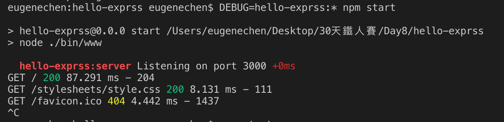
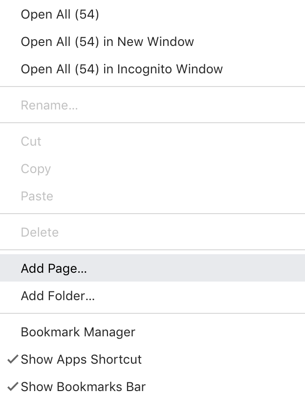
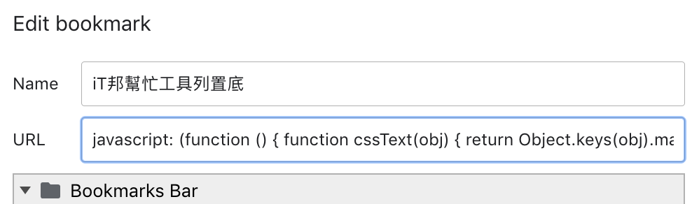
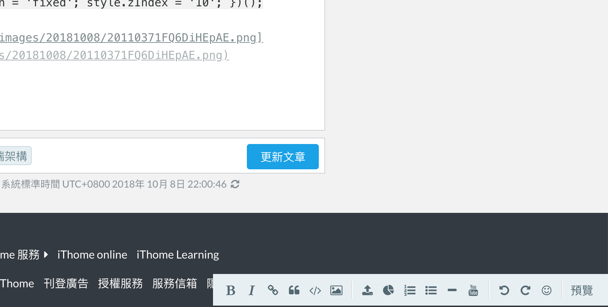

+++
title = "Day 8 - 一周目- 開始玩轉後端(一)"
date = "2018-10-08"
description = "了解前後端的職責、架構，建立第一個後端應用程式"
featured = false
categories = [
]
tags = [
"2019 iT 邦幫忙鐵人賽",
"用js成為老闆心中的全端工程師"
]
images = [
]
series = [
"用js成為老闆心中的全端工程師 - 2019 iT邦幫忙鐵人賽"
]
+++

了解前後端的職責、架構，建立第一個後端應用程式

<!--more-->

# 回顧
昨天，我列出了ES6常用的語法，接下來我們開始玩玩後端了

# 目標

1. 了解前後端的職責、架構
1. 建立第一個後端應用程式：hello-express

# 前後端架構

> 軟體架構對不同的人可能有不同的解釋，請用開放的心態，不需要強求別人

軟體架構常見的有：Centralized computing，peer-to-peer architecture, [Client–server model](https://en.wikipedia.org/wiki/Client%E2%80%93server_model)…等。而本主題採的 ***前後端架構***，是屬於 **Client–server model**。　Client 指的是終端用戶的網頁瀏覽器，Server 指的是提供實際資料或計算的主機。


1. 後端(backend)：儲存資料、計算資料、提供資料、提供服務(商業邏輯)的區塊，雖然圖片看起來很得簡單，但實際上的它們可能是叢集的方式存在，或依照能功性被切割(ex: [微服務(Microservices)](https://zh.wikipedia.org/wiki/%E5%BE%AE%E6%9C%8D%E5%8B%99))
    1. 資料庫(database)：用儲存、計算、提供資料，常見的[資料庫關聯式(Relational database)](https://zh.wikipedia.org/zh-tw/%E5%85%B3%E7%B3%BB%E6%95%B0%E6%8D%AE%E5%BA%93) 像是： MySQL/MSSQL 和 [NoSQL 資料庫](https://zh.wikipedia.org/wiki/NoSQL)：MongoDB，Apache Cassandra 和 Redis。我們將會選擇用 MongoDB 來當作資料庫
    2. 應用程式伺服器(application server)：提供商業邏輯服務、與前端串接的入口/介面、系統間互相串連。伺服器可能以各種程式語言撰寫，但為了與外界串接(提供服務)，需要使用指定[網路傳輸協定(Communications Protocol)](https://zh.wikipedia.org/zh-tw/%E7%BD%91%E7%BB%9C%E4%BC%A0%E8%BE%93%E5%8D%8F%E8%AE%AE)，兩個串接的系統才能有同樣的二元資料(0/1)解讀規則。常見的如：http(s), websocket, ftp(s)…等。
        1. 因為 http(s)介面也會用於網頁瀏覽器，所以也稱做是 ***Web API (Application Programming Interface)*** 。 基於 http(s) 所定義的[請求方法(Request methods)](https://en.wikipedia.org/wiki/Hypertext_Transfer_Protocol#Request_methods)，如：GET/POST/DELETE/PATCH/PUT，把它們當做是對某URL(ex: `http://api/account`)的動作，就形成了所謂的 [REST(ful) API](https://zh.wikipedia.org/zh-tw/%E8%A1%A8%E7%8E%B0%E5%B1%82%E7%8A%B6%E6%80%81%E8%BD%AC%E6%8D%A2)，它不是標準而是「API設計風格」。
        1. 用來架設http(s)伺服器的程式框架就叫作 **Web Framework**，像是我們採用 [Express.js](https://expressjs.com/) 也是其中之一，也有人把提供API的伺服器的框架叫 **API Framework**。不論是叫什麼，反正都是為了架設 http(s)的 **應用層網路傳輸協定** 伺服器
1. 前端(frontend)：提供給客戶端(client)圖形化使用者介面(GUI)的資料，像是把HTML/Javascript/CSS資料送給瀏覽器。另外，Mobile APP(iOS/Adroid)也有人說是前端。
    1. 網頁伺服器(web server)：這雖然也是基於 http(s) 的伺服器，但這主要是提供一些靜態的網頁/檔案/圖片給瀏覽器，比較不會多太多的商業邏輯、運算在裡面。常用 Nginx/Apache/IIS 架設，安裝後通常就可以使用。
        1. 因為這個網頁伺服器常常代表客戶端/瀏覽器向隱藏在背後的應用程式伺服器送出要求(request)，這行為就叫做 ***反向代理***，它需要知道 request 要送給誰？所以它會存有 ***路由(routing)*** 資訊，就如同 ***路由器*** 一樣。
    1. 網頁瀏覽器(web browser)：瀏覽器(chrome/safari/firefox)收到 HTML/Javascript/CSS資料，便會開始執行並繪製圖形在瀏覽器上，就是我們看的畫面。
        1. 就如同 Markdown一樣，Markdown reader 的實作會導致些微的差異，瀏覽器也是一樣，各家最後生成的畫面有可能會不太一樣，這就是也是前端工師需要花時間的地方。
        1. 網頁畫面主要是由 HTML 組成，當 HTML 是在 ***非*** 網頁瀏覽器(ex: 後端)組成，再送到網頁瀏覽器，這技術叫 **Server-Side Rendering**。
        1. 反之，完全在網頁瀏覽器中透過 Javascript 執行而產生 HTML，這技術叫 **Single Page Application(SPA)** 。當產生 HTML 的工作移到在瀏覽器上執行的 Javascript 時，常常需要 **前端框架 (Frontend Framework)** 來有條理地寫 Javascript 程式碼，目前常見有 [Vue.js](https://vuejs.org/)、[Angular](https://angular.io/) 或我們要使用的 [React](https://reactjs.org/)

我們利用前後架構圖，終於把他們的職責說完了，其實每個名詞都有它們值得深入學習的地方，不同的技術也有各自的優缺點。

接下來，我們開始建立第一個後端應用程式。

-----

# 第一個後端應用程式：hello-express

我們將使用 [Express](https://expressjs.com) 這個 Web Framework 來架設我們的後端應用程式。因為也是網頁伺服器，所以架完後可以值接從瀏覽器送出 http(s) 的要求(request)。

很幸運，Express提供方便的指令幫我們產生一個專案。

## 建立執行 hello-express
1. 安裝`express-generator`：隨便開一個 terminal 後安裝全域指令
    ``` shell
    npm install -g express-generator
    ```
    
    這裡因為有檔案寫入權限的問題，所以需要用 [`sudo`](http://www.runoob.com/linux/linux-comm-sudo.html)
1. 使用`express` 指令：用 `express` 指令產生一個 Express 框架的 Node.js 專案
    1. 開一個Node.js 專案：建立一個名為 `hello-exprss` 的資料夾，並以此專案為根目錄
        ```
        mkdir hello-exprss
        cd hello-exprss
        ```
    1. 產生一個 Express 框架
        ``` shell
        express --view hbs .
        ```
        會自動產生整個 Express 專案(Node.js 專案)的結構
        
        
        這裡看到 `--view` 選項，這是在設定[Express 樣版引擎](https://expressjs.com/en/guide/using-template-engines.html) 要用哪一個？    我選擇用 [handlebars](http://handlebarsjs.com/)。
        **樣版引擎** 是拿來寫 HTML 樣版(template)用的，把 HTML 寫好，留下資料要填入的欄位，當 request 來的時候就可以把字串填入，例：
        ``` html
        <html>
        <body>
          <div>
            Hi! {{username}}
          </div>
        </body>
        </html>
        ```
        `{{username}}` 就是未來要填入的字串，樣版引擎可以幫我們把字串填入(ex: `const html = template({username: 'billy'});`)，就會產生最後的 HTML，就可以回傳了。
        
        > 可以輸入 `express --help` 查看更多
        

1. 安裝相依套件：在專案根目錄的 terminal 下執行
    ``` shell
    npm inatall
    ```
1. 執行 express：在專案根目錄的 terminal 下執行
    ``` shell
    DEBUG=hello-exprss:* npm start
    ```
    這行做兩個件事
    1. 設定 `DEBUG` 這環境變數，伺服器執行時可以在主行程(main process)中透過 `process.env['DEBUG']` 抓到值 `hello-exprss:*`，之後會好好的來介紹它。
    1. `npm start` 也是 `npm run start`，從 **package.json** 中看出
        ``` json
        "scripts": {
          "start": "node ./bin/www"
        },
        ```
        就是在執行 `node ./bin/www`
1. 查看是否安裝成功
    打開瀏覽器，到 `http://localhost:3000/`，看到下圖就表是成功了
    
    若查看 terminal，可以看到從瀏覽器送出的 requests
    

## 停止 hello-express
停止很簡單，在執行 express的 terminal 中，用按鍵
``` shell
ctl + c
```
會看到 `^C` 終止執行


## 背景執行伺服器
伺服器的執行應該要能在背景運作，不能因為關閉 terminal 就無法運作。這裡只先列出來，未來有機會再說明
1. `&`：執行一個背景執行的指令。停止要用 `kill` 指令，刪除行程
1. `systemctl`：設定一個 linux 的 service，用 `systemctl start <service>`，執行服務
1. `screen`：`screen`工具，可以背景開啟多個shell，伺服器指令執行在裡面
1. `pm2`: [pm2](http://pm2.keymetrics.io/) 是 Node.js 的行程管理器，不只可以在背景執行，還可以以叢集的方法執行伺服器
1. `docker 容器`：本主題想要介紹的方法，用 docker 執行一個載有伺服器映象檔的容器

# 總結
今天我們提到前後端架構及他們的職責，也粗略地點出各種技術的名詞。最後，利用 `express-generator` 快速地建立第一個後端伺服器，也用瀏覽器訪問它。

# iT邦幫忙工具列置底
寫了幾天的文章，我真的受不了工具欄一直在上面，上傳圖片超不方便，所以寫了簡單的 javascript，把工具欄置底

以下用 Chrome 示範：
1. 在書籤加入一個新的書籤


2. 填入 Name, URL
    Name: iT邦幫忙工具列置底
    URL：下面的 javascript貼上
    ``` javascript
    javascript: (function () { function cssText(obj) { return Object.keys(obj).map(key => `${key}: ${obj[key]};`).join(' '); } var doms = window.document.getElementsByClassName('editor-toolbar'); var dom = doms.length > 0 ? doms[0] : undefined; if(!dom) return; var style = dom.style || {}; style.bottom = '10px'; style.right = '0px'; style.position = 'fixed'; style.zIndex = '10'; })();
    ```
    

之後就在編輯模式時，點這書籤就好了。


